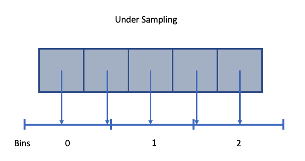
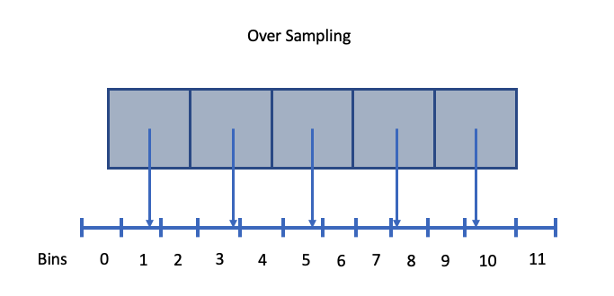
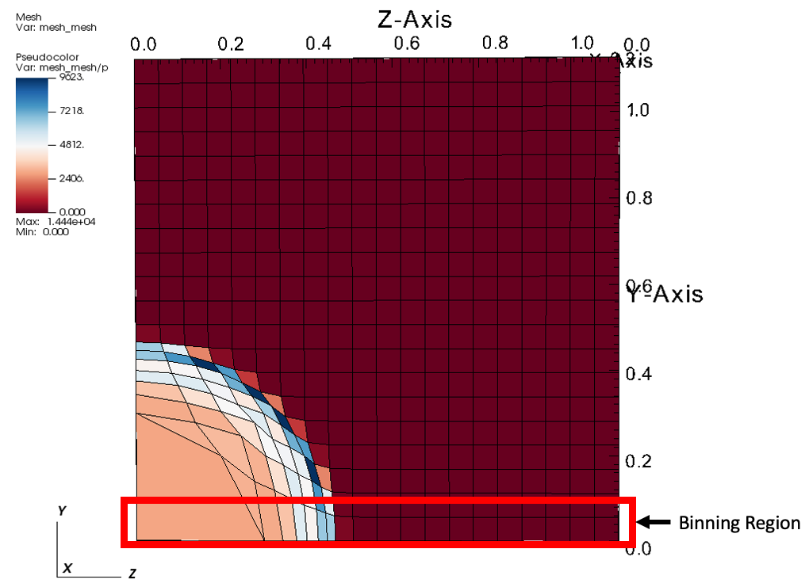
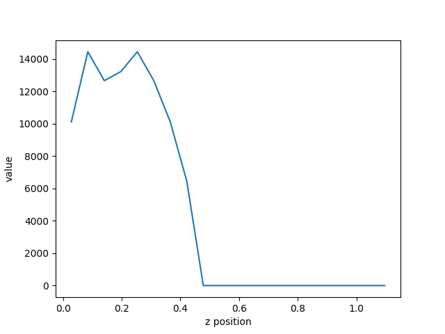

.. ############################################################################
.. # Copyright (c) 2015-2019, Lawrence Livermore National Security, LLC.
.. #
.. # Produced at the Lawrence Livermore National Laboratory
.. #
.. # LLNL-CODE-716457
.. #
.. # All rights reserved.
.. #
.. # This file is part of Ascent.
.. #
.. # For details, see: http://ascent.readthedocs.io/.
.. #
.. # Please also read ascent/LICENSE
.. #
.. # Redistribution and use in source and binary forms, with or without
.. # modification, are permitted provided that the following conditions are met:
.. #
.. # * Redistributions of source code must retain the above copyright notice,
.. #   this list of conditions and the disclaimer below.
.. #
.. # * Redistributions in binary form must reproduce the above copyright notice,
.. #   this list of conditions and the disclaimer (as noted below) in the
.. #   documentation and/or other materials provided with the distribution.
.. #
.. # * Neither the name of the LLNS/LLNL nor the names of its contributors may
.. #   be used to endorse or promote products derived from this software without
.. #   specific prior written permission.
.. #
.. # THIS SOFTWARE IS PROVIDED BY THE COPYRIGHT HOLDERS AND CONTRIBUTORS "AS IS"
.. # AND ANY EXPRESS OR IMPLIED WARRANTIES, INCLUDING, BUT NOT LIMITED TO, THE
.. # IMPLIED WARRANTIES OF MERCHANTABILITY AND FITNESS FOR A PARTICULAR PURPOSE
.. # ARE DISCLAIMED. IN NO EVENT SHALL LAWRENCE LIVERMORE NATIONAL SECURITY,
.. # LLC, THE U.S. DEPARTMENT OF ENERGY OR CONTRIBUTORS BE LIABLE FOR ANY
.. # DIRECT, INDIRECT, INCIDENTAL, SPECIAL, EXEMPLARY, OR CONSEQUENTIAL
.. # DAMAGES  (INCLUDING, BUT NOT LIMITED TO, PROCUREMENT OF SUBSTITUTE GOODS
.. # OR SERVICES; LOSS OF USE, DATA, OR PROFITS; OR BUSINESS INTERRUPTION)
.. # HOWEVER CAUSED AND ON ANY THEORY OF LIABILITY, WHETHER IN CONTRACT,
.. # STRICT LIABILITY, OR TORT (INCLUDING NEGLIGENCE OR OTHERWISE) ARISING
.. # IN ANY WAY OUT OF THE USE OF THIS SOFTWARE, EVEN IF ADVISED OF THE
.. # POSSIBILITY OF SUCH DAMAGE.
.. #
.. ############################################################################

.. _Binning:

Data Binning
============
Ascent's Data Binning was modeled after VisIt's Data Binning / Derived Data Field capability.
The capability defies a good name, it is has also been called Equivalence Class Functions.
The approach is very similar to a multi-dimensional histogram.
You to define a multi-dimensional binning, based on either spatial coordinates or field values,  and then Ascent will loop over your mesh elements and aggregate them into these bins.
During the binning process, you can employ a menu of reduction functions
(sum, average, min, max, variance, etc) depending on the type of analysis desired.

You can bin spatially to calculate distributions, find extreme values, etc.
With the right approach, you can implement mesh agnostic analysis that can be used across simulation codes.
You can also map the binned result back onto the original mesh topology
to enable further analysis, like deviations from an average.

Benefits
--------
Simulation user often needs to analyze quantaties of interest within fields on
a mesh, but the user might not know the exact data structures used by the underlying
simulation.
For example, the mesh data might be represented as uniform grids or as high-order finite
element meshes.
If the users does not know the underlying data structures, it can be very difficult to write
the underlying analysis, and that analysis code will not work for another simulation.
Using spatial binning essentially create a uniform representation that can be use across
simulation codes, regardless of the underlying mesh representation.

Sampling and Aggregation
------------------------
When specifying the number of bins on an axis, there will always be over smapling or undersampling.
During spatial binning, each zone is placed into a bin based on it centriod, and with all
binning, this is subject to over sampling or under sampling.

  An example of spatial under sampling.

  An example of spatial over sampling.

When multiple values fall into a sinlge bin, we aggregate values using the following options:

*  min: minimum value in a bin
*  max: maximum value in a bin
*  sum: sum of values in a bin
*  avg: average of values in a bin
*  pdf: probability distribution function
*  std: standard deviation of values in a bin
*  var: variance of values in a bin
*  rms: root mean square of values in a bin

Example Line Out
----------------
We will use data binning to provide capablility similar to a a line out.
To accomplish this, we will define a spatial binning that is like a pencil
down the center of the data set in the z direction,
and we will use the noise mini-app to demonstrate.

In the Lulesh proxy application, the mesh is defined with the spatial bounds
(0,0,0)-(1.2,1.2,1.2).
We will define a three dimentional binning on the ranges `x=(0,0.1)` with 1 bin,
`y=(0,1.2)` with 1 bin, and `z=(0,1.2)` with 20 bins.
This is technically a 3d binning, but it will result in a 1d array of values.

Lusesh implements the Sedov blast problem which deposits a region of high energy in
one corner of the data set, and as time progresses, a shockwave propagate out.
The idea behind this example is to create a simple query to help us track the shock
front as it moves through the problem.
To that end, we will create a query that bins pressure (i.e., the variable `p`).

  An example of Lulesh where the binning region is highlighted in red..

Actions File
^^^^^^^^^^^^
An example ascent actions file that create this query:

.. code-block:: yaml

  -
    action: "add_queries"
    queries:
      bin_density:
        params:
          expression: "binning('p','max', [axis('x',[0.0,0.1]), axis('y', [0.0,0.1]), axis('z', num_bins=20)])"
          name: my_binning_name

Note that with and `x` and `y` axes that we are explicity specifying the bounds of the bins.
Ascent deduces the number of bins bases on the explicit coordinates inside the array `[0.0,0.1]`.
With the `z` axis, the binning  automatically defines a uniform binning based on the spatial
extents of the mesh.
Additionally, we are using `max` as the aggregation function.

Session File
^^^^^^^^^^^^
The binning is called every cycle ascent is executed, and the results are stored within
the expressions cache.
When the run is complete, the results of the binnning, as well as all other expressions,
are output inside the `ascent_session.yaml` file, which is convenient for post processing.

Here is a excerpt from the session file (note: the large array is truncated):

.. code-block:: yaml

  my_binning_name:
    1:
      type: "binning"
      attrs:
        value:
          value: [0.0, ...]
          type: "array"
        reduction_var:
          value: "p"
          type: "string"
        reduction_op:
          value: "max"
          type: "string"
        bin_axes:
          value:
            x:
              bins: [0.0, 0.1]
              clamp: 0
            y:
              bins: [0.0, 0.1]
              clamp: 0
            z:
              num_bins: 20
              clamp: 0
              min_val: 0.0
              max_val: 1.12500001125
        association:
          value: "element"
          type: "string"
      time: 1.06812409221472e-05

Inside the session file is all the information Ascent used to create the binning,
including the automatically defined spatial ranges for the `z` axis,
fields used, the aggregate operation, cycle, and simulation time.
The session file will include an entry like the one above for each cycle,
and the cycle is located directly below the name of the query
(i.e., `my_binning_name`).
Once the simulation is complete, we can create a python script to process
and plot the data.

Plotting
^^^^^^^^
Plotting the resulting data is straight forward in python.

.. code-block:: python

  import yaml #pip install --user pyyaml
  import pandas as pd
  import matplotlib.pyplot as plt

  session = []
  with open(r'ascent_session.yaml') as file:
    session = yaml.load(file)

  binning = session['binning']
  cycles = list(binning.keys())
  bins = []

  # loop through each cycle and grab the bins
  for cycle in binning.values():
    bins.append((cycle['attrs']['value']['value']))

  # create the coordinate axis using bin centers
  z_axis = binning[cycles[0]]['attrs']['bin_axes']['value']['z']
  z_min = z_axis['min_val']
  z_max = z_axis['max_val']
  z_bins = z_axis['num_bins']

  z_delta = (z_max - z_min) / float(z_bins)
  z_start = z_min + 0.5 * z_delta
  z_vals = []
  for b in range(0,z_bins):
    z_vals.append(b * z_delta + z_start)

  # plot the curve from the last cycle
  plt.plot(z_vals, bins[-1]);
  plt.xlabel('z position')
  plt.ylabel('pressure')
  plt.savefig("binning.png")

  The resulting plot of pressure from the last cycle.

From the resulting plot, we can clearly see how far the shock front has traveled
through the problem.
