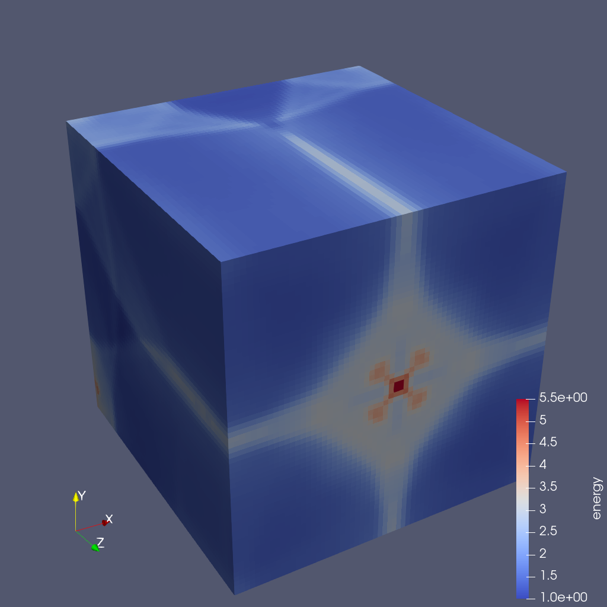

.. ############################################################################
.. # Copyright (c) 2015-2019, Lawrence Livermore National Security, LLC.
.. #
.. # Produced at the Lawrence Livermore National Laboratory
.. #
.. # LLNL-CODE-716457
.. #
.. # All rights reserved.
.. #
.. # This file is part of Ascent.
.. #
.. # For details, see: http://ascent.readthedocs.io/.
.. #
.. # Please also read ascent/LICENSE
.. #
.. # Redistribution and use in source and binary forms, with or without
.. # modification, are permitted provided that the following conditions are met:
.. #
.. # * Redistributions of source code must retain the above copyright notice,
.. #   this list of conditions and the disclaimer below.
.. #
.. # * Redistributions in binary form must reproduce the above copyright notice,
.. #   this list of conditions and the disclaimer (as noted below) in the
.. #   documentation and/or other materials provided with the distribution.
.. #
.. # * Neither the name of the LLNS/LLNL nor the names of its contributors may
.. #   be used to endorse or promote products derived from this software without
.. #   specific prior written permission.
.. #
.. # THIS SOFTWARE IS PROVIDED BY THE COPYRIGHT HOLDERS AND CONTRIBUTORS "AS IS"
.. # AND ANY EXPRESS OR IMPLIED WARRANTIES, INCLUDING, BUT NOT LIMITED TO, THE
.. # IMPLIED WARRANTIES OF MERCHANTABILITY AND FITNESS FOR A PARTICULAR PURPOSE
.. # ARE DISCLAIMED. IN NO EVENT SHALL LAWRENCE LIVERMORE NATIONAL SECURITY,
.. # LLC, THE U.S. DEPARTMENT OF ENERGY OR CONTRIBUTORS BE LIABLE FOR ANY
.. # DIRECT, INDIRECT, INCIDENTAL, SPECIAL, EXEMPLARY, OR CONSEQUENTIAL
.. # DAMAGES  (INCLUDING, BUT NOT LIMITED TO, PROCUREMENT OF SUBSTITUTE GOODS
.. # OR SERVICES; LOSS OF USE, DATA, OR PROFITS; OR BUSINESS INTERRUPTION)
.. # HOWEVER CAUSED AND ON ANY THEORY OF LIABILITY, WHETHER IN CONTRACT,
.. # STRICT LIABILITY, OR TORT (INCLUDING NEGLIGENCE OR OTHERWISE) ARISING
.. # IN ANY WAY OUT OF THE USE OF THIS SOFTWARE, EVEN IF ADVISED OF THE
.. # POSSIBILITY OF SUCH DAMAGE.
.. #
.. ############################################################################

.. _paraview_visualization:

ParaView Visualization
======================

The section :ref:`paraview_ascent_support` describes how to install Ascent
with ParaView support and how to run the example integrations using
insitu ParaView pipelines. In this section we describe in detail the
ParaView visualization pipeline for ``cloverleaf3d``, one of the example
integrations, and we provide implementation details for the
Ascent ParaView integration.

The ParaView pipeline for cloverleaf3d
--------------------------------------
First we need to tell Ascent that we are using a Python script to visualize data using ``ascent-actions.json``.

.. code:: json

          [
            {
              "action": "add_extracts",
              "extracts":
              {
                "e1":
                {
                  "type": "python",
                   "params":
                   {
                     "file": "paraview-vis.py"
                   }
                 }
              }
            }
          ]

The ParaView pipeline for the ``cloverleaf3d`` sample integration is in `paraview-vis.py <https://github.com/Alpine-DAV/ascent/blob/develop/src/examples/paraview-vis/paraview-vis-cloverleaf3d.py.in>`_.

We use a variable ``count`` to be able to distinguish timestep 0, when
we setup the visualization pipeline. For all timesteps including
timestep 0, we execute the visualization pipeline we setup at
timestep 0.

.. code:: python

          try:
              count = count + 1
          except NameError:
              count = 0

For timestep 0, we initialize ParaView,

.. code:: python

          if count == 0:
              import paraview
              paraview.options.batch = True
              paraview.options.symmetric = True

then we load the ``AscentSource`` plugin and we create the object
that presents the simulation data as a VTK dataset. We also create
a view of the same size as the image we want to save.

.. code:: python

          #
              LoadPlugin("@PARAVIEW_ASCENT_SOURCE@", remote=True, ns=globals())
              ascentSource = AscentSource()
              view = CreateRenderView()
              view.ViewSize = [1024, 1024]

From the VTK dataset, we select only the cells that are not ghosts and
show them colored by the ``energy`` scalar. Note that for a ParaView
filter that has no input specified, the output data from the previous
command in the program is used. So ``SelectCells`` uses the output
data from ``ascentSource``.

.. code:: python

          #
              sel = SelectCells("vtkGhostType < 1")
              e = ExtractSelection(Selection=sel)
              rep = Show()
              ColorBy(rep, ("CELLS", "energy"))

We rescale the transfer function, show a scalar bar, and change the viewing direction

.. code:: python

          #
              transferFunction = GetColorTransferFunction('energy')
              transferFunction.RescaleTransferFunction(1, 5.5)
              renderView1 = GetActiveView()
              scalarBar = GetScalarBar(transferFunction, renderView1)
              scalarBar.Title = 'energy'
              scalarBar.ComponentTitle = ''
              scalarBar.Visibility = 1
              rep.SetScalarBarVisibility(renderView1, True)
              cam = GetActiveCamera()
              cam.Elevation(30)
              cam.Azimuth(-30)

For all timesteps, ``UpdateAscentData`` sets the new Ascent data and
marks the VTK source as modified. This insures that a new VTK dataset
will be computed when we need to ``Render``. We also call
``UpdatePropertyInformation`` which insures that property values are
available to the script. There are two properties setup on
``AscentSource``: ``Time`` (this represents the simulation time and is
the same as ``state/time`` in `Conduit Blueprint Mesh
<https://llnl-conduit.readthedocs.io/en/latest/blueprint_mesh.html>`_
specification) and ``Cycle`` (this represents the simulation time step
when the visualization pipeline is called and is the same as
``state/cycle`` in `Conduit Blueprint Mesh
<https://llnl-conduit.readthedocs.io/en/latest/blueprint_mesh.html>`_
specification). After that, we ``ResetCamera`` so that the image fits
the screen properly, we render and save the image to a file.

.. code:: python

          ascentSource.UpdateAscentData()
          ascentSource.UpdatePropertyInformation()
          cycle = GetProperty(ascentSource, "Cycle").GetElement(0)
          imageName = "image_{0:04d}.png".format(int(cycle))
          ResetCamera()
          Render()
          SaveScreenshot(imageName, ImageResolution=(1024, 1024))

This script saves an image for each ``cycle`` with the image for
``cycle`` 200 shown next.

.. _paraview_clover_exfig:

    CloverLeaf3D visualized with a ParaView pipeline

Implementation details
----------------------

The Ascent ParaView integration is implemented in the
`src/examples/paraview-vis
<https://github.com/Alpine-DAV/ascent/blob/develop/src/examples/paraview-vis>`_
directory in the Ascent distribution.

``AscentSource`` class, found in ``paraview_ascent_source.py``,
derives from ``VTKPythonAlgorithmBase`` and produces one of the
following datasets: ``vtkImageData``, ``vtkRectilinearGrid``,
``vtkStructuredGrid`` or ``vtkUnstructuredGrid``. ``AscentSource``
receives from an instrumented simulation a tree structure (json like)
that describes the simulation data using the `Conduit Blueprint Mesh
<https://llnl-conduit.readthedocs.io/en/latest/blueprint_mesh.html>`_
specification. This data is converted to a VTK format using zero copy
for data arrays.

Global extents are not passed for the existing example integrations so
they are computed (using MPI communication) for uniform and
rectilinear topologies but they are not computed for a structured
topology (``lulesh`` integration example). This means that for ``lulesh`` and
datasets that have a structured topology we cannot save a correct
parallel file that represents the whole dataset, unless the global
extents are passed from the simulation.

A ParaView pipeline for each sample simulation is specified in a
``paraview-vis-XXX.py`` file where ``XXX`` is the name of the
simulation. In this file, we load the ParaView plugin and setup the
pipeline for timestep 0 and update the pipeline and save a screenshot
for each timestep of the simulation.
