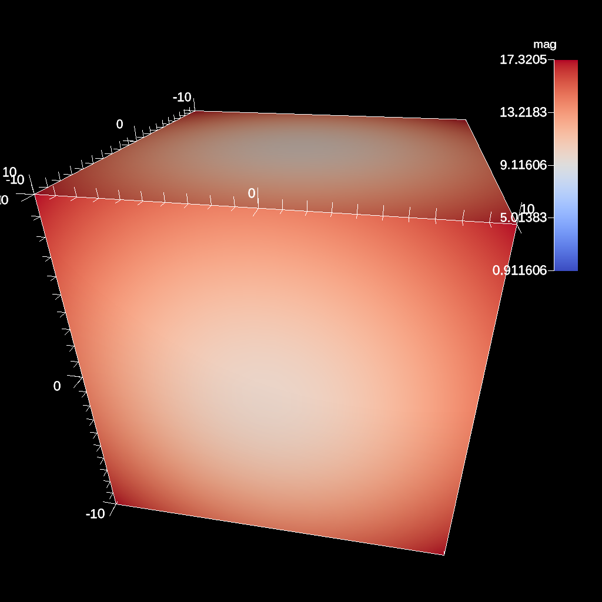

.. ############################################################################
.. # Copyright (c) Lawrence Livermore National Security, LLC and other Ascent
.. # Project developers. See top-level LICENSE AND COPYRIGHT files for dates and
.. # other details. No copyright assignment is required to contribute to Ascent.
.. ############################################################################

.. _Pipelines:

Pipelines
=========
Pipelines allow users to compose filters that transform the published input data into new meshes.
This is where users specify typical geometric transforms (e.g., clipping and slicing), field based transforms (e.g., threshold and contour), etc.
The resulting data from each Pipeline can be used as input to Scenes or Extracts.
Each pipeline contains one or more filters that transform the published mesh data.
When more than one filter is specified, each successive filter consumes the result of the previous filter, and filters are executed in the order in which they are declared.

The code below shows how to declare two pipelines, and generate images of the pipeline results.
The first applies a contour filter to extract two isosurfaces of the scalar field ``noise``.
The second pipeline applies a threshold filter to screen the ``noise`` field, and then a clip
filter to extract the intersection of what remains from the threshold with a sphere.

.. code-block:: c++

  conduit::Node pipelines;
  // pipeline 1
  pipelines["pl1/f1/type"] = "contour";
  // filter parameters
  conduit::Node contour_params;
  contour_params["field"] = "noise";
  constexpr int num_iso_values = 2;
  double iso_values[num_iso_values] = {0.0, 0.5};
  contour_params["iso_values"].set_external(iso_values, num_iso_values);
  pipelines["pl1/f1/params"] = contour_params;

  // pipeline 2
  pipelines["pl2/f1/type"] = "threshold";
  // filter parameters
  conduit::Node thresh_params;
  thresh_params["field"]  = "noise";
  thresh_params["min_value"] = 0.0;
  thresh_params["max_value"] = 0.5;
  pipelines["pl2/f1/params"] = thresh_params;

  pipelines["pl2/f2/type"]   = "clip";
  // filter parameters
  conduit::Node clip_params;
  clip_params["topology"] = "mesh";
  clip_params["sphere/center/x"] = 0.0;
  clip_params["sphere/center/y"] = 0.0;
  clip_params["sphere/center/z"] = 0.0;
  clip_params["sphere/radius"]   = .1;
  pipelines["pl2/f2/params/"] = clip_params;

  // make some imaages of the data
  conduit::Node scenes;
  // add a plot of pipeline 1
  scenes["s1/plots/p1/type"] = "pseudocolor";
  scenes["s1/plots/p1/pipeline"] = "pl1";
  scenes["s1/plots/p1/field"] = "noise";

  // add a plot of pipeline 2
  scenes["s2/plots/p1/type"] = "pseudocolor";
  scenes["s2/plots/p1/pipeline"] = "pl2";
  scenes["s2/plots/p1/field"] = "noise";

  // setup actions
  conduit::Node actions;

  conduit::Node add_pipelines = actions.append();
  add_pipelines["action"] = "add_pipelines";
  add_pipelines["pipelines"] = pipelines;

  conduit::Node add_scenes = actions.append();
  add_scenes["action"] = "add_scenes";
  add_scenes["scenes"] = scenes;

  actions.append()["action"] = "execute";

  Ascent ascent;
  ascent.open();
  ascent.publish(mesh); // mesh not shown
  ascent.execute(actions);
  ascent.close();

Ascent and VTK-h are under heavy development and features are being added rapidly.
As we stand up the infrastructure necessary to support a wide variety filter we created the following filters for the alpha release:

  - Contour
  - Threshold
  - Slice
  - Three Slice
  - Clip
  - Clip by field
  - Isovolume
  - Vector magnitude

In the following section we provide brief descriptions and code examples of the supported filters.
For complete code examples, please consult the unit tests located in ``src/tests/ascent``..

Filters
-------
Our filter API consists of the type of filter and the parameters associated with the filter in the general form:

.. code-block:: json

  {
    "type"   : "filter_name",
    "params":
    {
      "string_param" : "string",
      "double_param" : 2.0
    }
  }

In c++, the equivalent declarations would be as follows:

.. code-block:: c++

  conduit::Node filter;
  filter["type"] = "filter_name";
  filter["params/string_param"] = "string";
  filter["params/double_param"] = 2.0;

Included Filters
^^^^^^^^^^^^^^^^

Contour
~~~~~~~
The contour filter evaluates a node-centered scalar field for all points at a given iso-value.
This results in a surface if the iso-value is within the scalar field.
``iso_vals`` can contain a single double or an array of doubles.
Additionally, instead of specifying exact iso-values, a number of 'levels' can be entered.
In this case, iso-values will be created evenly spaced through the scalar range. For example,
if the scalar range is `[0.0, 1.0]` and 'levels' is set to `3`, then the iso-values `(0.25, 0.5, 0.75)`
will be created.
The code below provides examples creating a pipeline using all three methods:

.. code-block:: c++

  conduit::Node pipelines;
  // pipeline 1
  pipelines["pl1/f1/type"] = "contour";
  // filter knobs
  conduit::Node &contour_params = pipelines["pl1/f1/params"];
  contour_params["field"] = "braid";
  contour_params["iso_values"] = -0.4;

.. code-block:: c++

  conduit::Node pipelines;
  // pipeline 1
  pipelines["pl1/f1/type"] = "contour";
  // filter knobs
  conduit::Node &contour_params = pipelines["pl1/f1/params"];
  contour_params["field"] = "braid";
  constexpr int num_iso_values = 3;
  double iso_vals[num_iso_values] = {-0.4, 0.2, 0.4};
  contour_params["iso_values"].set_external(iso_vals, num_iso_values);

.. _contourfig:

..  figure:: ../images/contour.png
    :scale: 50 %
    :align: center

    An example image of multiple contours produced using the previous code sample.

.. code-block:: c++

  conduit::Node pipelines;
  // pipeline 1
  pipelines["pl1/f1/type"] = "contour";
  // filter knobs
  conduit::Node &contour_params = pipelines["pl1/f1/params"];
  contour_params["field"] = "braid";
  contour_params["levels"] = 5;

.. _contourlevelsfig:

..  figure:: ../images/contour_levels.png
    :scale: 50 %
    :align: center

    An example of creating five evenly spaced iso-values through a scalar field.

:numref:`Figure %s <contourfig>` shows an image produced from multiple contours.
All contour examples are  located in the test in the file `contour test <https://github.com/Alpine-DAV/ascent/blob/develop/src/tests/ascent/t_ascent_contour.cpp>`_.

Threshold
~~~~~~~~~
The threshold filter removes cells that are not contained within a specified scalar range.

.. code-block:: c++

  conduit::Node pipelines;
  // pipeline 1
  pipelines["pl1/f1/type"] = "threshold";
  // filter knobs
  conduit::Node &thresh_params = pipelines["pl1/f1/params"];
  thresh_params["field"] = "braid";
  thresh_params["min_value"] = -0.2;
  thresh_params["max_value"] = 0.2;

.. _thresholdfig:

..  figure:: ../images/threshold.png
    :scale: 50 %
    :align: center

    An example image of the threshold filter using the previous code sample.

:numref:`Figure %s <thresholdfig>` shows an image produced from a threshold filter.
The full example is located in the file `threshold test <https://github.com/Alpine-DAV/ascent/blob/develop/src/tests/ascent/t_ascent_threshold.cpp>`_.

Slice
~~~~~
The slice filter extracts a 2d plane from a 3d data set.
The plane is defined by a point (on the plane) and a normal vector (not required to be normalized).

.. code-block:: c++

  conduit::Node pipelines;
  pipelines["pl1/f1/type"] = "slice";
  // filter knobs
  conduit::Node &slice_params = pipelines["pl1/f1/params"];
  slice_params["point/x"] = 0.f;
  slice_params["point/y"] = 0.f;
  slice_params["point/z"] = 0.f;

  slice_params["normal/x"] = 0.f;
  slice_params["normal/y"] = 0.f;
  slice_params["normal/z"] = 1.f;

.. _slicefig:

..  figure:: ../images/slice.png
    :scale: 50 %
    :align: center

    An example image of the slice filter on a element-centered variable using the previous code sample.

:numref:`Figure %s <slicefig>` shows an image produced from the slice filter.
The full example is located in the file `slice test <https://github.com/Alpine-DAV/ascent/blob/develop/src/tests/ascent/t_ascent_slice.cpp>`_.

Three Slice
~~~~~~~~~~~
The three slice filter slices 3d data sets using three axis-aligned slice planes and
leaves the resulting planes in 3d where they can all be viewed at the same time.
Three slice is meant primarily for quick visual exploration of 3D data where the
internal features cannot be readily observed from the outside.

The slice planes will automatically placed at the center of the data sets spatial extents.
Optionally, offsets for each plane can be specified. Offsets for each axis are specified
by a floating point value in the range ``[-1.0, 1.0]``, where ``-1.0`` places the plane at the
minimum spatial extent on the axis, ``1.0`` places the plane at the maximum spatial extent
on the axis, and ``0.0`` places the plane at the center of the spatial extent. By default,
all three offsets are ``0.0``.

.. code-block:: c++

  conduit::Node pipelines;
  pipelines["pl1/f1/type"] = "3slice";

.. _threeslicefig:

..  figure:: ../images/three_slice.png
    :scale: 50 %
    :align: center

    An example image of the three slice filter on a element-centered variable using the
    previous code sample with automatic slice plane placement.

.. code-block:: c++

  conduit::Node pipelines;
  pipelines["pl1/f1/type"] = "3slice";

  // filter knobs (all these are optional)
  conduit::Node &slice_params = pipelines["pl1/f1/params"];
  slice_params["x_offset"] = 1.f;   // largest value on the x-axis
  slice_params["y_offset"] = 0.f;   // middle of the y-axis
  slice_params["z_offset"] = -1.f;  // smalles value of the z-axis

.. _threeslice2fig:

..  figure:: ../images/three_slice2.png
    :scale: 50 %
    :align: center

    An example image of the three slice filter on a element-centered variable using the
    previous code sample with user specified offsets for each axis.

:numref:`Figures %s <threeslicefig>` and :numref:`%s <threeslice2fig>` show an images produced from the three slice filter.
The full example is located in the file `slice test <https://github.com/Alpine-DAV/ascent/blob/develop/src/tests/ascent/t_ascent_slice.cpp>`_.

Clip
~~~~
The clip filter removes cells from the specified topology using implicit functions.
By default, only the area outside of the implicit function remains, but the clip
can be inverted. There are three implicit functions that clip can use: sphere, box,
and plane.

.. code-block:: c++

  // define a clip by a sphere
  conduit::Node pipelines;
  // pipeline 1
  pipelines["pl1/f1/type"] = "clip";
  // filter knobs
  conduit::Node &clip_params = pipelines["pl1/f1/params"];
  clip_params["topology"] = "mesh";
  clip_params["sphere/radius"] = 11.;
  clip_params["sphere/center/x"] = 0.;
  clip_params["sphere/center/y"] = 0.;
  clip_params["sphere/center/z"] = 0.;

.. _clipspherefig:

..  figure:: ../images/clip.png
    :scale: 50 %
    :align: center

    An example image of the clip filter using the previous code sample.
    The data set is a cube with extents from (-10, -10, -10) to (10, 10, 10), and the code removes a sphere centered at the origin with a radius of 11.

.. code-block:: c++

  conduit::Node pipelines;
  // pipeline 1
  pipelines["pl1/f1/type"] = "clip";
  // filter knobs
  conduit::Node &clip_params = pipelines["pl1/f1/params"];
  clip_params["topology"] = "mesh";
  clip_params["invert"] = "true";
  clip_params["sphere/radius"] = 11.;
  clip_params["sphere/center/x"] = 0.;
  clip_params["sphere/center/y"] = 0.;
  clip_params["sphere/center/z"] = 0.;

.. _clipsphereInvertedfig:

..  figure:: ../images/clip_inverted.png
    :scale: 50 %
    :align: center

    An example of the same sphere clip, but in this case, the clip is inverted.

.. code-block:: c++

  // define a clip by a box
  conduit::Node pipelines;
  // pipeline 1
  pipelines["pl1/f1/type"] = "clip";
  // filter knobs
  conduit::Node &clip_params = pipelines["pl1/f1/params"];
  clip_params["topology"] = "mesh";
  clip_params["box/min/x"] = 0.;
  clip_params["box/min/y"] = 0.;
  clip_params["box/min/z"] = 0.;
  clip_params["box/max/x"] = 10.01; // <=
  clip_params["box/max/y"] = 10.01;
  clip_params["box/max/z"] = 10.01;

.. _clipboxfig:

..  figure:: ../images/box_clip.png
    :scale: 50 %
    :align: center

    A box clip of the same data set that removes the octant on the positive x, y, and z axes.

.. code-block:: c++

  conduit::Node pipelines;
  // pipeline 1
  pipelines["pl1/f1/type"] = "clip";
  // filter knobs
  conduit::Node &clip_params = pipelines["pl1/f1/params"];
  clip_params["topology"] = "mesh";
  clip_params["plane/point/x"] = 0.;
  clip_params["plane/point/y"] = 0.;
  clip_params["plane/point/z"] = 0.;
  clip_params["plane/normal/x"] = 1.;
  clip_params["plane/normal/y"] = 0.;
  clip_params["plane/normal/z"] = 0;

.. _clipplanefig:

..  figure:: ../images/clip_plane.png
    :scale: 50 %
    :align: center

    Clipping by a plane defined by a point on the plane and the plane normal.

:numref:`Figures %s <clipspherefig>`,
:numref:`%s <clipsphereInvertedfig>`,
:numref:`%s <clipboxfig>`, and
:numref:`%s <clipplanefig>` show an images produced from the clip filter.
All of the clip  examples are located in the file `clip test <https://github.com/Alpine-DAV/ascent/blob/develop/src/tests/ascent/t_ascent_clip.cpp>`_.

Clip By Field
~~~~~~~~~~~~~
The clip by field filter removes cells from the specified topology using the values in a scalar field.
By default, all values below the clip value are removed from the data set. As with clip by implicit function,
the clip can be inverted.

.. code-block:: c++

  conduit::Node pipelines;
  // pipeline 1
  pipelines["pl1/f1/type"] = "clip_with_field";
  // filter knobs
  conduit::Node &clip_params = pipelines["pl1/f1/params"];
  clip_params["field"] = "braid";
  clip_params["clip_value"] = 0.;

.. _clipfieldfig:

..  figure:: ../images/clip_field.png
    :scale: 50 %
    :align: center

    An example of clipping all values below 0 in a data set.

.. code-block:: c++

  conduit::Node pipelines;
  // pipeline 1
  pipelines["pl1/f1/type"] = "clip_with_field";
  // filter knobs
  conduit::Node &clip_params = pipelines["pl1/f1/params"];
  clip_params["field"] = "braid";
  clip_params["invert"] = "true";
  clip_params["clip_value"] = 0.;

.. _clipfieldinvertedfig:

..  figure:: ../images/clip_field_inverted.png
    :scale: 50 %
    :align: center

    An example of clipping all values above 0 in a data set.

IsoVolume
~~~~~~~~~
IsoVolume is a filter that clips a data set based on a minimum
and maximum value in a scalar field. All value outside of the minimum and maximum
values are removed from the data set.

.. code-block:: c++

  conduit::Node pipelines;
  // pipeline 1
  pipelines["pl1/f1/type"] = "iso_volume";
  // filter knobs
  conduit::Node &clip_params = pipelines["pl1/f1/params"];
  clip_params["field"] = "braid";
  clip_params["min_value"] = 5.;
  clip_params["max_value"] = 10.;

.. _isovolume:

..  figure:: ../images/iso_volume.png
    :scale: 50 %
    :align: center

    An example of creating a iso-volume of values between 5.0 and 10.0.

Vector Magnitude
~~~~~~~~~~~~~~~~
Vector magnitude creates a new field on the data set representing the magitude
of a vector variable. The only parameters are the input vector field name
and the name of the new field.

.. code-block:: c++

  conduit::Node pipelines;
  // pipeline 1
  pipelines["pl1/f1/type"] = "vector_magnitude";
  // filter knobs (all these are optional)
  conduit::Node &params = pipelines["pl1/f1/params"];
  params["field"] = "vel";         // name of the vector field
  params["output_name"] = "mag";   // name of the output field

.. _vecmag:

    An example of creating a pseudocolor plot of vector magnitude

Vector Component
~~~~~~~~~~~~~~~~
Vector component creates a new scalar field on the data set by
extracting a component of a vector field. There are three required
parameters: the input field, the output field name, and the index
of the component to extract.

.. code-block:: c++

  conduit::Node pipelines;
  // pipeline 1
  pipelines["pl1/f1/type"] = "vector_component";
  // filter knobs (all these are optional)
  conduit::Node &params = pipelines["pl1/f1/params"];
  params["field"] = "vel";         // name of the vector field
  params["output_name"] = "vel_x"; // name of the output field
  params["component"] = 0; // index of the component

Composite Vector
~~~~~~~~~~~~~~~~
Composite Vector creates a new vector field on the data set
by combining two or three scalar fields into a vector.
The first two fields are required and the presense of the
third field dictates whether a 2D or 3D vector is created.
Input fields can be different types (e.g., int32 and float32),
and the resulting vector field will be a float64.

.. code-block:: c++

  conduit::Node pipelines;
  // pipeline 1
  pipelines["pl1/f1/type"] = "vector_component";
  // filter knobs (all these are optional)
  conduit::Node &params = pipelines["pl1/f1/params"];
  params["field1"] = "pressure";      // (required)
  params["field1"] = "temperature";   // (required)
  params["field1"] = "bananas";       // (optional, 2D vector if not present)
  params["output_name"] = "my_vec";   // (required) name of the output field
  params["component"] = 0; // (required) index of the component

Recenter
~~~~~~~~
Recenter changes the association of a field. Fields associated with either `element` or `vertex` can
be interchanged by averaging the surrounding values. When recentering to a element associated field, all vertex
values incident to a element are averaged, and similarly when rencentering to a vertex associated field,
all element values incident to the vertex are averaged. If a field is already of the desired associated, then
the nothing is done and the field is simply passed through the filter. Note: ghost zones must be available when
the data set has more than one domain. Without ghost, the averaging will not be smooth across domain boundaries.

.. code-block:: c++

  conduit::Node pipelines;
  // pipeline 1
  pipelines["pl1/f1/type"] = "recenter";
  conduit::Node &params = pipelines["pl1/f1/params"];
  params["field"] = "braid";         // name of the vector field
  params["association"] = "vertex";   // output field association
  // or params["association"] = "element";   // output field association

Gradient
~~~~~~~~
Computes the gradient of a vertex-centered input field for every element
in the input data set. Fields will be automaticall recentered if they
are elemenet-centered.
The gradient computation can either generate cell center based gradients,
which are fast but less accurate, or more accurate but slower
point based gradients (default).

.. code-block:: c++

  conduit::Node pipelines;
  // pipeline 1
  pipelines["pl1/f1/type"] = "gradient";
  // filter knobs (all these are optional)
  conduit::Node &params = pipelines["pl1/f1/params"];
  params["field"] = "velocity";          // (required)
  params["output_name"] = "my_grad";     // (required) name of the output field
  params["use_cell_gradient"] = "false"; // (optional)

Vorticity
~~~~~~~~~
Computes the vorticity of a vertex-centered input field for every element
in the input data set. Fields will be automaticall recentered if they
are elemenet-centered.
The vorticity computation (based on the gradient) can either generate
cell center based gradients, which are fast but less accurate, or more
accurate but slower point based gradients (default).

.. code-block:: c++

  conduit::Node pipelines;
  // pipeline 1
  pipelines["pl1/f1/type"] = "vorticity";
  // filter knobs (all these are optional)
  conduit::Node &params = pipelines["pl1/f1/params"];
  params["field"] = "velocity";          // (required)
  params["output_name"] = "my_vorticity";// (required) name of the output field
  params["use_cell_gradient"] = "false"; // (optional)

Q-Criterion
~~~~~~~~~~~
Computes the qcriterion of a vertex-centered input field for every element
in the input data set. Fields will be automaticall recentered if they
are elemenet-centered.
The qcriterion computation (based on the gradient) can either generate
cell center based gradients, which are fast but less accurate, or more
accurate but slower point based gradients (default).

.. code-block:: c++

  conduit::Node pipelines;
  // pipeline 1
  pipelines["pl1/f1/type"] = "qcriterion";
  // filter knobs (all these are optional)
  conduit::Node &params = pipelines["pl1/f1/params"];
  params["field"] = "velocity";          // (required)
  params["output_name"] = "my_q";        // (required) name of the output field
  params["use_cell_gradient"] = "false"; // (optional)

