.. ############################################################################
.. # Copyright (c) 2015-2018, Lawrence Livermore National Security, LLC.
.. #
.. # Produced at the Lawrence Livermore National Laboratory
.. #
.. # LLNL-CODE-716457
.. #
.. # All rights reserved.
.. #
.. # This file is part of Ascent.
.. #
.. # For details, see: http://ascent.readthedocs.io/.
.. #
.. # Please also read ascent/LICENSE
.. #
.. # Redistribution and use in source and binary forms, with or without
.. # modification, are permitted provided that the following conditions are met:
.. #
.. # * Redistributions of source code must retain the above copyright notice,
.. #   this list of conditions and the disclaimer below.
.. #
.. # * Redistributions in binary form must reproduce the above copyright notice,
.. #   this list of conditions and the disclaimer (as noted below) in the
.. #   documentation and/or other materials provided with the distribution.
.. #
.. # * Neither the name of the LLNS/LLNL nor the names of its contributors may
.. #   be used to endorse or promote products derived from this software without
.. #   specific prior written permission.
.. #
.. # THIS SOFTWARE IS PROVIDED BY THE COPYRIGHT HOLDERS AND CONTRIBUTORS "AS IS"
.. # AND ANY EXPRESS OR IMPLIED WARRANTIES, INCLUDING, BUT NOT LIMITED TO, THE
.. # IMPLIED WARRANTIES OF MERCHANTABILITY AND FITNESS FOR A PARTICULAR PURPOSE
.. # ARE DISCLAIMED. IN NO EVENT SHALL LAWRENCE LIVERMORE NATIONAL SECURITY,
.. # LLC, THE U.S. DEPARTMENT OF ENERGY OR CONTRIBUTORS BE LIABLE FOR ANY
.. # DIRECT, INDIRECT, INCIDENTAL, SPECIAL, EXEMPLARY, OR CONSEQUENTIAL
.. # DAMAGES  (INCLUDING, BUT NOT LIMITED TO, PROCUREMENT OF SUBSTITUTE GOODS
.. # OR SERVICES; LOSS OF USE, DATA, OR PROFITS; OR BUSINESS INTERRUPTION)
.. # HOWEVER CAUSED AND ON ANY THEORY OF LIABILITY, WHETHER IN CONTRACT,
.. # STRICT LIABILITY, OR TORT (INCLUDING NEGLIGENCE OR OTHERWISE) ARISING
.. # IN ANY WAY OUT OF THE USE OF THIS SOFTWARE, EVEN IF ADVISED OF THE
.. # POSSIBILITY OF SUCH DAMAGE.
.. #
.. ############################################################################

Pipelines
=========
Pipelines allow users to compose filters that transform the published input data into new meshes.
This is where users specify typical geometric transforms (e.g., clipping and slicing), field based transforms (e.g., threshold and contour), etc. 
The resulting data from each Pipeline can be used as input to Scenes or Extracts. 
Each pipeline contains one or more filters that transform the published mesh data.
When more than one filter is specified, each successive filter consumes the result of the previous filter, and filters are executed in the order in which they are declared.

The code below shows the declaration of two pipelines. 
The first applies a contour filter to extract two isosurfaces of the scalar field ``noise``. 
The second pipeline applies a threshold filter to screen the ``noise`` field, and then a clip filter to extract the intersection of what remains from the threshold with a sphere.

.. code-block:: c++

  conduit::Node pipelines;
  // pipeline 1
  pipelines["pl1/f1/type"] = "contour";
  // filter parameters 
  conduit::Node contour_params; 
  contour_params["field"] = "noise";
  contour_params["iso_values"] = {0.0, 0.5};
  pipelines["pl1/f1/params"] = contour_params;

  // pipeline 2 
  pipelines["pl2/f1/type"] = "threshold";
  // filter parameters
  conduit::Node thresh_params;
  thresh_params["field"]  = "noise";
  thresh_params["min_value"] = 0.0;
  thresh_params["max_value"] = 0.5;
  pipelines["pl2/f1/params"] = thresh_params;

  pipelines["pl2/f2/type"]   = "clip";
  // filter parameters
  conduit::Node clip_params; 
  clip_params["topology"] = "mesh";
  clip_params["sphere/center/x"] = 0.0;
  clip_params["sphere/center/y"] = 0.0;
  clip_params["sphere/center/z"] = 0.0;
  clip_params["sphere/radius"]   = .1;
  pipelines["pl2/f2/params/"] = clip_params;

Ascent and VTK-h are under heavy development and features are being added rapidly. 
As we stand up the infrastructure necessary to support a wide variety filter we created the following filters for the alpha release:

  - Contour
  - Threshold
  - Slice
  - Three Slice 
  - Clip 

Filters
-------
Our filter API consists of the type of filter and the parameters associated with the filter in the general form:

.. code-block:: json

  {
    "type"   : "filter_name",
    "params": 
    {
      "string_param" : "string",
      "double_param" : 2.0
    }
  }

In c++, the equivalent declarations would be as follows:

.. code-block:: c++

  conduit::Node filter;
  filter["type"] = "filter_name";
  filter["params/string_param"] = "string";
  filter["params/double_param"] = 2.0;

Included Filters
^^^^^^^^^^^^^^^^

Contour
~~~~~~~
The contour filter evaluates a node-centered scalar field for all points at a given iso-value.
This results in a surface if the iso-value is within the scalar field. 
``iso_vals`` can contain a single double or an array of doubles. 
Additionally, instead of specifying exact iso-values, a number of 'levels' can be entered.
In this case, iso-values will be created evenly spaced through the scalar range. For example,
if the scalar range is `[0.0, 1.0]` and 'levels' is set to `3`, then the iso-values `(0.25, 0.5, 0.75)`
will be created.
The code below provides examples creating a pipeline using all three methods:

.. code-block:: c++

  conduit::Node pipelines;
  // pipeline 1
  pipelines["pl1/f1/type"] = "contour";
  // filter knobs
  conduit::Node &contour_params = pipelines["pl1/f1/params"];
  contour_params["field"] = "braid";
  contour_params["iso_values"] = -0.4;

.. code-block:: c++

  conduit::Node pipelines;
  // pipeline 1
  pipelines["pl1/f1/type"] = "contour";
  // filter knobs
  conduit::Node &contour_params = pipelines["pl1/f1/params"];
  contour_params["field"] = "braid";
  double iso_vals[3] = {-0.4, 0.2, 0.4};
  contour_params["iso_values"].set_external(iso_vals,3);

.. _contourfig:

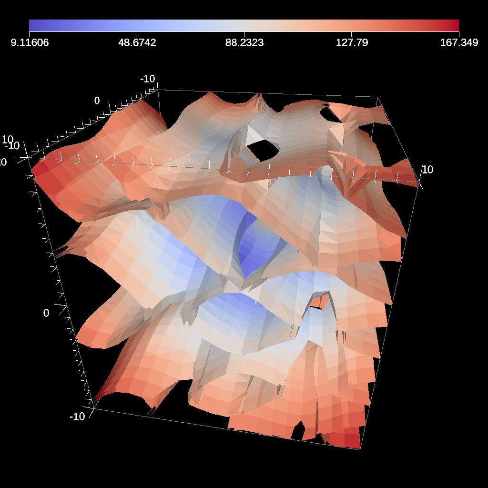

    An example image of multiple contours produced using the previous code sample.

.. code-block:: c++

  conduit::Node pipelines;
  // pipeline 1
  pipelines["pl1/f1/type"] = "contour";
  // filter knobs
  conduit::Node &contour_params = pipelines["pl1/f1/params"];
  contour_params["field"] = "braid";
  contour_params["levels"] = 5;

.. _contourlevelsfig:

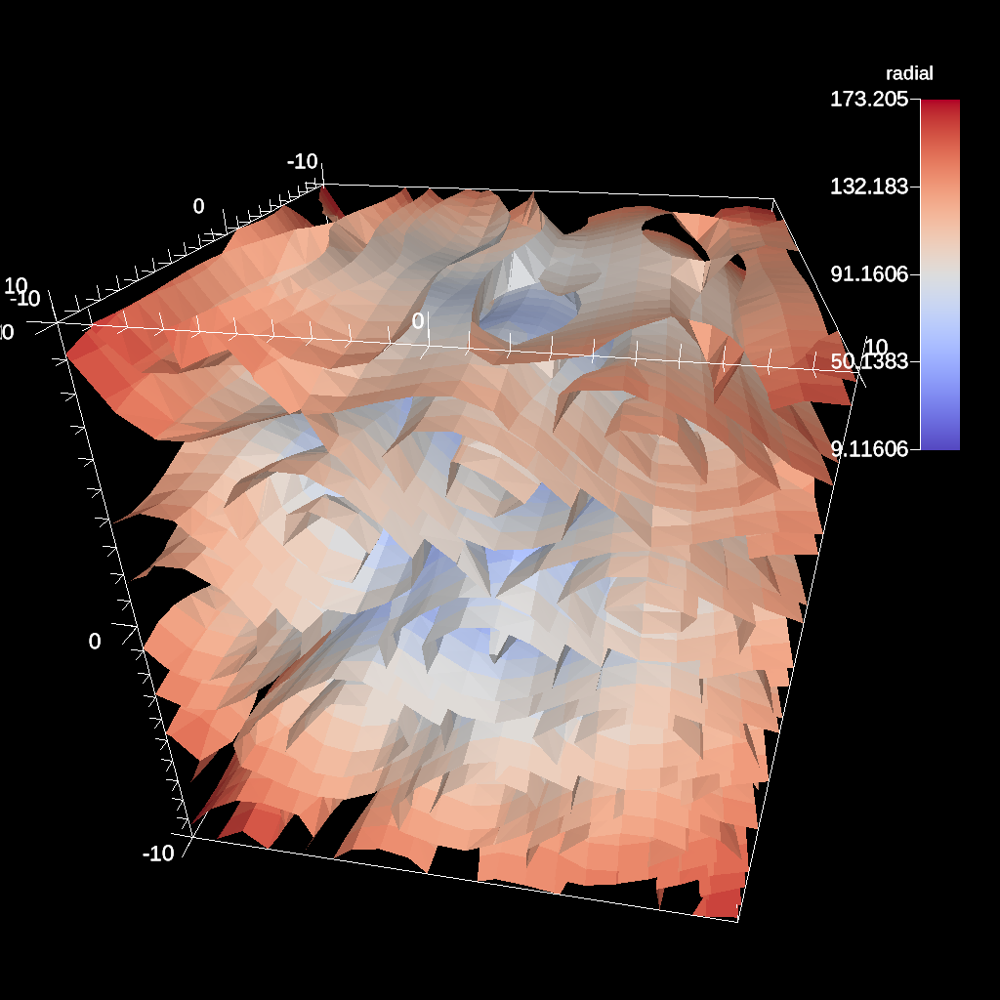

    An example of creating five evenly spaced iso-values through a scalar field.

:numref:`Figure %s <contourfig>` shows an image produced from mulitple contours. 
All contour examples are  located in the test in the file `contour test <https://github.com/Alpine-DAV/ascent/blob/develop/src/tests/ascent/t_ascent_contour.cpp>`_.

Threshold
~~~~~~~~~
The threshold filter removes cells that are not contained within a specified scalar range.

.. code-block:: c++

  conduit::Node pipelines;
  // pipeline 1
  pipelines["pl1/f1/type"] = "threshold";
  // filter knobs
  conduit::Node &thresh_params = pipelines["pl1/f1/params"];
  thresh_params["field"] = "braid";
  thresh_params["min_value"] = -0.2;
  thresh_params["max_value"] = 0.2;

.. _thresholdfig:

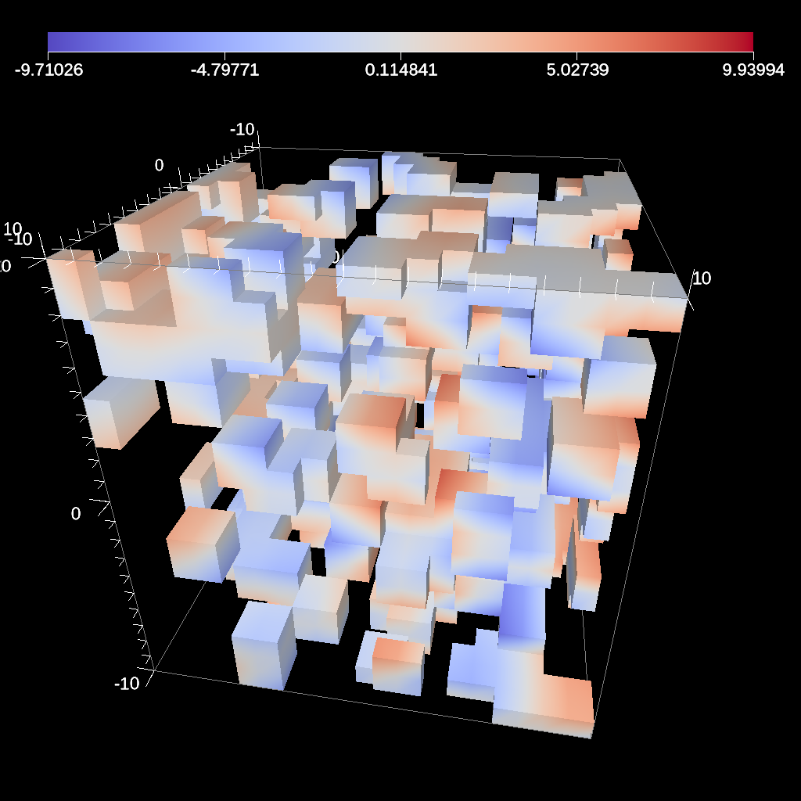

    An example image of the threshold filter using the previous code sample.

:numref:`Figure %s <thresholdfig>` shows an image produced from a threshold filter. 
The full example is located in the file `threshold test <https://github.com/Alpine-DAV/ascent/blob/develop/src/tests/ascent/t_ascent_threshold.cpp>`_.

Slice
~~~~~
The slice filter extracts a 2d plane from a 3d data set. 
The plane is defined by a point (on the plane) and a normal vector (not required to be nomalized).

.. code-block:: c++

  conduit::Node pipelines;
  pipelines["pl1/f1/type"] = "slice";
  // filter knobs
  conduit::Node &slice_params = pipelines["pl1/f1/params"];
  slice_params["point/x"] = 0.f;
  slice_params["point/y"] = 0.f;
  slice_params["point/z"] = 0.f;

  slice_params["normal/x"] = 0.f;
  slice_params["normal/y"] = 0.f;
  slice_params["normal/z"] = 1.f;
  
.. _slicefig:

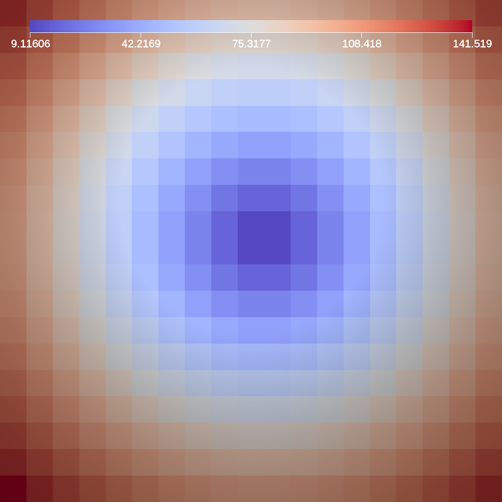

    An example image of the slice filter on a zone-centered variable using the previous code sample. 

:numref:`Figure %s <slicefig>` shows an image produced from the slice filter. 
The full example is located in the file `slice test <https://github.com/Alpine-DAV/ascent/blob/develop/src/tests/ascent/t_ascent_slice.cpp>`_.

Three Slice
~~~~~~~~~~~
The three slice filter slices 3d data sets using three axis-aligned slice planes and 
leaves the resulting planes in 3d where they can all be viewed at the same time.
Three slice is meant primarily for quick visual exploration of 3D data where the 
internal features cannot be readily observed from the outside. 

The slice planes will automatically placed at the center of the data sets spatial extents. 
Optionally, offsets for each plane can be specified. Offsets for each axis are specified 
by a floating point value in the range ``[-1.0, 1.0]``, where ``-1.0`` places the plane at the
minimum spatial extent on the axis, ``1.0`` places the plane at the maximum spatial extent
on the axis, and ``0.0`` places the plane at the center of the spatial extent. By default,
all three offsets are ``0.0``.

.. code-block:: c++

  conduit::Node pipelines;
  pipelines["pl1/f1/type"] = "3slice";
  
.. _threeslicefig:

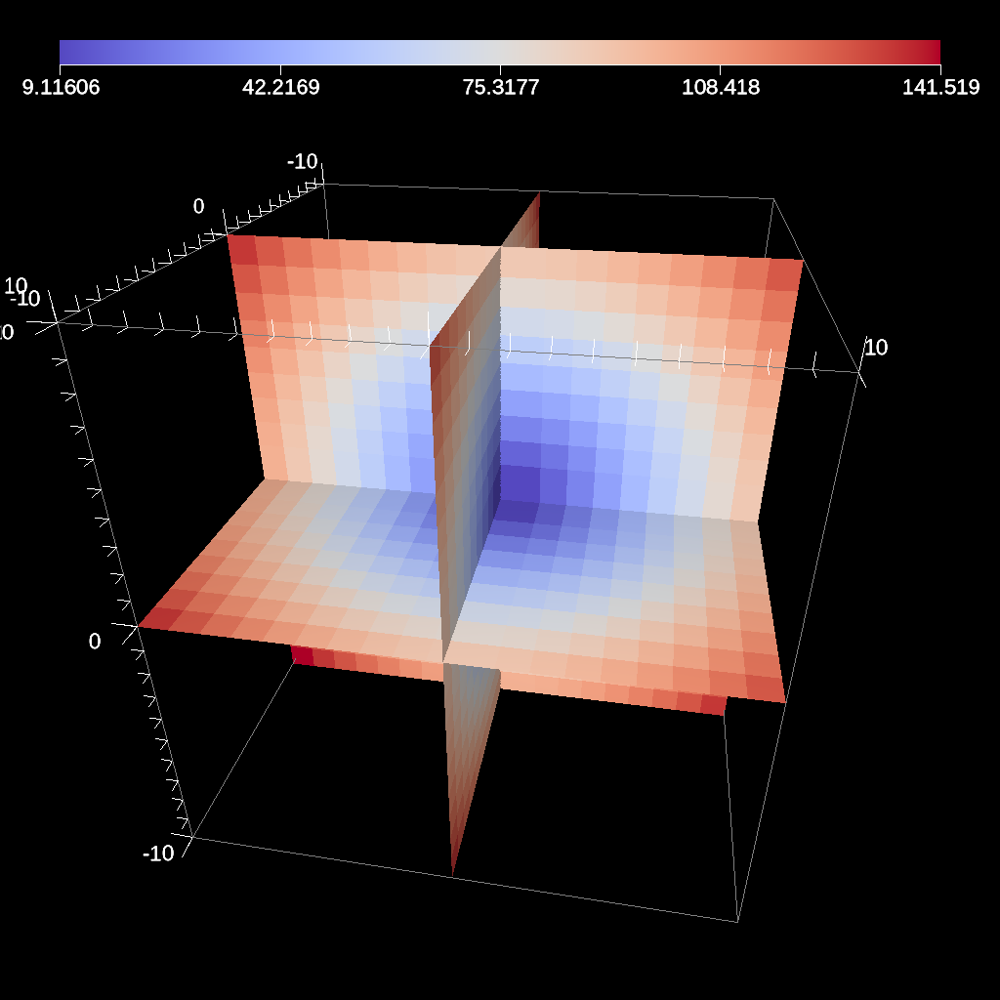

    An example image of the three slice filter on a zone-centered variable using the 
    previous code sample with automatic slice plane placement. 

.. code-block:: c++

  conduit::Node pipelines;
  pipelines["pl1/f1/type"] = "3slice";
  
  // filter knobs (all these are optional)
  conduit::Node &slice_params = pipelines["pl1/f1/params"];
  slice_params["x_offset"] = 1.f;   // largest value on the x-axis
  slice_params["y_offset"] = 0.f;   // middle of the y-axis
  slice_params["z_offset"] = -1.f;  // smalles value of the z-axis

.. _threeslice2fig:

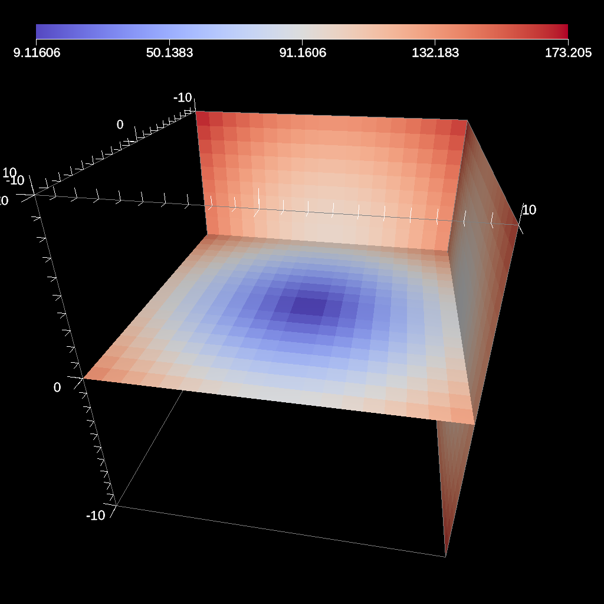

    An example image of the three slice filter on a zone-centered variable using the 
    previous code sample with user specified offsets for each axis. 

:numref:`Figures %s <threeslicefig>` and :numref:`%s <threeslice2fig>` show an images produced from the three slice filter. 
The full example is located in the file `slice test <https://github.com/Alpine-DAV/ascent/blob/develop/src/tests/ascent/t_ascent_slice.cpp>`_.

Clip
~~~~
The clip filter removes cells from the specified topology using implicit functions. 
By default, only the area outside of the implicit function remains, but the clip
can be inverted. There are three implicit functions that clip can use: sphere, box, 
and plane. 

.. code-block:: c++

  // define a clip by a sphere
  conduit::Node pipelines;
  // pipeline 1
  pipelines["pl1/f1/type"] = "clip";
  // filter knobs
  conduit::Node &clip_params = pipelines["pl1/f1/params"];
  clip_params["topology"] = "mesh";
  clip_params["sphere/radius"] = 11.;
  clip_params["sphere/center/x"] = 0.;
  clip_params["sphere/center/y"] = 0.;
  clip_params["sphere/center/z"] = 0.;
  
.. _clipspherefig:

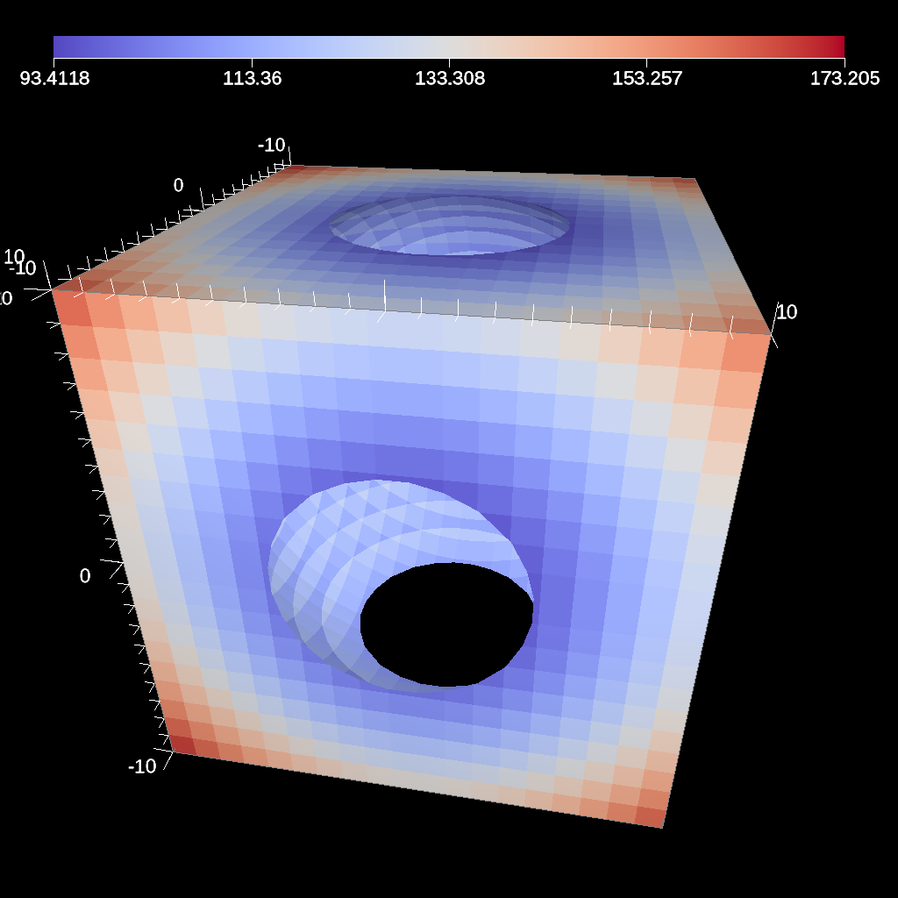

    An example image of the clip filter using the previous code sample. 
    The data set is a cube with extents from (-10, -10, -10) to (10, 10, 10), and the code removes a sphere centered at the origin with a radius of 11.

.. code-block:: c++

  conduit::Node pipelines;
  // pipeline 1
  pipelines["pl1/f1/type"] = "clip";
  // filter knobs
  conduit::Node &clip_params = pipelines["pl1/f1/params"];
  clip_params["topology"] = "mesh";
  clip_params["invert"] = "true";
  clip_params["sphere/radius"] = 11.;
  clip_params["sphere/center/x"] = 0.;
  clip_params["sphere/center/y"] = 0.;
  clip_params["sphere/center/z"] = 0.;

.. _clipsphereInvertedfig:

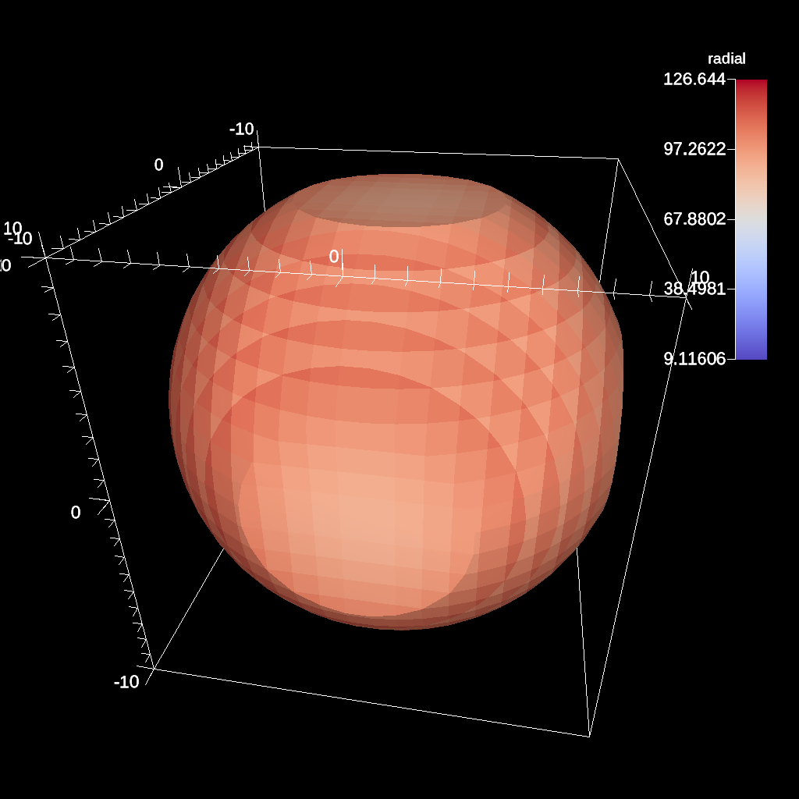
    
    An example of the same sphere clip, but in this case, the clip is inverted.

.. code-block:: c++

  // define a clip by a box 
  conduit::Node pipelines;
  // pipeline 1
  pipelines["pl1/f1/type"] = "clip";
  // filter knobs
  conduit::Node &clip_params = pipelines["pl1/f1/params"];
  clip_params["topology"] = "mesh";
  clip_params["box/min/x"] = 0.;
  clip_params["box/min/y"] = 0.;
  clip_params["box/min/z"] = 0.;
  clip_params["box/max/x"] = 10.01; // <=
  clip_params["box/max/y"] = 10.01;
  clip_params["box/max/z"] = 10.01;
  
.. _clipboxfig:

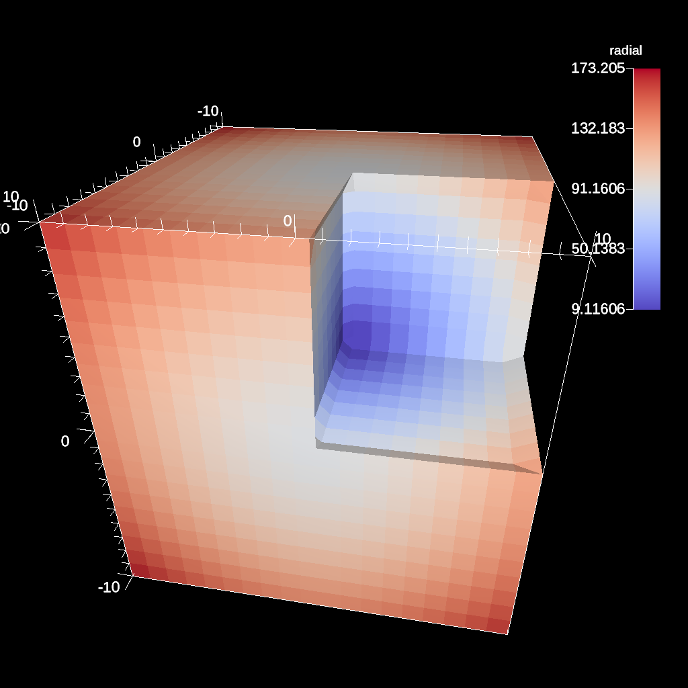

    A box clip of the same data set that removes the octant on the positive x, y, and z axes.

.. code-block:: c++

  conduit::Node pipelines;
  // pipeline 1
  pipelines["pl1/f1/type"] = "clip";
  // filter knobs
  conduit::Node &clip_params = pipelines["pl1/f1/params"];
  clip_params["topology"] = "mesh";
  clip_params["plane/point/x"] = 0.;
  clip_params["plane/point/y"] = 0.;
  clip_params["plane/point/z"] = 0.;
  clip_params["plane/normal/x"] = 1.; 
  clip_params["plane/normal/y"] = 0.;
  clip_params["plane/normal/z"] = 0;

.. _clipplanefig:

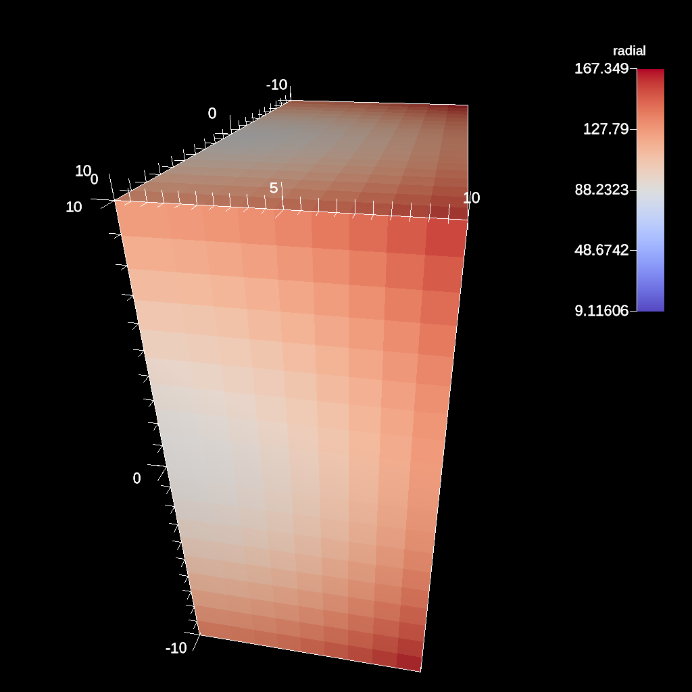
    
    Clipping by a plane defined by a point on the plane and the plane normal.

:numref:`Figures %s <clipspherefig>`, 
:numref:`%s <clipsphereInvertedfig>`,  
:numref:`%s <clipboxfig>`, and  
:numref:`%s <clipplanefig>` show an images produced from the clip filter. 
All of the clip  examples are located in the file `clip test <https://github.com/Alpine-DAV/ascent/blob/develop/src/tests/ascent/t_ascent_clip.cpp>`_.

Clip By Field
~~~~~~~~~~~~~
The clip by field filter removes cells from the specified topology using the values in a scalar field.
By default, all values below the clip value are removed from the data set. As with clip by implicit function,
 the clip can be inverted.

.. code-block:: c++

  conduit::Node pipelines;
  // pipeline 1
  pipelines["pl1/f1/type"] = "clip_with_field";
  // filter knobs
  conduit::Node &clip_params = pipelines["pl1/f1/params"];
  clip_params["field"] = "braid";
  clip_params["clip_value"] = 0.;
  
.. _clipfieldfig:

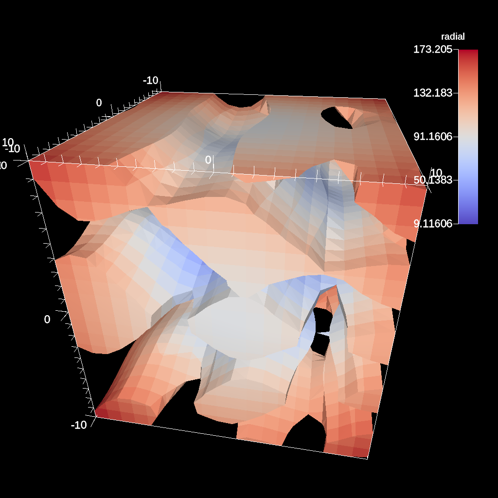

    An example of clipping all values below 0 in a data set. 

.. code-block:: c++

  conduit::Node pipelines;
  // pipeline 1
  pipelines["pl1/f1/type"] = "clip_with_field";
  // filter knobs
  conduit::Node &clip_params = pipelines["pl1/f1/params"];
  clip_params["field"] = "braid";
  clip_params["invert"] = "true";
  clip_params["clip_value"] = 0.;
  
.. _clipfieldinvertedfig:

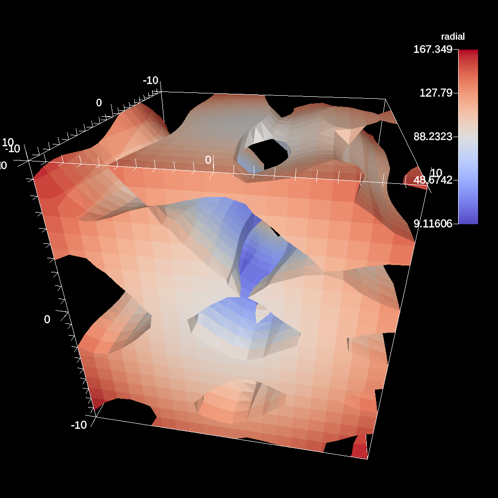

    An example of clipping all values above 0 in a data set. 

IsoVolume
~~~~~~~~~
IsoVolume is a filter that clips a data set based on a minimum 
and maximum value in a scalar field. All value outside of the minminum and maximum 
values are removed from the data set.

.. code-block:: c++

  conduit::Node pipelines;
  // pipeline 1
  pipelines["pl1/f1/type"] = "iso_volume";
  // filter knobs
  conduit::Node &clip_params = pipelines["pl1/f1/params"];
  clip_params["field"] = "braid";
  clip_params["min_value"] = 5.;
  clip_params["max_value"] = 10.;
  
.. _isovolume:

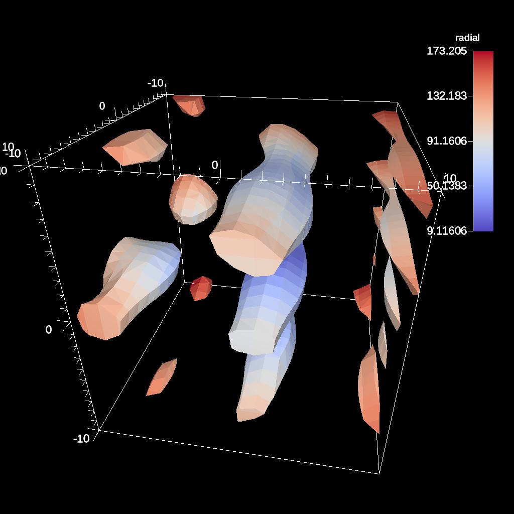

    An example of creating a iso-volume of values between 5.0 and 10.0.. 

