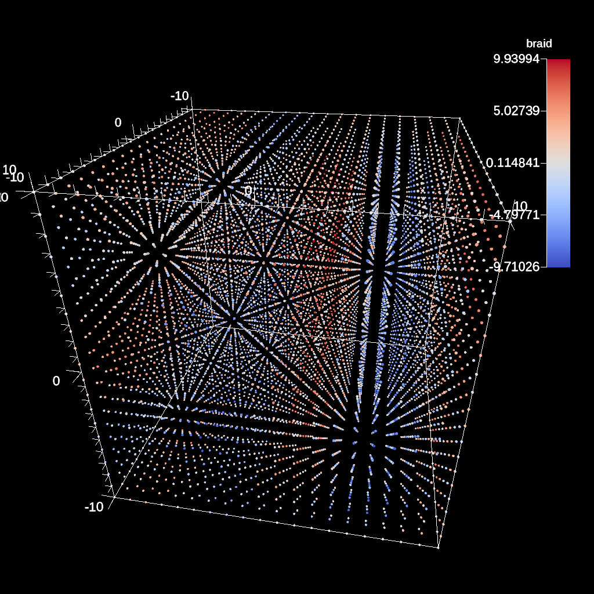
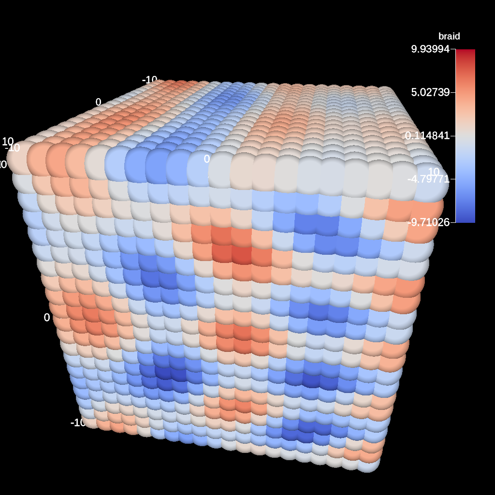
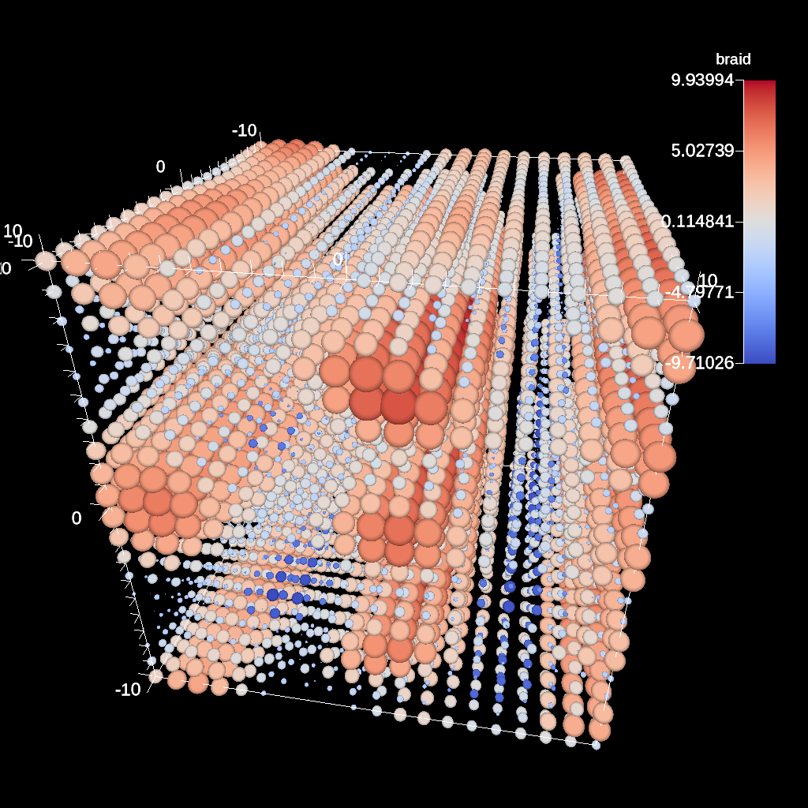
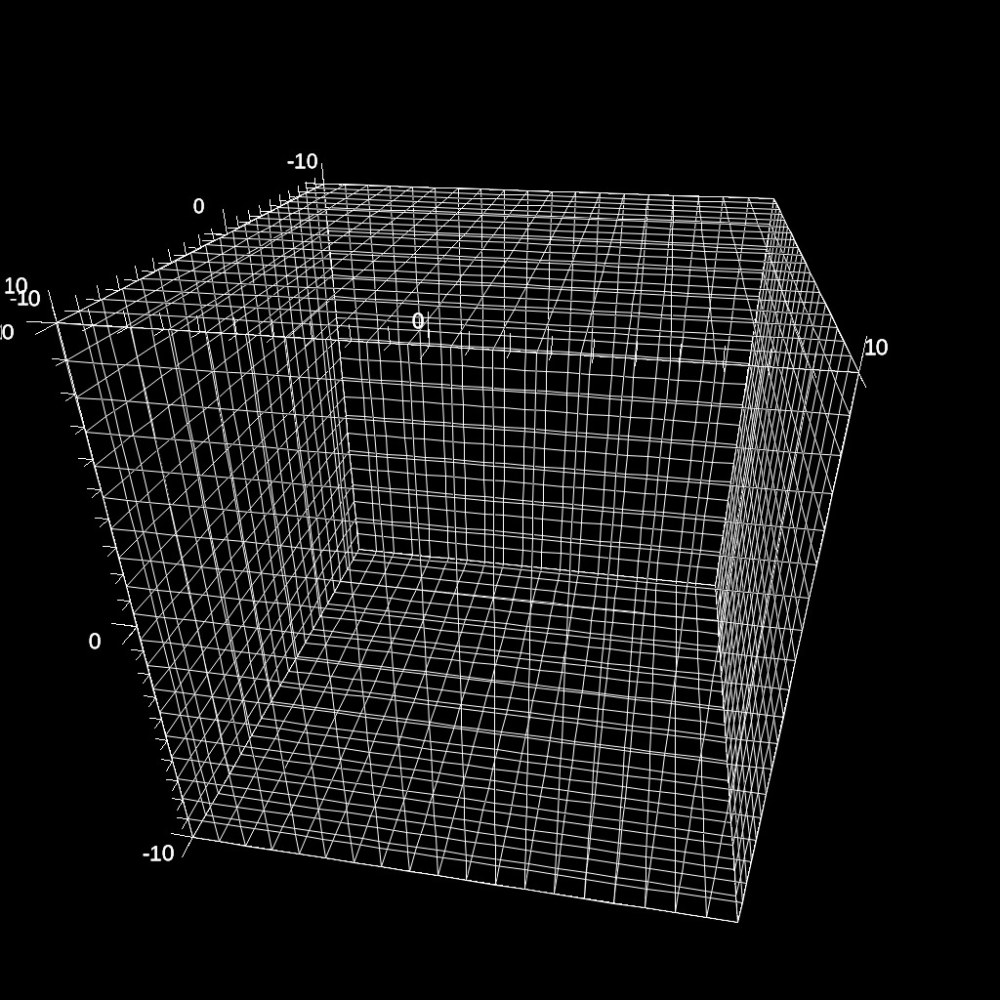

.. ############################################################################
.. # Copyright (c) 2015-2019, Lawrence Livermore National Security, LLC.
.. #
.. # Produced at the Lawrence Livermore National Laboratory
.. #
.. # LLNL-CODE-716457
.. #
.. # All rights reserved.
.. #
.. # This file is part of Ascent.
.. #
.. # For details, see: http://ascent.readthedocs.io/.
.. #
.. # Please also read ascent/LICENSE
.. #
.. # Redistribution and use in source and binary forms, with or without
.. # modification, are permitted provided that the following conditions are met:
.. #
.. # * Redistributions of source code must retain the above copyright notice,
.. #   this list of conditions and the disclaimer below.
.. #
.. # * Redistributions in binary form must reproduce the above copyright notice,
.. #   this list of conditions and the disclaimer (as noted below) in the
.. #   documentation and/or other materials provided with the distribution.
.. #
.. # * Neither the name of the LLNS/LLNL nor the names of its contributors may
.. #   be used to endorse or promote products derived from this software without
.. #   specific prior written permission.
.. #
.. # THIS SOFTWARE IS PROVIDED BY THE COPYRIGHT HOLDERS AND CONTRIBUTORS "AS IS"
.. # AND ANY EXPRESS OR IMPLIED WARRANTIES, INCLUDING, BUT NOT LIMITED TO, THE
.. # IMPLIED WARRANTIES OF MERCHANTABILITY AND FITNESS FOR A PARTICULAR PURPOSE
.. # ARE DISCLAIMED. IN NO EVENT SHALL LAWRENCE LIVERMORE NATIONAL SECURITY,
.. # LLC, THE U.S. DEPARTMENT OF ENERGY OR CONTRIBUTORS BE LIABLE FOR ANY
.. # DIRECT, INDIRECT, INCIDENTAL, SPECIAL, EXEMPLARY, OR CONSEQUENTIAL
.. # DAMAGES  (INCLUDING, BUT NOT LIMITED TO, PROCUREMENT OF SUBSTITUTE GOODS
.. # OR SERVICES; LOSS OF USE, DATA, OR PROFITS; OR BUSINESS INTERRUPTION)
.. # HOWEVER CAUSED AND ON ANY THEORY OF LIABILITY, WHETHER IN CONTRACT,
.. # STRICT LIABILITY, OR TORT (INCLUDING NEGLIGENCE OR OTHERWISE) ARISING
.. # IN ANY WAY OUT OF THE USE OF THIS SOFTWARE, EVEN IF ADVISED OF THE
.. # POSSIBILITY OF SUCH DAMAGE.
.. #
.. ############################################################################
.. _add_plot-label:

Scenes
======
A scene encapsulates the information required to generate one or more images.
To define a scene, the user specifies a collection of plots (e.g., volume or surface rendering) and associated parameters such as camera definitions, light positions, and annotations.
The simplest plot description requires only a plot type and scalar field name.
A scene defined in this way uses the default data source, which is all of the data published by the simulation, and default settings for camera position, image resolution, lighting, and annotations.

Plots
-----
We current have support for three plot types: pseudocolor, volume, and mesh.
Both plots support node centered and element centered scalar fields.
Plots optionally consume the result of a pipeline, but if none is specified, then the plot input is the published mesh data.
Each scene can contain one or more plots.
The plot interface is simply:

.. code-block:: json

  {
    "type"   : "plot_name",
    "pipeline" : "pipeline_name",
    "field" : "field_name"
  }

In c++, the equivalent declarations would be as follows:

.. code-block:: c++

  conduit::Node plot;
  plot["type"] = "plot_name";
  plot["pipeline"] = "pipeline_name";
  plot["field"] = "field_name";

Pseudocolor
^^^^^^^^^^^
A pseudocolor plot simply renders the mesh coloring by the provided scalar field.
Below is an example of creating a scene with a single pseudocolor plot with the default pipeline:

.. code-block:: c++

  conduit::Node scenes;
  scenes["s1/plots/p1/type"]         = "pseudocolor";
  scenes["s1/plots/p1/field"] = "braid";
  scenes["s1/image_prefix"] = output_file_name;

  conduit::Node actions;
  conduit::Node &add_plots = actions.append();
  add_plots["action"] = "add_scenes";
  add_plots["scenes"] = scenes;

An example of creating a scene with a user defined pipeline:

.. code-block:: c++

  conduit::Node pipelines;
  // pipeline 1
  pipelines["pl1/f1/type"] = "contour";
  // filter knobs
  conduit::Node &contour_params = pipelines["pl1/f1/params"];
  contour_params["field"] = "braid";
  contour_params["iso_values"] = 0.;

  conduit::Node scenes;
  scenes["s1/plots/p1/type"]         = "pseudocolor";
  scenes["s1/plots/p1/field"] = "radial";
  scenes["s1/plots/p1/pipeline"] = "pl1";
  scenes["s1/image_prefix"] = output_file;

  conduit::Node actions;
  // add the pipeline
  conduit::Node &add_pipelines= actions.append();
  add_pipelines["action"] = "add_pipelines";
  add_pipelines["pipelines"] = pipelines;
  // add the scenes
  conduit::Node &add_scenes= actions.append();
  add_scenes["action"] = "add_scenes";
  add_scenes["scenes"] = scenes;

In addition to surfaces, this pseudocolor color plot can render point meshes
with no additional parameters.
While there is a default point radius, the plot options allow for constant or
variable radii.

.. _pnormalfig:

    Default heuristic for points size

.. code-block:: c++

    conduit::Node scenes;
    scenes["s1/plots/p1/type"]         = "pseudocolor";
    scenes["s1/plots/p1/field"] = "braid";
    scenes["s1/plots/p1/points/radius"] = 1.f;

.. _pconst:

    Point mesh rendered with a constant radius

For variable radii, the field values are used to scale each points radius
relative to the global min and max scalar value. The inputs are the base
radius size, and the delta (multiplier) of the radius. In the example below, scalar
values at the minimum of the scalar range will have a radius of ``0.25`` and scalar
values at the max will have radii of ``0.25 + 0.5``.

.. code-block:: c++

    conduit::Node scenes;
    scenes["s1/plots/p1/type"]  = "pseudocolor";
    scenes["s1/plots/p1/field"] = "braid";
    scenes["s1/plots/p1/points/radius"] = 0.25f;
    // this detla is relative to the base radius
    scenes["s1/plots/p1/points/radius_delta"] = 2.0f;

.. _pvariable:

    Point mesh rendered with a variable radius

Volume Plot
^^^^^^^^^^^
The volume plot produces a volume rendering of the provided scalar field.
The code below creates a volume plot of the default pipeline.

.. code-block:: c++

  conduit::Node scenes;
  scenes["s1/plots/p1/type"]  = "volume";
  scenes["s1/plots/p1/field"] = "braid";

  conduit::Node actions;
  conduit::Node &add_plots = actions.append();
  add_plots["action"] = "add_scenes";
  add_plots["scenes"] = scenes;

Mesh Plot
^^^^^^^^^
The mesh plot, displays the computational mesh over which the simulations
variables are defined. The mesh plot is often added to the scene window
when other plots are visualized to allow individual cells to be clearly seen.
The code below creates a volume plot of the default pipeline.

.. code-block:: c++

  conduit::Node scenes;
  scenes["s1/plots/p1/type"]  = "mesh";

  conduit::Node actions;
  conduit::Node &add_plots = actions.append();
  add_plots["action"] = "add_scenes";
  add_plots["scenes"] = scenes;

    A mesh plot of simple grid.

Color Tables
^^^^^^^^^^^^
The color map translates normalized scalars to color values. Color maps
can be applied to each each plot in a scene.
Minimally, a color table name needs to be specified, but the ``color_table`` node allows you to specify RGB and Alpha (opacity) control points for complete customization of color maps.
Alpha control points are used when rendering volumes.
The built-in Color map names are: ``Cool to Warm``, ``Black-Body Radiation``, ``Samsel Fire``, ``Inferno``, ``Linear YGB``, ``Cold and Hot``, ``Rainbow Desaturated``, ``Cool to Warm (Extended)``, ``X Ray``, ``Black, Blue and White``, ``Viridis``, ``Linear Green``, ``Jet``, and ``Rainbow``.
Colors are three double precision values between 0 and 1.
Alphas and positions  are a single double precision values between 0 and 1.

Here is an example of specifying a color table by name:

.. code-block:: c++

  conduit::Node scenes;
  scenes["s1/plots/p1/type"]  = "pseudocolor";
  scenes["s1/plots/p1/field"] = "braid";
  scenes["s1/plots/p1/color_table/name"] = "Viridis";

Color in the table can be reversed through an optional parameter:

.. code-block:: c++

  scenes["s1/plots/p1/color_table/reverse"] = "true";

Volume plots are special since ray casting blends colors together.
When no color table is specified, alpha values are automatically created,
but when a color table is specified, then the color table needs to include
alpha values. Otherwise, the volume plot will look exactly the same as a
pseudocolor plot.

Here is an example of adding a custom color table to the volume plot:

.. code-block:: c++

  conduit::Node control_points;
  conduit::Node &point1 = control_points.append();
  point1["type"] = "rgb";
  point1["position"] = 0.;
  double color[3] = {1., 0., 0.};
  point1["color"].set_float64_ptr(color, 3);

  conduit::Node &point2 = control_points.append();
  point2["type"] = "rgb";
  point2["position"] = 0.5;
  color[0] = 0;
  color[1] = 1.;
  point2["color"].set_float64_ptr(color, 3);

  conduit::Node &point3 = control_points.append();
  point3["type"] = "rgb";
  point3["position"] = 1.0;
  color[1] = 0;
  color[2] = 1.;
  point3["color"].set_float64_ptr(color, 3);

  conduit::Node &point4 = control_points.append();
  point4["type"] = "alpha";
  point4["position"] = 0.;
  point4["alpha"] = 0.;

  conduit::Node &point5 = control_points.append();
  point5["type"] = "alpha";
  point5["position"] = 1.0;
  point5["alpha"] = 1.;

  conduit::Node scenes;
  scenes["s1/plots/p1/type"]  = "volume";
  scenes["s1/plots/p1/field"] = "braid";
  scenes["s1/plots/p1/color_table/control_points"] = control_points;

  conduit::Node actions;
  conduit::Node &add_plots = actions.append();
  add_plots["action"] = "add_scenes";
  add_plots["scenes"] = scenes;

Clamping Scalar Values
^^^^^^^^^^^^^^^^^^^^^^
The minimum and maximum values of a scalar field varies with each simulation time
step, and rendering plots of the same field from different time steps causes
inconsistent mappings from scalars values to colors. To create a consistent mapping,
a plot has two optional parameters that clamp the scalar values to a given range.
Any scalar value above the maximum value will be clamped to the maximum,
and any scalar value below the minimum value will be clamped to the minimum.

Here is an example of clamping the scalar values to the range [-0.5, 0.5].

.. code-block:: c++

  conduit::Node scenes;
  scenes["s1/plots/p1/type"]  = "pseudocolor";
  scenes["s1/plots/p1/field"] = "braid";
  scenes["s1/plots/p1/min_value"] = -0.5;
  scenes["s1/plots/p1/max_value"] = 0.5;

Renders (Optional)
------------------
Scenes contains a list of `Renders` that specify the parameters of a single image.
If no render is specified, a default render is created automatically.
Here is an example of creating a scene with render with some basic parameters:

.. code-block:: c++

  conduit::Node scenes;
  scenes["s1/plots/p1/type"]  = "pseudocolor";
  scenes["s1/plots/p1/field"] = "braid";
  scenes["s1/image_prefix"] = output_file;

  scenes["s1/renders/r1/image_width"]  = 512;
  scenes["s1/renders/r1/image_height"] = 512;
  scenes["s1/renders/r1/image_name"]   = output_file;

Now we add a second render to the same example using every available parameter:

.. code-block:: c++

  scenes["s1/renders/r2/image_width"]  = 300;
  scenes["s1/renders/r2/image_height"] = 400;
  scenes["s1/renders/r2/image_name"]   = output_file2;
  double vec3[3];
  vec3[0] = 1.; vec3[1] = 1.; vec3[2] = 1.;
  scenes["s1/renders/r2/camera/look_at"].set_float64_ptr(vec3,3);
  vec3[0] = 15.; vec3[1] = 17.; vec3[2] = 15.;
  scenes["s1/renders/r2/camera/position"].set_float64_ptr(vec3,3);
  vec3[0] = 0.; vec3[1] = -1.; vec3[2] = 0.;
  scenes["s1/renders/r2/camera/up"].set_float64_ptr(vec3,3);
  scenes["s1/renders/r2/camera/fov"] = 45.;
  scenes["s1/renders/r2/camera/xpan"] = 1.;
  scenes["s1/renders/r2/camera/ypan"] = 1.;
  scenes["s1/renders/r2/camera/azimuth"] = 10.0;
  scenes["s1/renders/r2/camera/elevation"] = -10.0;
  scenes["s1/renders/r2/camera/zoom"] = 3.2;
  scenes["s1/renders/r2/camera/near_plane"] = 0.1;
  scenes["s1/renders/r2/camera/far_plane"] = 33.1;

.. code-block:: json

  "renders":
  {
    "r1":
    {
      "image_width": 300,
      "image_height": 400,
      "image_name": "some_image",
      "camera":
      {
        "look_at": [1.0, 1.0, 1.0],
        "position": [0.0, 25.0, 15.0],
        "up": [0.0, -1.0, 0.0],
        "fov": 60.0,
        "xpan": 0.0,
        "ypan": 0.0,
        "elevation": 10.0,
        "azimuth": -10.0,
        "zoom": 0.0,
        "near_plane": 0.1,
        "far_plane": 100.1
      }
    }
  }

Additional Render Options
-------------------------
In addition to image and camera parameters, renders have several options that
allow the users to control the appearance of images. Below is a list of additional
parameters:

- ``bg_color`` : an array of three floating point values that controls the background color.
- ``fg_color`` : an array of three floating point values that controls the foreground color. The foreground color is used to color annotations and mesh plot lines.
- ``annotations`` : controls if annotations are rendered or not. Valid values are ``"true"`` and ``"false"``.
- ``render_bg`` : controls if the background is rendered or not. If no background is rendered, the background will appear transparent. Valid values are ``"true"`` and ``"false"``.

.. _actions_cinema:

Cinema Databases
----------------
The Cinema specification is a image-based solution for post-hoc exploration of
simulation data. The idea behind Cinema is images take many orders of magnitude
less disk space than that of the entire simulation data. By saving images instead
of the full mesh, we can save data much more frequently, giving users access to
more temporal fidelity than would be possible otherwise. For a complete overview,
see the `SC 14 paper <https://datascience.lanl.gov/data/papers/SC14.pdf>`_. Other
Cinema resources can be found at `Cinema Science <http://cinemascience.org/>`_.

Ascent currently supports the creation of the Astaire specification (spec A) which
captures images of the scene from positions on a spherical camera. The number of
images are captured in the parameters ``phi`` and ``theta``. ``phi`` specifies
the number of divisions along the polar angle and ``theta`` specifies the number of
divisions along the azimuth. For example, if ``phi = 4`` and ``theta = 8`` then
the resulting database will contain ``4 * 8`` images per time step. The Cinema
database can then be explored in a supported viewer. In the future we hope to integrate
a web-based viewer to enable exploration of the Cinema database as the simulation is running.

.. code-block:: c++

    conduit::Node scenes;
    scenes["scene1/plots/plt1/type"]         = "pseudocolor";
    scenes["scene1/plots/plt1/params/field"] = "braid";
    // setup required cinema params
    scenes["scene1/renders/r1/type"] = "cinema";
    scenes["scene1/renders/r1/phi"] = 2;
    scenes["scene1/renders/r1/theta"] = 2;
    scenes["scene1/renders/r1/db_name"] = "example_db";

A full code example can be found in the test suite's `Cinema test <https://github.com/Alpine-DAV/ascent/blob/develop/src/tests/ascent/t_ascent_cinema_a.cpp>`_.
