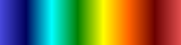

.. _vtkm_color_tables:

VTK-m Color Tables
===================

Black - Blue - White
--------------------

.. image:: color_tables/vtkm/nospace/Black-Blue-White.png

Black-Body Radiation
--------------------

Blue - Green - Orange
---------------------

.. image:: color_tables/vtkm/nospace/Blue-Green-Orange.png

Blue to Orange
--------------

.. image:: color_tables/vtkm/nospace/BluetoOrange.png

Cold and Hot
------------

Cool to Warm Extended
---------------------

Cool to Warm
------------

.. image:: color_tables/vtkm/nospace/CooltoWarm.png

Default
-------

.. image:: color_tables/vtkm/Default.png

Gray to Red
-----------

Green
-----

.. image:: color_tables/vtkm/Green.png

Inferno
-------

.. image:: color_tables/vtkm/Inferno.png

Jet
---

.. image:: color_tables/vtkm/Jet.png

Plasma
------

.. image:: color_tables/vtkm/Plasma.png

Rainbow Desaturated
-------------------

Rainbow Uniform
---------------

Viridis
-------

.. image:: color_tables/vtkm/Viridis.png

X Ray
-----

Yellow - Gray - Blue
--------------------

.. image:: color_tables/vtkm/nospace/Yellow-Gray-Blue.png

