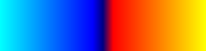
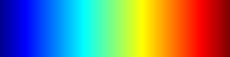
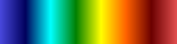

.. _viskores_color_tables:

Viskores Color Tables
===================

Black - Blue - White
--------------------

Black-Body Radiation
--------------------

Blue - Green - Orange
---------------------

Blue to Orange
--------------

Cold and Hot
------------

Cool to Warm Extended
---------------------

Cool to Warm
------------

Default
-------

Gray to Red
-----------

Green
-----

Inferno
-------

Jet
---

Plasma
------

Rainbow Desaturated
-------------------

Rainbow Uniform
---------------

Viridis
-------

.. image:: color_tables/viskores/Viridis.png

X Ray
-----

Yellow - Gray - Blue
--------------------

