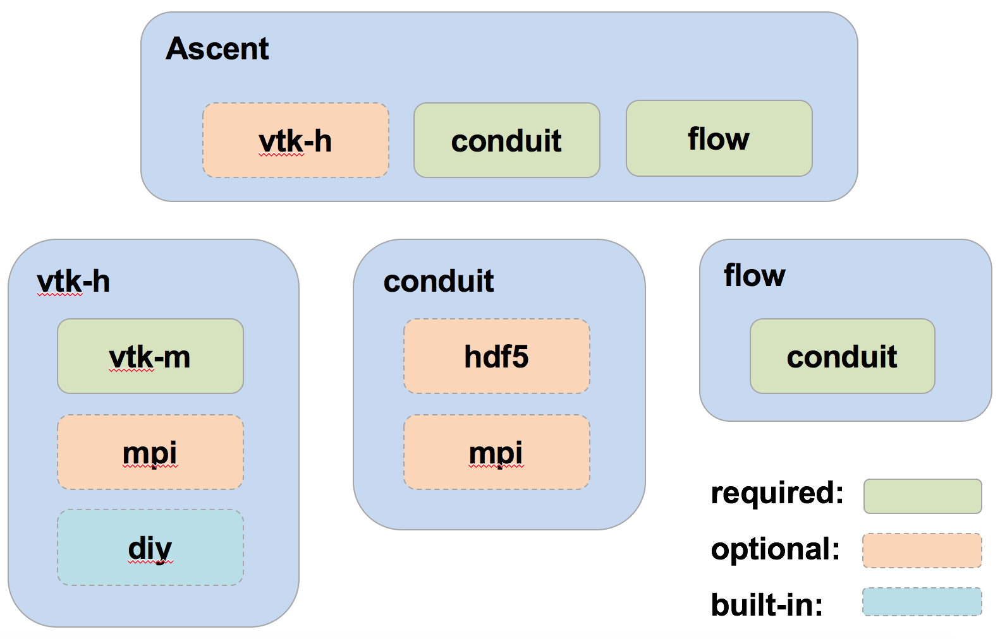

.. ############################################################################
.. # Copyright (c) 2015-2017, Lawrence Livermore National Security, LLC.
.. #
.. # Produced at the Lawrence Livermore National Laboratory
.. #
.. # LLNL-CODE-716457
.. #
.. # All rights reserved.
.. #
.. # This file is part of Conduit.
.. #
.. # For details, see: http://software.llnl.gov/ascent/.
.. #
.. # Please also read ascent/LICENSE
.. #
.. # Redistribution and use in source and binary forms, with or without
.. # modification, are permitted provided that the following conditions are met:
.. #
.. # * Redistributions of source code must retain the above copyright notice,
.. #   this list of conditions and the disclaimer below.
.. #
.. # * Redistributions in binary form must reproduce the above copyright notice,
.. #   this list of conditions and the disclaimer (as noted below) in the
.. #   documentation and/or other materials provided with the distribution.
.. #
.. # * Neither the name of the LLNS/LLNL nor the names of its contributors may
.. #   be used to endorse or promote products derived from this software without
.. #   specific prior written permission.
.. #
.. # THIS SOFTWARE IS PROVIDED BY THE COPYRIGHT HOLDERS AND CONTRIBUTORS "AS IS"
.. # AND ANY EXPRESS OR IMPLIED WARRANTIES, INCLUDING, BUT NOT LIMITED TO, THE
.. # IMPLIED WARRANTIES OF MERCHANTABILITY AND FITNESS FOR A PARTICULAR PURPOSE
.. # ARE DISCLAIMED. IN NO EVENT SHALL LAWRENCE LIVERMORE NATIONAL SECURITY,
.. # LLC, THE U.S. DEPARTMENT OF ENERGY OR CONTRIBUTORS BE LIABLE FOR ANY
.. # DIRECT, INDIRECT, INCIDENTAL, SPECIAL, EXEMPLARY, OR CONSEQUENTIAL
.. # DAMAGES  (INCLUDING, BUT NOT LIMITED TO, PROCUREMENT OF SUBSTITUTE GOODS
.. # OR SERVICES; LOSS OF USE, DATA, OR PROFITS; OR BUSINESS INTERRUPTION)
.. # HOWEVER CAUSED AND ON ANY THEORY OF LIABILITY, WHETHER IN CONTRACT,
.. # STRICT LIABILITY, OR TORT (INCLUDING NEGLIGENCE OR OTHERWISE) ARISING
.. # IN ANY WAY OUT OF THE USE OF THIS SOFTWARE, EVEN IF ADVISED OF THE
.. # POSSIBILITY OF SUCH DAMAGE.
.. #
.. ############################################################################

Building Ascent
=================

Overview
--------

Ascent uses CMake for its build system.
Building Ascent creates two separate libraries:

    * libascent : a version for execution on a single node
    * libascent_mpi : a version for distributed memory parallel

The CMake variable( ENABLE_MPI ON | OFF ) controls the building the parallel version of Ascent and included proxy-apps.

The build dependencies vary according to which pipelines and proxy-applications are desired.
For a minimal build with no parallel components, the following are required:
    
    * Conduit
    * C++ compilers

Build Dependencies
------------------

Ascent
^^^^^^^^

  * Conduit
  * One or more runtimes 

For Ascent, the Flow runtime is builtin, but for visualization functionality (filters and rendering), the VTK-h runtime is needed.

Conduit
"""""""
  * MPI
  * Python + NumPy (Optional)
  * HDF5 (Optional)
  * Fortran compiler (Optional)

VTK-h
"""""""""

* VTK-h: 
  
    * VTK-m: 

      * TBB (Optional)  Intel's Threaded Building Blocks
      * CUDA 6.5+ (Optional)
      * MPI (Optional)

.. note:: 

    When building VTK-m with VTK-h which must be configured with rendering on, among other options. 
    For a full list of options that need to be set, consult `/uberenv_libs/spack/var/spack/repos/builtin/packages/vtkm/package.py`.

Getting Started
---------------
Clone the Ascent repo:

* From Github

.. code:: bash
    
    git clone --recursive https://github.com/Ascent-DAV/ascent.git 

``--recursive`` is necessary because we are using a git submodule to pull in BLT (https://github.com/llnl/blt). 
If you cloned without ``--recursive``, you can checkout this submodule using:

.. code:: bash
    
    cd ascent
    git submodule init
    git submodule update

Configure a build:

``config-build.sh`` is a simple wrapper for the cmake call to configure ascent. 
This creates a new out-of-source build directory ``build-debug`` and a directory for the install ``install-debug``.
It optionally includes a ``host-config.cmake`` file with detailed configuration options. 

.. code:: bash
    
    cd ascent
    ./config-build.sh

Build, test, and install Ascent:

.. code:: bash
    
    cd build-debug
    make -j 8
    make test
    make install

Build Options
-------------

Ascent's build system supports the following CMake options:

* **BUILD_SHARED_LIBS** - Controls if shared (ON) or static (OFF) libraries are built. *(default = ON)* 
* **ENABLE_TESTS** - Controls if unit tests are built. *(default = ON)* 

* **ENABLE_DOCS** - Controls if the Ascent documentation is built (when sphinx and doxygen are found ). *(default = ON)*

* **ENABLE_FORTRAN** - Controls if Fortran components of Ascent are built. This includes the Fortran language bindings and Cloverleaf3D . *(default = ON)*
* **ENABLE_PYTHON** - Controls if the ascent python module and related tests are built. *(default = OFF)*

 The Ascent python module will build for both Python 2 and Python 3. To select a specific Python, set the CMake variable PYTHON_EXECUTABLE to path of the desired python binary. The ascent python module requires the Conduit python module.

* **ENABLE_OPENMP** - Controls if the proxy-apps are configured with OpenMP. *(default = OFF)*
* **ENABLE_MPI** - Controls if parallel versions of proxy-apps and Ascent are built. *(default = ON)*

 We are using CMake's standard FindMPI logic. To select a specific MPI set the CMake variables **MPI_C_COMPILER** and **MPI_CXX_COMPILER**, or the other FindMPI options for MPI include paths and MPI libraries.

 To run the mpi unit tests on LLNL's LC platforms, you may also need change the CMake variables **MPIEXEC** and **MPIEXEC_NUMPROC_FLAG**, so you can use srun and select a partition. (for an example see: src/host-configs/chaos_5_x86_64.cmake)

* **CONDUIT_DIR** - Path to an Conduit install *(required for parallel version)*. 

* **VTKM_DIR** - Path to an VTK-m install *(optional)*. 

* **HDF5_DIR** - Path to a HDF5 install *(optional)*. 

* **ADIOS_DIR** - Path to a ADIOS install *(optional)*. 

Host Config Files
-----------------
To handle build options, third party library paths, etc we rely on CMake's initial-cache file mechanism. 

.. code:: bash
    
    cmake -C config_file.cmake

We call these initial-cache files *host-config* files, since we typically create a file for each platform or specific hosts if necessary. 

The ``config-build.sh`` script uses your machine's hostname, the SYS_TYPE environment variable, and your platform name (via *uname*) to look for an existing host config file in the ``host-configs`` directory at the root of the ascent repo. If found, it passes the host config file to CMake via the `-C` command line option.

.. code:: bash
    
    cmake {other options} -C host-configs/{config_file}.cmake ../

You can find example files in the ``host-configs`` directory. 

These files use standard CMake commands. CMake *set* commands need to specify the root cache path as follows:

.. code:: cmake

    set(CMAKE_VARIABLE_NAME {VALUE} CACHE PATH "")

It is  possible to create your own configure file, and an boilerplate example is provided in `/host-configs/boilerplate.cmake`

.. warning:: If compiling all of the dependencies yourself, it is important that you use the same compilers for all dependencies. For
             example, different MPI and Fortran compilers (e.g., Intel and GCC) are not compatible with one another.

Bootstrapping Third Party Dependencies 
--------------------------------------

You can use ``bootstrap-env.sh`` (located at the root of the ascent repo) to help setup your development environment on OSX and Linux. 
This script uses ``scripts/uberenv/uberenv.py``, which leverages **Spack** (http://software.llnl.gov/spack) to build the external third party libraries and tools used by Ascent. 
Fortran support in is optional, dependencies should build without fortran. 
After building these libraries and tools, it writes an initial *host-config* file and adds the Spack built CMake binary to your PATH, so can immediately call the ``config-build.sh`` helper script to configure a ascent build.

.. code:: bash
    
    #build third party libs using spack
    source bootstrap-env.sh
    
    #copy the generated host-config file into the standard location
    cp uberenv_libs/`hostname`*.cmake to host-configs/
    
    # run the configure helper script
    ./config-build.sh

    # or you can run the configure helper script and give it the 
    # path to a host-config file 
    ./config-build.sh uberenv_libs/`hostname`*.cmake

.. .. note::
..     There is a known issue on some OSX systems when building with Fortran dependencies.
..     This is caused by the native compilers being 64-bit while the Fortran compiler is 32-bit.

Compiler Settings for Third Party Dependencies 
----------------------------------------------
You can edit ``scripts/uberenv/compilers.yaml`` to change the compiler settings
passed to Spack. See the `Spack Compiler Configuration <http://software.llnl.gov/spack/basic_usage.html#manual-compiler-configuration>`_   
documentation for details.

For OSX, the defaults in ``compilers.yaml`` are clang from X-Code and gfortran from https://gcc.gnu.org/wiki/GFortranBinaries#MacOS. 

.. note::
    The bootstrapping process ignores ``~/.spack/compilers.yaml`` to avoid conflicts
    and surprises from a user's specific Spack settings on HPC platforms.

.. note::
  Ascent developers use ``scripts/uberenv/uberenv.py`` to setup third party libraries for Ascent 
  development.  Due to this, the process builds more libraries than necessary for most use cases.
  For example, we build independent installs of Python 2 and Python 3 to make it easy 
  to check Python C-API compatibility during development. In the near future, we plan to 
  provide a Spack package to simplify deployment.

Building with Spack
-------------------

.. _building_with_spack:

As of 11/10/2017,  Spack's develop branch includes a
`recipe <https://github.com/spack/spack/blob/develop/var/spack/repos/builtin/packages/ascent/package.py>`_ 
to build and install Ascent. 

To install Ascent with all options (and also build all of its dependencies as necessary) run:

.. code:: bash
  
  spack install ascent

To build and install Ascent with CUDA support:
  
.. code:: bash
  
  spack install ascent+cuda

The Ascent Spack package provides several 
`variants <http://spack.readthedocs.io/en/latest/basic_usage.html#specs-dependencies>`_ 
that customize the options and dependencies used to build Ascent:

 ================== ==================================== ======================================
  Variant             Description                          Default
 ================== ==================================== ======================================
  **shared**          Build Ascent  as shared libraries    ON (+shared)
  **cmake**           Build CMake with Spack               ON (+cmake)
  **python**          Enable Ascent Python support         ON (+python)
  **mpi**             Enable Ascent MPI support            ON (+mpi)
  **vtkh**            Enable Ascent VTK-h support          ON (+vtkh)
  **tbb**             Enable VTK-h TBB support             ON (+tbb)
  **cuda**            Enable VTK-h CUDA support            OFF (~cuda)
  **doc**             Build Ascent's Documentation         OFF (~doc)
 ================== ==================================== ======================================

Variants are enabled using ``+`` and disabled using ``~``. For example, to build Conduit with the minimum set of options (and dependencies) run:

.. code:: bash

  spack install ascent+cuda~python~docs

See `Spack's Compiler Configuration <https://spack.readthedocs.io/en/latest/getting_started.html#compiler-config>`_ to customize which compiler settings.

Using system installs of dependencies with Spack
^^^^^^^^^^^^^^^^^^^^^^^^^^^^^^^^^^^^^^^^^^^^^^^^^

Spack allows you to specify system installs of packages using a `packages.yaml
<https://spack.readthedocs.io/en/latest/build_settings.html#build-settings>`_ file.

Here is an example specifying system CUDA on MacOS:

.. code:: yaml

  # CUDA standard MacOS install
    cuda:
      paths:
        cuda@8.0: /Developer/NVIDIA/CUDA-8.0
    buildable: False

Here is an example of specifying system MPI and CUDA on an LLNL Chaos 5 machine:

.. code:: yaml

  # LLNL chaos5 CUDA 
    cuda:
      paths:
        cuda@8.0: /opt/cudatoolkit-8.0
      buildable: False
  # LLNL chaos5 mvapich for gcc
    mvapich:
      paths:
        mvapich@2: /usr/local/tools/mvapich2-gnu-2.0/
      buildable: False

Using Ascent in Another Project
---------------------------------

Under ``src/examples`` there are examples demonstrating how to use Ascent in a CMake-based build system (``using-with-cmake``) and via a Makefile (``using-with-make``). 
Under ``src/examples/proxies``  you can find example integrations using ascent in the Lulesh, Kripke, and Cloverleaf3D proxy-applications.
In ``src/examples/synthetic/noise`` you can find an example integration using our synthetic smooth noise application.

Building Ascent in a Docker Container
---------------------------------------

Under ``src/examples/docker/master/ubuntu`` there is an example ``Dockerfile`` which can be used to create an ubuntu-based docker image with a build of the Ascent github master branch. There is also a script that demonstrates how to build a Docker image from the Dockerfile (``example_build.sh``) and a script that runs this image in a Docker container (``example_run.sh``). The Ascent repo is cloned into the image's file system at ``/ascent``, the build directory is ``/ascent/build-debug``, and the install directory is ``/ascent/install-debug``.

Building Ascent Dependencies Manually
-------------------------------------

In some environments, a spack build of Ascents dependencies can fail or a user may prefer to build the dependencies manually. 
This section describes how to build Ascents components. 
When building Ascents dependencies, it is **highly** recommended to fill out a host config file like the one located in ``/host-configs/boilerplate.cmake``.
This is the best way to avoid problems that can easily arise from mixing c++ standard libraries conflicts, MPI library conflicts, and fortran module conflicts, all of which are difficult to spot.
Use the same CMake host-config file for each of Ascent's dependencies, and while this may bring in unused cmake variables and clutter the ccmake curses interface, it will help avoid problems.
In the host config, you can specify options such as ``ENABLE_PYTHON=OFF`` and ``ENABLE_FORTRAN=OFF`` that will be respected by both conduit and ascent.

.. warning:: At this time, VTK-m cannot be built and linked to with Intel Compilers because of an issue with symbol visibility. Consequently, we only recommend building Ascent with GNU compilers with c++11 support.

HDF5 (Optional)
^^^^^^^^^^^^^^^

The `HDF5 source tarball <https://support.hdfgroup.org/ftp/HDF5/releases/hdf5-1.8/hdf5-1.8.16/src/hdf5-1.8.16.tar.gz>`_ on the HDF5 group's website. While the source contains both an autotools configure and CMake build system, use the CMake build system with your host config file.
Once you have built and installed HDF5 into a local directory, add the location of that directory to the declaration of the ``HDF5_DIR`` in the host config file.

.. code:: bash
    
    curl https://support.hdfgroup.org/ftp/HDF5/releases/hdf5-1.8/hdf5-1.8.16/src/hdf5-1.8.16.tar.gz > hdf5.tar.gz
    tar -xzf hdf5.tar.gz
    cd hdf5-1.8.16/ 
    mkdir build
    mkdir install
    cd build
    cmake -C path_to_host_config/myhost_config.cmake . \
      -DCMAKE_INSTALL_PREFIX=path_to_install -DCMAKE_BUILD_TYPE=Release
    make install

In the host config, add ``set(HDF5_DIR "/path/to/hdf5_install" CACHE PATH "")``.

Conduit
^^^^^^^
The version of conduit we use is v0.3.0. If the ``HDF5_DIR`` is specified in the host config, conduit will build the relay io library.
Once you have installed conduit, add the path to the install directory to your host config file in the cmake variable `CONDUIT_DIR`.

.. code:: bash
    
    git clone --recursive https://github.com/LLNL/conduit.git
    cd conduit
    git checkout tags/v0.3.0
    mkdir build
    mkdir install
    cd build
    cmake -C path_to_host_config/myhost_config.cmake ../src \ 
      -DCMAKE_INSTALL_PREFIX=path_to_install -DCMAKE_BUILD_TYPE=Release
    make install 

In the host config, add ``set(CONDUIT_DIR "/path/to/conduit_install" CACHE PATH "")``.

VTK-m (Optional but recommended)
^^^^^^^^^^^^^^^^^^^^^^^^^^^^^^^^
We currently use the master branch of VTK-m, but in the future, we will checkout a specific commit or release for stability. 
We recommend VTK-m since VTK-m and VTK-h provide the majority of Ascent's visualization and analysis functionality.
The code below is minimal, and will only configure the serial device adapter. For instructions on building with TBB and CUDA, please consult the 
`VTK-m repository <https://gitlab.kitware.com/vtk/vtk-m>`_. In Ascent, we require non-default configure options, so pay close attention to the extra cmake configure options.

.. code:: bash
    
    git clone https://gitlab.kitware.com/vtk/vtk-m.git 
    cd vtk-m 
    mkdir install
    cmake -C path_to_host_config/myhost_config.cmake . -DCMAKE_INSTALL_PREFIX=path_to_install \ 
      -DCMAKE_BUILD_TYPE=Release -DVTKm_USE_64BIT_IDS=OFF -DVTKm_USE_DOUBLE_PRECISION=ON
    make install

In the host config, add ``set(VTKM_DIR "/path/to/vtkm_install" CACHE PATH "")``.

VTK-h (Optional but recommended)
^^^^^^^^^^^^^^^^^^^^^^^^^^^^^^^^
We recommend VTK-h since VTK-m and VTK-h provide the majority of Ascent's visualization and analysis functionality.

.. code:: bash
    
    git clone ://github.com/Alpine-DAV/vtk-h.git 
    cd vtk-h 
    mkdir build
    mkdir install
    cd build
    cmake -C path_to_host_config/myhost_config.cmake . -DCMAKE_INSTALL_PREFIX=path_to_install  
    make install

In the host config, add ``set(VTKH_DIR "/path/to/vtkh_install" CACHE PATH "")``.

Ascent
^^^^^^
Now that we have all the dependencies built and a host config file for our environment, we can now build Ascent.

.. code:: bash
    
    git clone --recursive https://github.com/Alpine-DAV/ascent.git 
    cd ascent 
    mkdir build
    mkdir install
    cd build
    cmake -C path_to_host_config/myhost_config.cmake . -DCMAKE_INSTALL_PREFIX=path_to_install \ 
      -DCMAKE_BUILD_TYPE=Release 
    make install
    
To run the unit tests to make sure everything works, do ``make test``. 
If you install these dependencies in a public place in your environment, we encourage you to make you host config publicly available by submitting a pull request to the Ascent repo. 
This will allow others to easily build on that system by only following the Ascent build instructions.
