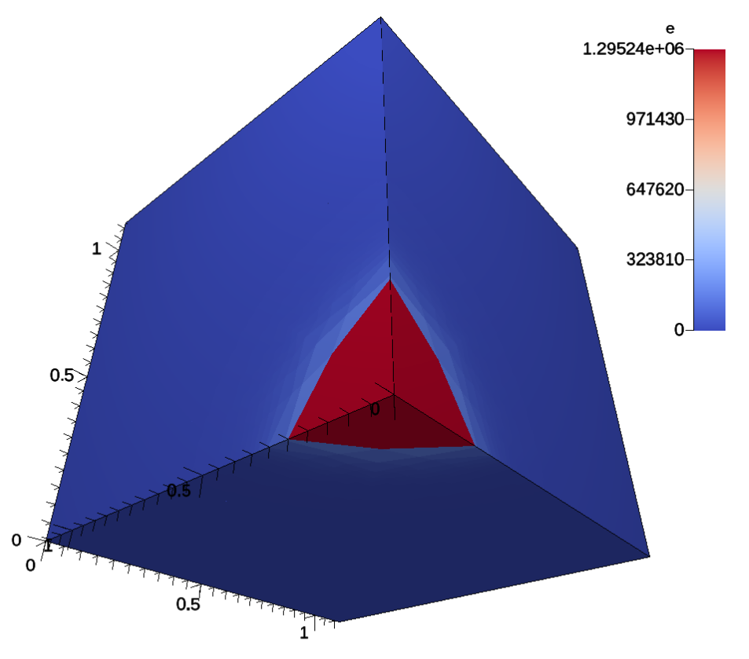
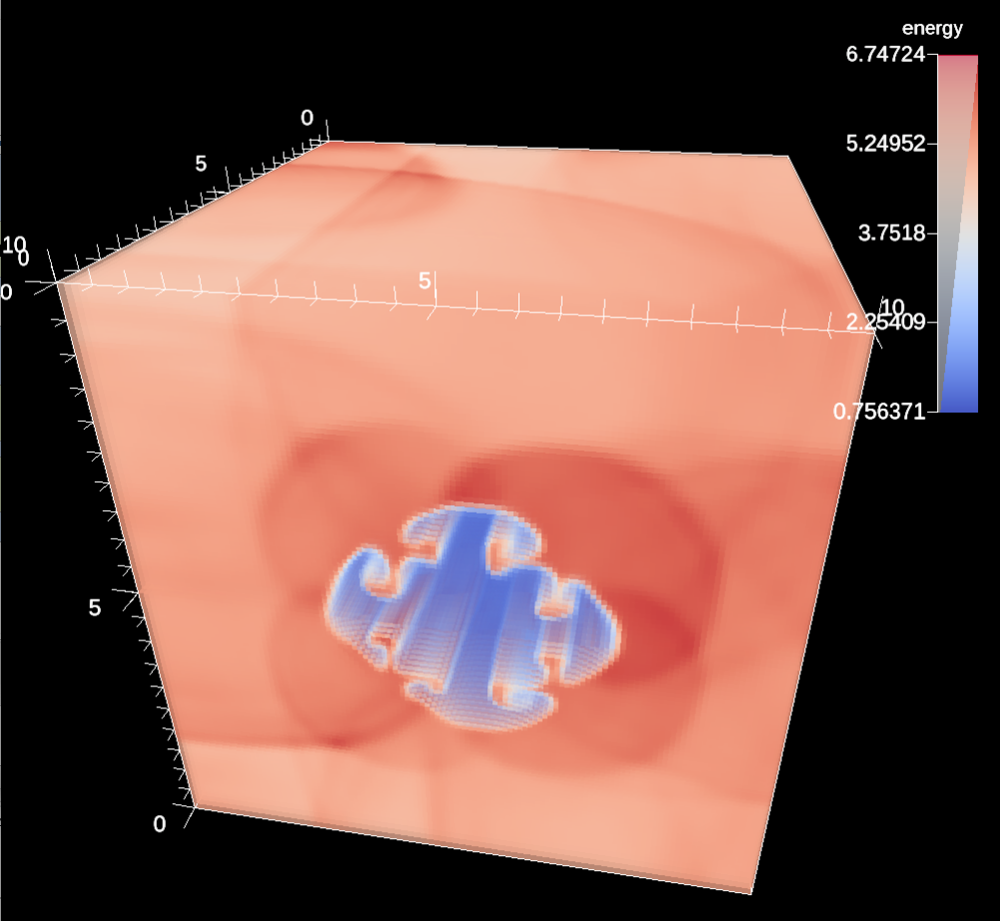
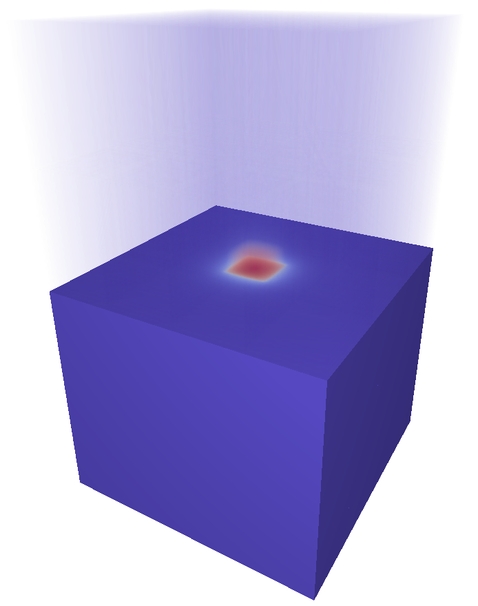
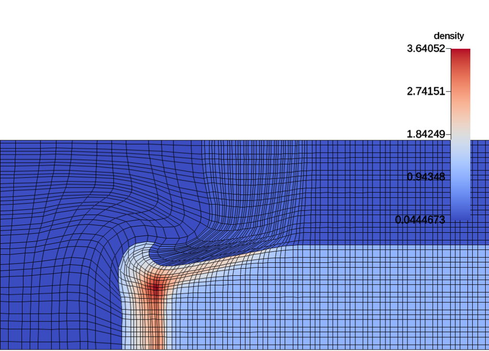
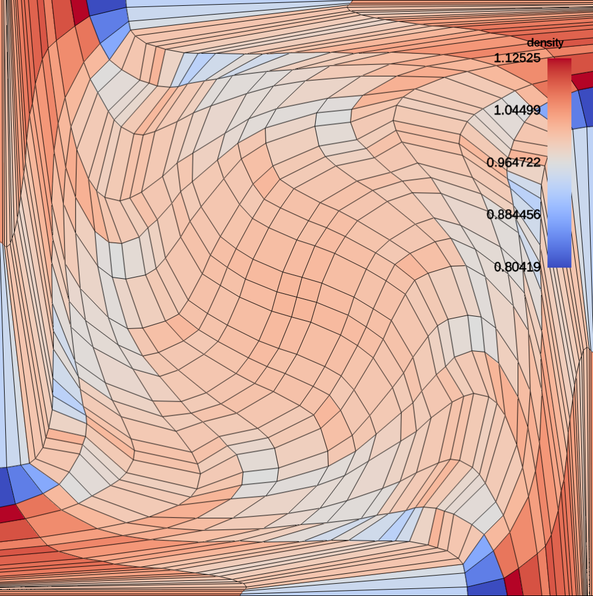
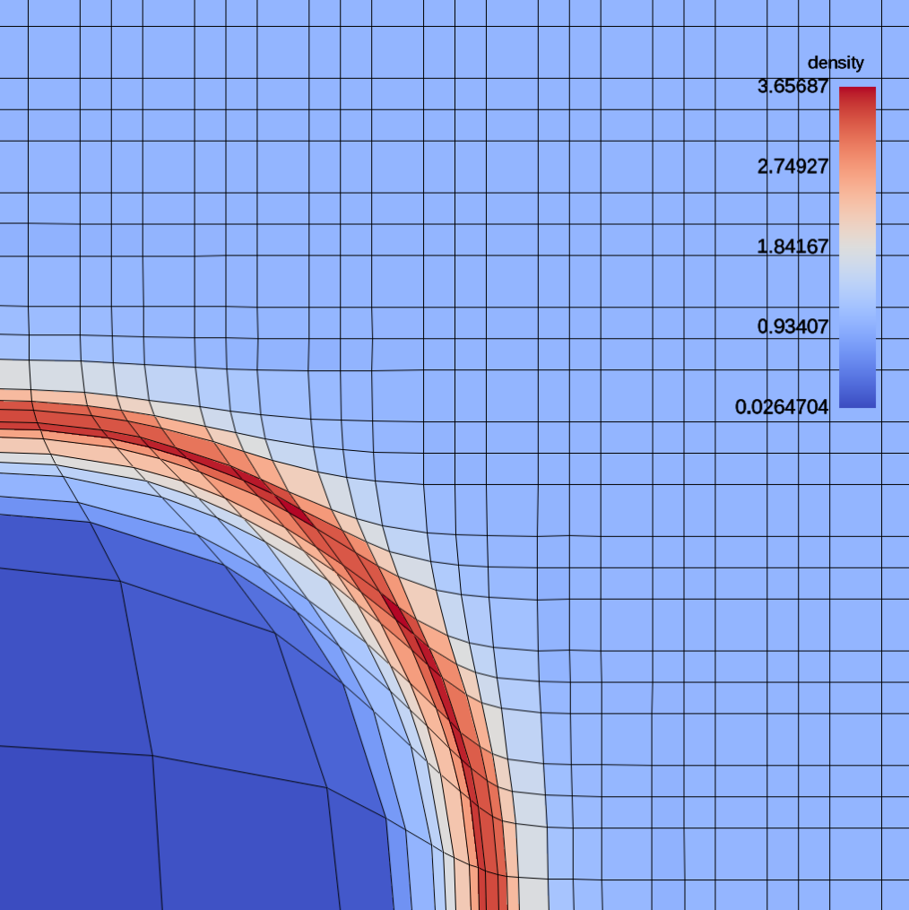

.. ############################################################################
.. # Copyright (c) Lawrence Livermore National Security, LLC and other Ascent
.. # Project developers. See top-level LICENSE AND COPYRIGHT files for dates and
.. # other details. No copyright assignment is required to contribute to Ascent.
.. ############################################################################

Example Integrations
--------------------
Ascent comes with five example integrations:

  - Lulesh: a lagrangian shock hydrodynamics code
  - Kripke: a deterministic neutron transport code
  - CloverLeaf3D: an eulerian hydrodynamics code
  - Laghos : high-order finite element hydrodynamics code
  - Noise : an synthetic data source based on open simplex noise

.. note::
  All example codes, except Laghos (MPI only), use both MPI and OpenMP for hybrid parallelism.

Lulesh
^^^^^^

Lulesh is a proxy-application for LLNL's production ALE3D code that models the Sedov blast problem.
Lulesh in programmed in C++ and uses an structured mesh with an explicit coordinate system (curvilinear).
More information about Lulesh can be found at `https://codesign.llnl.gov/lulesh.php <https://codesign.llnl.gov/lulesh.php>`_.

The Ascent integration can be found in two locations.
Lulesh's mesh description can be found at line 189 in ``/src/examples/proxies/lulesh2.0.3/lulesh-init.cc``, and the Ascent API usage can be found in the simulations main loop beginning at line 2769 in the file ``/src/examples/proxies/lulesh2.0.3/lulesh.cc``.

.. _lulesh_exfig:

Running Lulesh
""""""""""""""
Ascent will create two versions of lulesh, one serial and one MPI parallel, but both versions are capable of using OpenMP.
Lulesh takes several command line arguments, but the most useful are:

  - ``-p`` prints the progress of the solver as the simulation progresses
  - ``-i {number of iterations}`` how many iterations to run the simulation. Note: this is not a guarantee, since Lulesh has other termination criteria.
  - ``-s {per node problem size}`` defines the problem size to run on each node. The larger the value, the longer the times steps will be take to calculate

.. note::
  When running lulesh in parallel, the number of MPI processes must be a perfect cube. For example, some valid numbers of MPI tasks would be 1, 2, 8, and 27.

The command below would launch Lulesh for 10 iterations with a problem size of 32^3 elements per node (8*32^3 = 262,144 total elements):

.. code-block:: bash

  srun -n 8 lulesh_par -i 10 -s 32

.. _cloverleaf3d_integration:

CloverLeaf3D
^^^^^^^^^^^^
CloverLeaf3D is a proxy-application from the Atomic Weapons Establishment (AWE) that can be found at `http://uk-mac.github.io/CloverLeaf3D <http://uk-mac.github.io/CloverLeaf3D>`_.
CloverLeaf is written in Fortran90.
The data integration can be found in the file ``src/examples/proxies/cloverleaf3d-ref/visit.F90``, and the Ascent API in the main loop can be found at ``src/examples/proxies/cloverleaf3d-ref/hydro.F90`` starting at line 46.
CloverLeaf3D uses ghost elements, thus they have to be stripped each time step before being passed to Ascent.

.. _clover_exfig:

    A volume plot of the CloverLeaf3D.

Running CloverLeaf3D
""""""""""""""""""""
Unlike the other two example integrations, CloverLeaf3D uses an input deck to describe the problem setup.
There are a number of example problems in the CloverLeaf3D source directory, and one (`clover.in`) is copied into the build directory.

.. code-block:: text

   *clover
   state 1 density=0.2 energy=1.0
   state 2 density=1.0 energy=2.5 geometry=cuboid xmin=0.0 xmax=5.0 ymin=0.0 ymax=2.0 zmin=0.0 zmax=2.0
   x_cells=10
   y_cells=2
   z_cells=2
   xmin=0.0
   ymin=0.0
   zmin=0.0
   xmax=10.0
   ymax=2.0
   zmax=2.0
   initial_timestep=0.04
   max_timestep=0.04
   end_step=75
   test_problem 1

   visit_frequency=10
   *endclover

Important variables to keep note of are:

 - ``state`` defines different areas with in the mesh, their shape, and the amount of initial energy deposited in them.
 - ``x_cells`` defines the number of cells in the x direction
 - ``xmin`` and ``xmax`` defines the spatial extents in the x direction for the problem
 - ``visit_freqency`` defines often the Ascent API is called

.. _kripke_integration:

Kripke
^^^^^^
Kripke is a scalable deterministic neutron transport solver that has an embedded test problem.
More information about Kripke can be found at `https://codesign.llnl.gov/kripke.php <https://codesign.llnl.gov/kripke.php>`_.
Unlike the other two proxy-applications, Kripke does not have discrete time steps.
Instead, the simulation represents a single moment in time and the iterations converge to a solution for the problem.

The both the Ascent API calls and the data integration can be found in ``src/examples/proxies/kripke/Kripke/Sweep_Solver.cpp``.
Kripke is meant to study the efficiency of different loop orderings and memory layouts for different architectures which makes zero copying the data difficult.
Thus, the data is extracted each iteration.
Mesh data extraction can be found starting at line 20, and the API calls can be found at line 101.

.. _kripke_exfig:

    A combined rendering of a clipped pseudocolor plot with a volume plot of the Kripke simulation.

Running Kripke
""""""""""""""
Kripke takes many command line parameters, and there is an example script that is copied into the directory where Kripke is built.

.. code-block:: bash

  srun -n 8 kripke_par --procs 2,2,2 --zones 32,32,32 --niter 5 --dir 1:2 --grp 1:1 --legendre 4 --quad 4:4

The parameters that control the problem size and layout are:

  - ``--procs`` controls the layout of the MPI processes over the mesh. In the example, we launch 8 total MPI tasks and distribute them evenly in each coordinate direction. The cross product of this argument must equal the number of MPI tasks, e.g. 2x2x2 = 8. Another valid value for 8 MPI tasks is ``1,1,8``.
  - ``--zones`` controls the number of elements(zones) in each coordinate direction of the problem mesh. In this case, the total mesh size is 32^3, and the number of elements for each MPI task will be 16^3. This is simply  elements / procs, e.g. 32/2, 32/2, 32/2.
  - ``--niter`` controls the number of iterations. Note: as the solver converges on a solution, the images will differ less and less.

Laghos
^^^^^^
Laghos is a high-order lagrangian hydrodynamics proxy-application based on the MFEM finite element library.
Laghos models three problems in both 3D and 3D: Sedov blast, tripple-point, and taylor-green vortex, and the integration can be found in ``src/examples/proxies/laghos/laghos.cpp``.
All three problems produce unstructured grids.

.. _tripple_exfig:

    2D simulation of the tripple-point problem.

.. _taylor_exfig:

    2D simulation of the taylor-green vortex.

.. _sedov_exfig:

    2D simulation of the Sedov blast problem.

Running Laghos
""""""""""""""
In the Laghos example directory, we provide scripts for running the different problem variants.
We also provide both MPI parallel and serial versions of the application.
More information about running Laghos can be found on the `Laghos github page <https://github.com/CEED/Laghos>`_,
but the basic parameters are:

  - ``-p``: problem setup
  - ``-rs``: number of times to refine the mesh (i.e., the higher the number the more elements will be generated)
  - ``-m``: mesh file
  - ``--visit``: enable Ascent visualization
  - ``-tf`` : run the simulation until this time has been reached

.. code-block:: bash

  ./laghos_ser -p 0 -m data/cube01_hex.mesh -rs 1 -tf 0.5 --visit

Noise
^^^^^^
Noise is a scalable synthetic application that generates data throughout the entire problem from the first time step.
For large data sets, proxy applications such as Lulesh and Cloverleaf3D require significant time for shockwaves to propagate through a distributed data set, and Noise allows large scale distributed-memory testing from the first time step without having to wait for a simulation to progress. Noise uses a uniform grid and defines two fields (node centered and node centered) that are based on open simplex noise.

.. _noise_exfig:

..  figure:: images/noise_example.png
    :scale: 50 %
    :align: center

    The noise synthetic proxy-application rendered with pseudocolor and volume plots.

Running Noise
""""""""""""""
Noise takes several command line parameters.

.. code-block:: bash

  srun -n 8 noise_par  --dims=32,32,32 --time_steps=5 --time_delta=.5

The parameters that control the problem size and cycle progression are:

  - ``--dims`` controls total problem size.
  - ``--time_steps`` controls the number of time steps.
  - ``--time_delta`` controls the amount of time to advance the simulation each time step.

