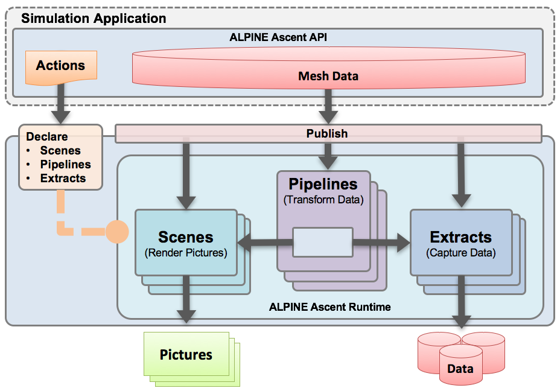

.. ############################################################################
.. # Copyright (c) 2015-2017, Lawrence Livermore National Security, LLC.
.. #
.. # Produced at the Lawrence Livermore National Laboratory
.. #
.. # LLNL-CODE-716457
.. #
.. # All rights reserved.
.. #
.. # This file is part of Ascent.
.. #
.. # For details, see: http://software.llnl.gov/ascent/.
.. #
.. # Please also read ascent/LICENSE
.. #
.. # Redistribution and use in source and binary forms, with or without
.. # modification, are permitted provided that the following conditions are met:
.. #
.. # * Redistributions of source code must retain the above copyright notice,
.. #   this list of conditions and the disclaimer below.
.. #
.. # * Redistributions in binary form must reproduce the above copyright notice,
.. #   this list of conditions and the disclaimer (as noted below) in the
.. #   documentation and/or other materials provided with the distribution.
.. #
.. # * Neither the name of the LLNS/LLNL nor the names of its contributors may
.. #   be used to endorse or promote products derived from this software without
.. #   specific prior written permission.
.. #
.. # THIS SOFTWARE IS PROVIDED BY THE COPYRIGHT HOLDERS AND CONTRIBUTORS "AS IS"
.. # AND ANY EXPRESS OR IMPLIED WARRANTIES, INCLUDING, BUT NOT LIMITED TO, THE
.. # IMPLIED WARRANTIES OF MERCHANTABILITY AND FITNESS FOR A PARTICULAR PURPOSE
.. # ARE DISCLAIMED. IN NO EVENT SHALL LAWRENCE LIVERMORE NATIONAL SECURITY,
.. # LLC, THE U.S. DEPARTMENT OF ENERGY OR CONTRIBUTORS BE LIABLE FOR ANY
.. # DIRECT, INDIRECT, INCIDENTAL, SPECIAL, EXEMPLARY, OR CONSEQUENTIAL
.. # DAMAGES  (INCLUDING, BUT NOT LIMITED TO, PROCUREMENT OF SUBSTITUTE GOODS
.. # OR SERVICES; LOSS OF USE, DATA, OR PROFITS; OR BUSINESS INTERRUPTION)
.. # HOWEVER CAUSED AND ON ANY THEORY OF LIABILITY, WHETHER IN CONTRACT,
.. # STRICT LIABILITY, OR TORT (INCLUDING NEGLIGENCE OR OTHERWISE) ARISING
.. # IN ANY WAY OUT OF THE USE OF THIS SOFTWARE, EVEN IF ADVISED OF THE
.. # POSSIBILITY OF SUCH DAMAGE.
.. #
.. ############################################################################

Ascent Overview
=================

Ascent is an evolution of the system presented in `Strawman: A Batch In Situ Visualization and Analysis Infrastructure for Multi-Physics Simulation Codes <http://dl.acm.org/citation.cfm?id=2828625>`_ . This paper was presented at the `ISAV 2015 Workshop <http://vis.lbl.gov/Events/ISAV-2015/>`_, held in conjunction with SC 15, on November 16th 2015 in Austin, TX, USA.

Requirements
------------
To guide the development of Ascent, we focused on a set of important in situ visualization and analysis requirements extracted from our interactions and experiences with several simulation code teams. Here are Ascent's requirements broken out into three broader categories:

Support a diverse set of simulations on many-core architectures.
  - Support execution on many-core architectures
  - Support  usage  within  a  batch  environment (i.e.,no simulation user involvement once the simulation has begun running).
  - Support the four most common languages used by simulation code teams:  C, C++, Python, and Fortran.
  - Support for multiple data models, including uniform, rectilinear, and unstructured grids.
  
Provide a streamlined interface to improve usability.
  - Provide  straight  forward  data  ownership  semantics between simulation routines and visualization and analysis routines
  - Provide a low-barrier to entry with respect to developer time for integration.
  - Ease-of-use in terms of directing visualization and analysis actions to occur during runtime.
  - Ease-of-use in terms of consuming visualization results, including delivery mechanisms both for images on a file system and for streaming to a web browser.
  
Minimize  the  resource  impacts  on  host  simulations.
  - Synchronous in situ processing, meaning that visualization and analysis routines can directly access the memory of a simulation code.
  - Efficient execution times that do not significantly slow down overall simulation time.
  - Minimal memory usage, including zero-copy usage when bringing data from simulation routines to visualization and analysis routines.

System Architecture
-------------------
The Ascent sytem architecture is composed of several components:
  * **Conduit**: `Conduit <http://software.llnl.gov/conduit/>`_  is used to describe and pass in-core mesh data and runtime options from the simulation code to Ascent.
  * **Runtimes**: Ascent contains a number of runtimes that implement analysis, rendering, and I/O operations on the mesh data published to Ascent. At a high level, a runtime is responsible for consuming the simulation data that is described using the Conduit Mesh Blueprint and performing a number of actions defined within Conduit Nodes, which create some form of output.
  * **Data Adapters**: Simulation mesh data is described using Conduit's `Mesh Blueprint <http://software.llnl.gov/conduit/blueprint_mesh.html>`_, which outlines a set of conventions to describe different types of mesh-based scientific data. Each Ascent runtime provides internal Data Adaptors that convert Mesh Blueprint data into a more a more specific data model, such as VTK-m's data model. Ascent will always zero-copy simulation data when possible. To simplify memory ownership semantics, the data provided to Ascent via Conduit Nodes is considered to be owned by the by the simulation.
  * **Embedded Web Server**: Ascent can stream images rendered from a running simulation to a web browser using the Conduit Relay's embedded web-server.

System Diagram
--------------

Dependencies
------------
  This section describes some of Ascents key dependencies.

..  image:: images/AscentDependencies.png
    :height: 600px
    :align: center

VTK-h
"""""
  VTK-h is a stand alone library that implements a distributed-memory layer on top of the VTK-m library, which focuses on shared-memory parallelism.
  The VTK-h library is a collection of distributed-memory algorithms, and VTK-h does not contain an execution model, such as the demand-driven data flow in VTK.
  The design of VTK-h is intended to facilitate the wrapping of VTK-m algorithms so that they can be included in the execution models of other visualization tools including ALPINE Ascent, ParaView, and VisIt.
  Consequently, VTK-h serves as a single point of development in which algorithms can be easily deployed into any toolkit that includes the VTK-h library.
  VTK-h heavily leverages VTK-m, and the basic building block of the VTK-h data model is the VTK-m data set.
  A VTK-h data set is a collection of VTK-m data sets along with supporting methods that handle distributed-memory queries (e.g., global scalar ranges).
  Within VTK-h, most code will directly invoke VTK-m methods to implement algorithms, and while it is possible to directly implement new VTK-m functionality within VTK-h, that functionality is limited to distributed-memory features.
  For distributed-memory parallelism, VTK-h uses MPI and also includes the DIY toolkit which encapsulates block-based abstractions that are common in distributed-memory problems, and VTK-h uses DIY to implement distributed-memory image compositing.

Flow
""""
  Recall from the prior section that VTK-h does not provide its own execution model. This choice simplifies the VTK-h API and makes it easy to leverage VTK-h within ParaView and VisIt`s existing full featured execution models. 
  Since ALPINE Ascent does not leverage ParaView or VisIt's infrastructure, it needs a basic execution model to support using VTK-h algorithms to carry out the user's requested actions. 
  
  Ascent uses a simple data flow library named Flow to efficiently compose and execute VTK-h filters. ALPINE's Flow library is a C++ evolution of the Python data flow network infrastructure used in `this implementation <http://ieeexplore.ieee.org/abstract/document/6495864/>`_. It supports declaration and execution of directed acyclic graphs (DAGs) of filters created from a menu of filter types that are registered at runtime. Filters declare a minimal interface, which includes the number of expected inputs and outputs, and a set of default parameters. Flow uses a topological sort to ensure proper filter execution order, tracks all intermediate results, and provides basic memory management capabilities. 
  The VTK-h algorithms needed by Ascent are wrapped as Flow Filters so they can be executed as part of DAGs composed by Ascent.
  
  Like its Python predecessor, Flow provides support for generic inputs and outputs. Flow provides a mechanism for filters to check input data types at runtime if necessary. Because of this data-type agnostic design, the Flow library does not depend on VTK-h. This provides the flexibility to create filters which can process data in other data models and APIs. This design supports important future use cases, such as creating a filter to refine high-order MFEM meshes into VTK-h data sets for rendering.

Runtimes
-----------------
  Ascent can be configured with one or more of the following runtimes. 
  When multiple runtimes are built with Ascent, available runtimes can be selected at runtime.
  A runtime has three main functions: consume simulation data, perfrom analysis (optional), and output data.
  Data describing the simulation mesh is sent to the runtime within a Conduit Node which is formatted according to `Conduit Blueprint <http://software.llnl.gov/conduit/blueprint.html>`_.
  Once the data is in a compatible format, the runtime can optionally perfrom some analysis operations, and then output the results. 
  Currently, the Ascent runtime uses the  

Ascent Runtime
""""""""""""""
The Ascent Runtime is the layer that sits on top of Flow and beneath the Ascent API.
Ascent's responsibility is to translate a set of actions passed to the Ascent ''execute'' method into a Flow graph.
Ascent loops through hierarchy of actions contained in a Conduit Node, and creates a series of Flow filters (i.e., graph nodes) and connects the Flow filters together (i.e., edges).

Flow Runtime
""""""""""""""
The Flow runtime provides direct access to Flow. This lower access allows availible flow filters to be directly assembled into a DAG instead of relying of the Ascent runtime.
By using the Flow runtime, developers can connect filters in advanced ways not directly supported by the Ascent API.

Empty
"""""
  The empty runtime contains all the boilerplate code needed to started implementing a custom runtime and is meant to serve as a staring place for those that wish to create a runtime from scratch.
