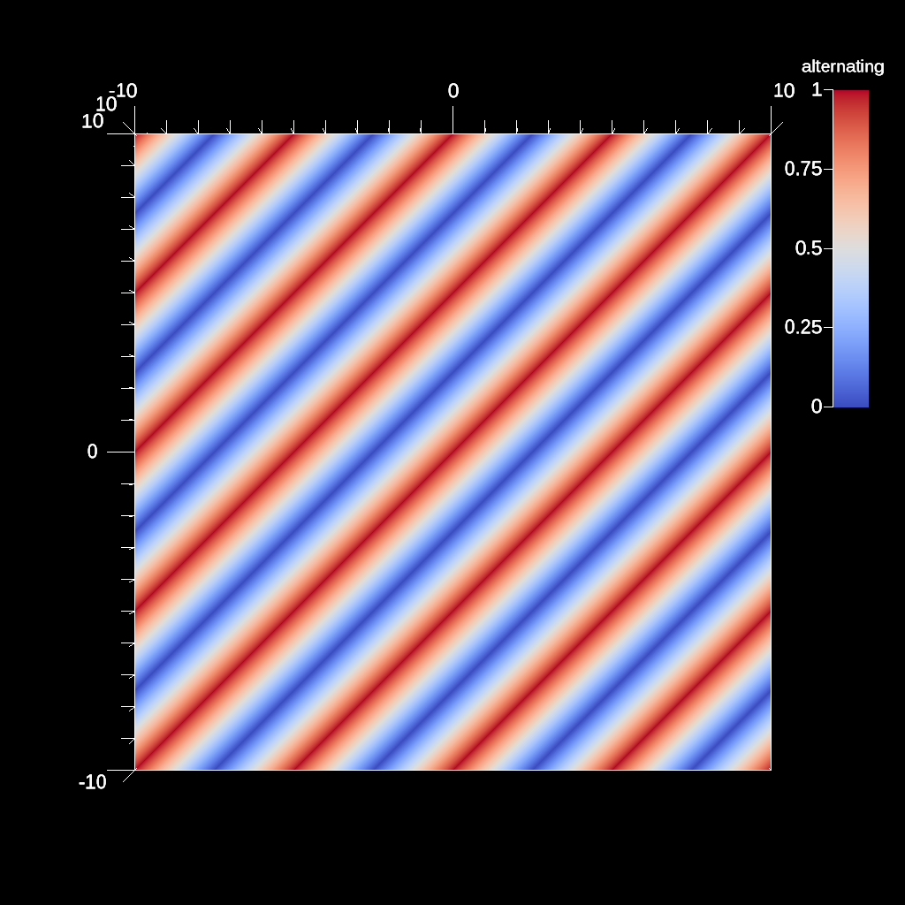
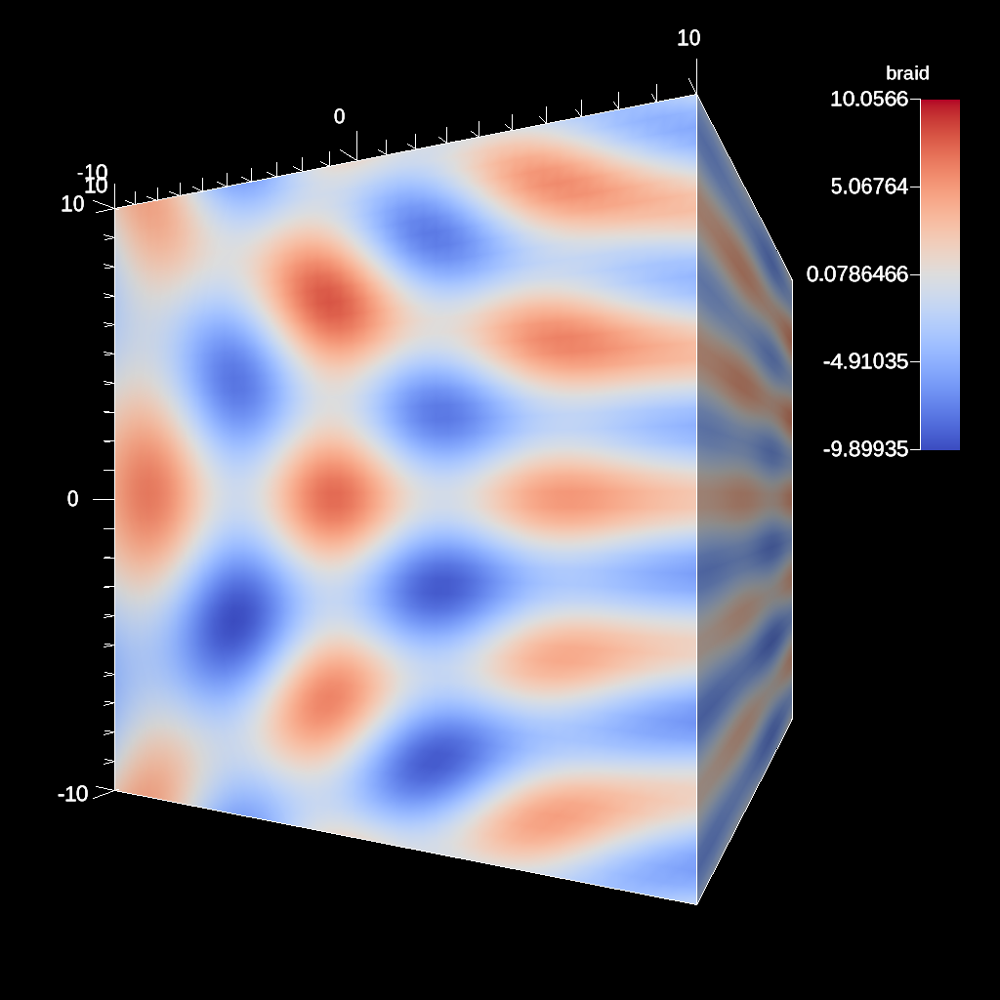

.. ############################################################################
.. # Copyright (c) Lawrence Livermore National Security, LLC and other Ascent
.. # Project developers. See top-level LICENSE AND COPYRIGHT files for dates and
.. # other details. No copyright assignment is required to contribute to Ascent.
.. ############################################################################

.. _tutorial_conduit_mesh_blueprint:

Conduit Blueprint Mesh Examples
---------------------------------

Simulation mesh data is passed to Ascent using a shared set of conventions called the
`Mesh Blueprint <https://llnl-conduit.readthedocs.io/en/latest/blueprint_mesh.html>`_.

Simply described, these conventions outline a structure to follow to create Conduit trees 
that can represent a wide range of simulation mesh types (uniform grids, unstructured meshes, etc).
Conduit's dynamic tree and zero-copy support make it easy to adapt existing data to conform to the Mesh Blueprint for use in tools like Ascent.

These examples outline how to create Conduit Nodes that describe simple single domain meshes and review
some of Conduits built-in mesh examples. More Mesh Blueprint examples are also detailed in Conduit's `Mesh Blueprint Examples Docs <https://llnl-conduit.readthedocs.io/en/latest/blueprint_mesh.html#examples>`_ .

Creating a uniform grid with a single field
~~~~~~~~~~~~~~~~~~~~~~~~~~~~~~~~~~~~~~~~~~~~

:download:`C++ Source <../../../src/examples/tutorial/ascent_intro/cpp/blueprint_example1.cpp>`

.. literalinclude:: ../../../src/examples/tutorial/ascent_intro/cpp/blueprint_example1.cpp
   :language: cpp
   :lines: 50-

:download:`Python Source <../../../src/examples/tutorial/ascent_intro/python/blueprint_example1.py>`

.. literalinclude:: ../../../src/examples/tutorial/ascent_intro/python/blueprint_example1.py
   :language: python
   :lines: 45-

    Example Uniform Mesh Rendered

Creating an unstructured tet mesh with fields
~~~~~~~~~~~~~~~~~~~~~~~~~~~~~~~~~~~~~~~~~~~~~~~

:download:`C++ Source <../../../src/examples/tutorial/ascent_intro/cpp/blueprint_example2.cpp>`

.. literalinclude:: ../../../src/examples/tutorial/ascent_intro/cpp/blueprint_example2.cpp
   :language: cpp
   :lines: 50-

:download:`Python Source <../../../src/examples/tutorial/ascent_intro/python/blueprint_example2.py>`

.. literalinclude:: ../../../src/examples/tutorial/ascent_intro/python/blueprint_example2.py
   :language: python
   :lines: 45-

..  figure:: Tutorial_Output/out_ascent_render_tets.png
    :scale: 50 %
    :align: center

    Example Tet Mesh Rendered

Experimenting with the built-in braid example
~~~~~~~~~~~~~~~~~~~~~~~~~~~~~~~~~~~~~~~~~~~~~~~~~~~~~

Related docs: `Braid <https://llnl-conduit.readthedocs.io/en/latest/blueprint_mesh.html#braid>`_ .

:download:`C++ Source <../../../src/examples/tutorial/ascent_intro/cpp/blueprint_example3.cpp>`

.. literalinclude:: ../../../src/examples/tutorial/ascent_intro/cpp/blueprint_example3.cpp
   :language: cpp
   :lines: 50-

:download:`Python Source <../../../src/examples/tutorial/ascent_intro/python/blueprint_example3.py>`

.. literalinclude:: ../../../src/examples/tutorial/ascent_intro/python/blueprint_example3.py
   :language: python
   :lines: 45-

    Final Braid Time-varying Result Rendered

