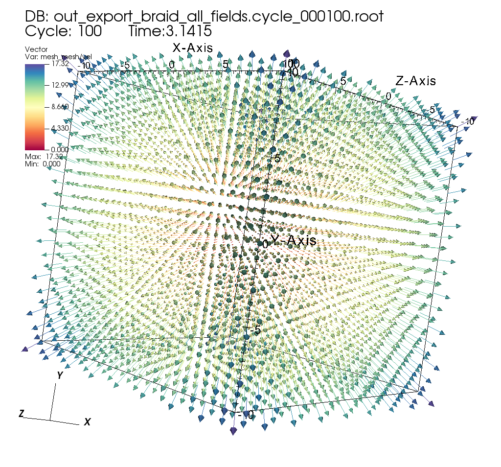
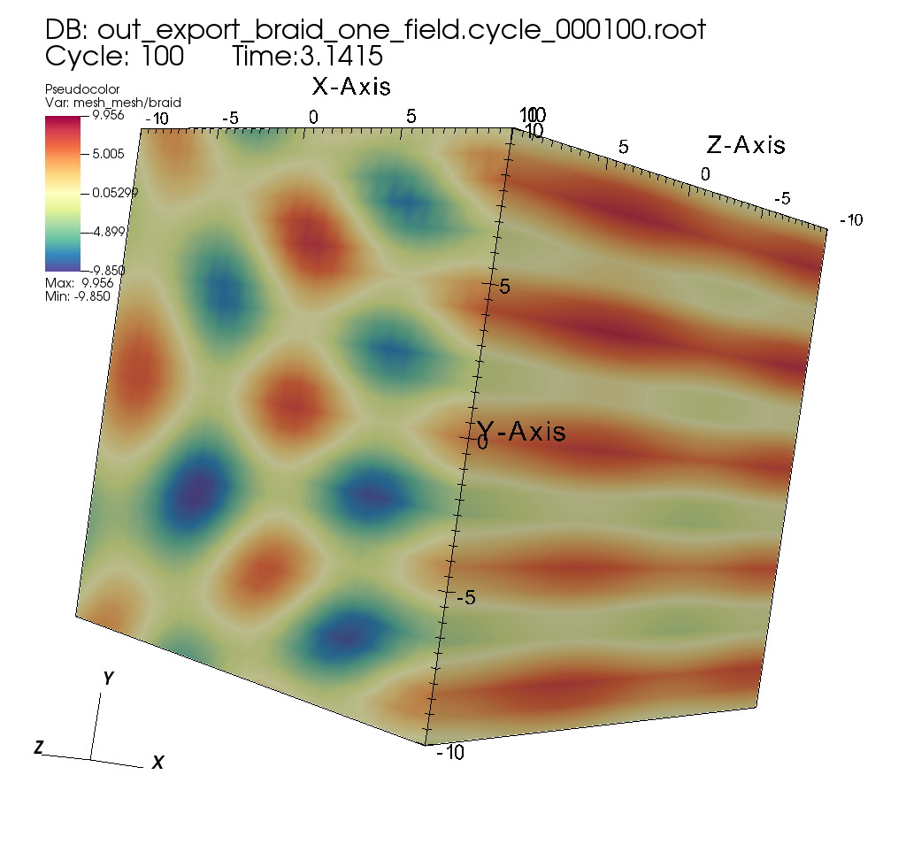
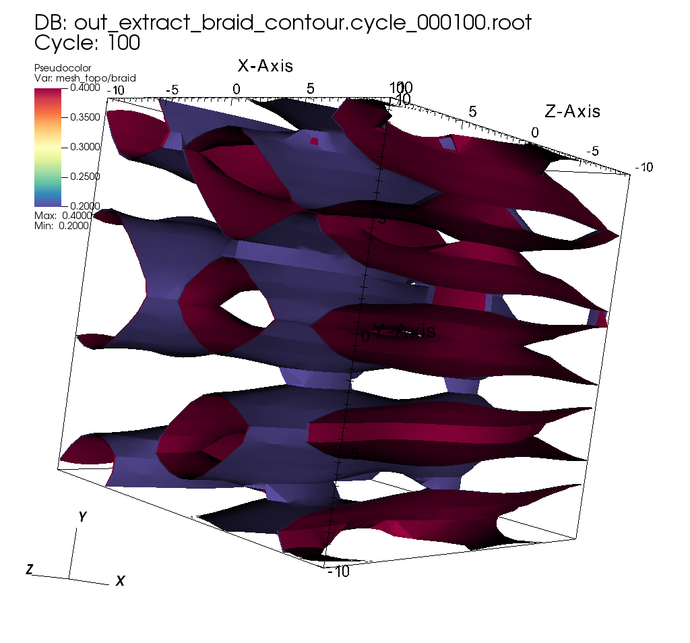
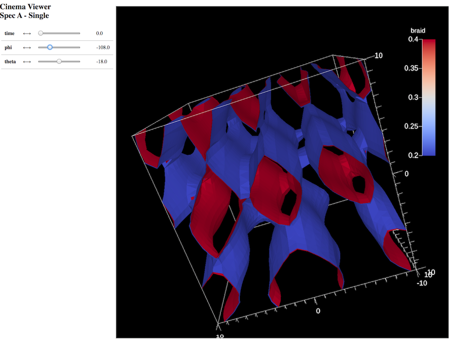

.. ############################################################################
.. # Copyright (c) Lawrence Livermore National Security, LLC and other Ascent
.. # Project developers. See top-level LICENSE AND COPYRIGHT files for dates and
.. # other details. No copyright assignment is required to contribute to Ascent.
.. ############################################################################

.. _tutorial_extracts:

Capturing data with Extracts
-----------------------------------

Extracts are the construct that allows users to capture and process data outside Ascent's pipeline infrastructure. Extract use cases include: Saving mesh data to HDF5 files, creating Cinema databases, and running custom Python analysis scripts. These examples outline how to use several of Ascent's extracts. See Ascent's :ref:`extracts`  docs for deeper details on Extracts.

Exporting input mesh data to Blueprint HDF5 files
~~~~~~~~~~~~~~~~~~~~~~~~~~~~~~~~~~~~~~~~~~~~~~~~~~~

Related docs: :ref:`extracts_relay`

:download:`C++ <../../../src/examples/tutorial/ascent_intro/cpp/ascent_extract_example1.cpp>`

.. literalinclude:: ../../../src/examples/tutorial/ascent_intro/cpp/ascent_extract_example1.cpp
   :language: cpp
   :lines: 13-

:download:`Python <../../../src/examples/tutorial/ascent_intro/python/ascent_extract_example1.py>`

.. literalinclude:: ../../../src/examples/tutorial/ascent_intro/python/ascent_extract_example1.py
   :language: python
   :lines: 7-

How can you use these files?

You can use them as input to Ascent :ref:`utils_replay`, which allows you to run Ascent outside of a simulation code.

You can also visualize meshes from these files using VisIt 2.13 or newer.

    
    Exported Mesh Rendered in VisIt

VisIt can also export Blueprint HDF5 files, which can be used as input to Ascent Replay.

Blueprint files help bridge in situ and post hoc workflows.

Exporting selected fields from input mesh data to Blueprint HDF5 files
~~~~~~~~~~~~~~~~~~~~~~~~~~~~~~~~~~~~~~~~~~~~~~~~~~~~~~~~~~~~~~~~~~~~~~~~~

Related docs: :ref:`extracts_relay`

:download:`C++ <../../../src/examples/tutorial/ascent_intro/cpp/ascent_extract_example2.cpp>`

.. literalinclude:: ../../../src/examples/tutorial/ascent_intro/cpp/ascent_extract_example2.cpp
   :language: cpp
   :lines: 13-

:download:`Python <../../../src/examples/tutorial/ascent_intro/python/ascent_extract_example2.py>`

.. literalinclude:: ../../../src/examples/tutorial/ascent_intro/python/ascent_extract_example2.py
   :language: python
   :lines: 7-

    
    Exported Mesh Rendered in VisIt

Exporting the result of a pipeline to Blueprint HDF5 files
~~~~~~~~~~~~~~~~~~~~~~~~~~~~~~~~~~~~~~~~~~~~~~~~~~~~~~~~~~~~~
Related docs: :ref:`extracts_relay`

:download:`C++ <../../../src/examples/tutorial/ascent_intro/cpp/ascent_extract_example3.cpp>`

.. literalinclude:: ../../../src/examples/tutorial/ascent_intro/cpp/ascent_extract_example3.cpp
   :language: cpp
   :lines: 13-

:download:`Python <../../../src/examples/tutorial/ascent_intro/python/ascent_extract_example3.py>`

.. literalinclude:: ../../../src/examples/tutorial/ascent_intro/python/ascent_extract_example3.py
   :language: python
   :lines: 7-

    
    Exported Mesh Rendered in VisIt

Creating a Cinema image database for post-hoc exploration
~~~~~~~~~~~~~~~~~~~~~~~~~~~~~~~~~~~~~~~~~~~~~~~~~~~~~~~~~~~~~
Related docs: :ref:`actions_cinema`

:download:`C++ <../../../src/examples/tutorial/ascent_intro/cpp/ascent_extract_example4.cpp>`

.. literalinclude:: ../../../src/examples/tutorial/ascent_intro/cpp/ascent_extract_example4.cpp
   :language: cpp
   :lines: 13-

:download:`Python <../../../src/examples/tutorial/ascent_intro/python/ascent_extract_example4.py>`

.. literalinclude:: ../../../src/examples/tutorial/ascent_intro/python/ascent_extract_example4.py
   :language: python
   :lines: 7-

    Snapshot of Cinema Database Result

Using a Python Extract to execute custom Python analysis
~~~~~~~~~~~~~~~~~~~~~~~~~~~~~~~~~~~~~~~~~~~~~~~~~~~~~~~~~~~~~

Related docs: :ref:`extracts_python`

:download:`C++ <../../../src/examples/tutorial/ascent_intro/cpp/ascent_extract_example5.cpp>`

.. literalinclude:: ../../../src/examples/tutorial/ascent_intro/cpp/ascent_extract_example5.cpp
   :language: cpp
   :lines: 13-

**Output**

.. literalinclude:: Tutorial_Output/out_txt_cpp_extract_example5.txt

:download:`Python <../../../src/examples/tutorial/ascent_intro/python/ascent_extract_example5.py>`

.. literalinclude:: ../../../src/examples/tutorial/ascent_intro/python/ascent_extract_example5.py
   :language: python
   :lines: 7-

**Output**

.. literalinclude:: Tutorial_Output/out_txt_py_extract_example5.txt

