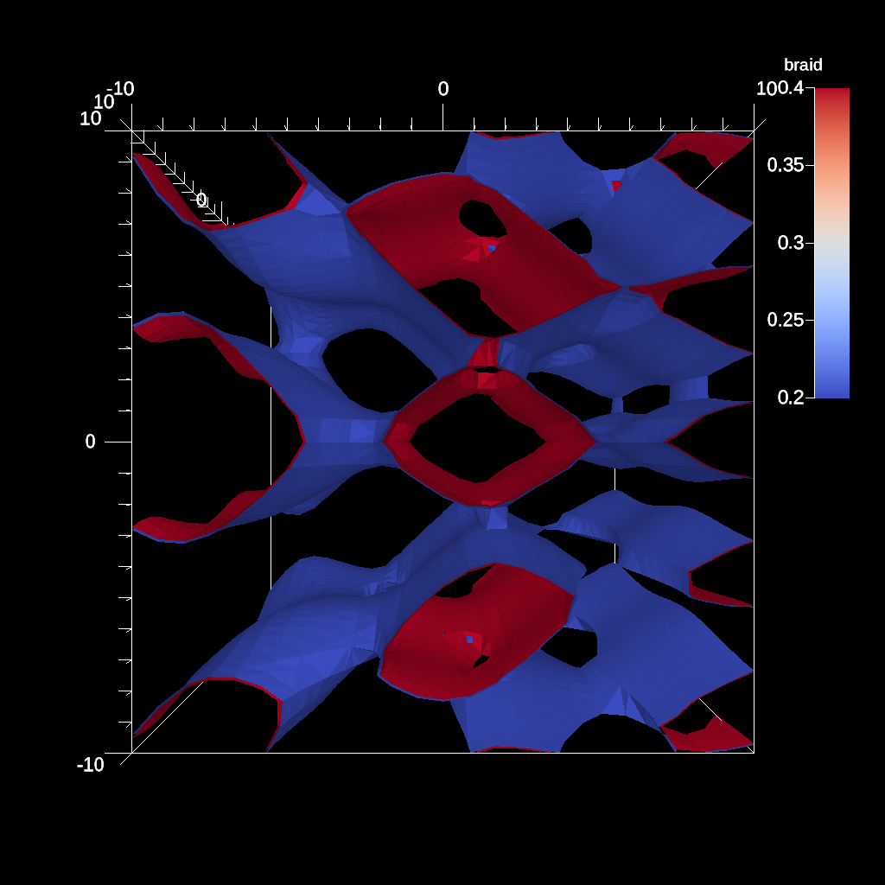
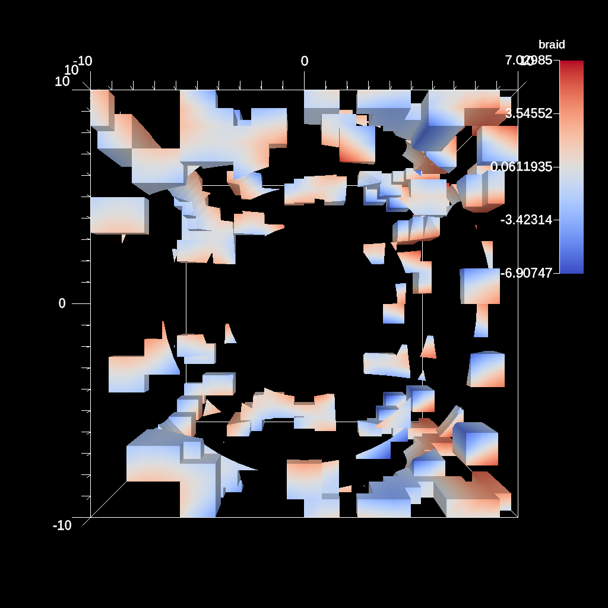
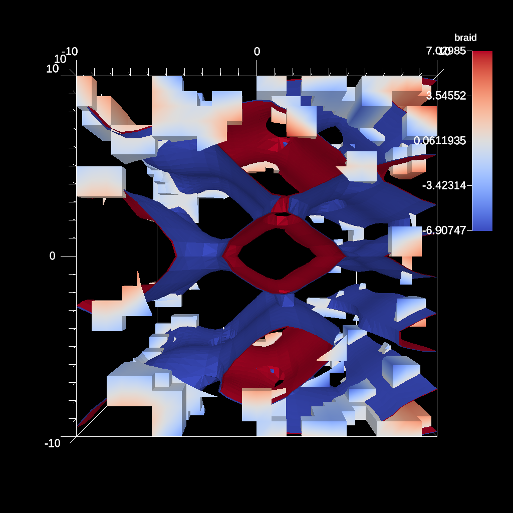

.. ############################################################################
.. # Copyright (c) Lawrence Livermore National Security, LLC and other Ascent
.. # Project developers. See top-level LICENSE AND COPYRIGHT files for dates and
.. # other details. No copyright assignment is required to contribute to Ascent.
.. ############################################################################

.. _tutorial_pipelines:

Transforming data with Pipelines
-----------------------------------

Pipelines are the construct used to compose filters that transform the published input data into new meshes. This is where users specify typical geometric transforms (e.g., clipping and slicing), field based transforms (e.g., threshold and contour), etc. The resulting data from each Pipeline can be used as input to Scenes or Extracts. Each pipeline contains one or more filters that transform the published mesh data. See Ascent's :ref:`scenes` docs for deeper details on Pipelines.

Calculating and rendering contours
~~~~~~~~~~~~~~~~~~~~~~~~~~~~~~~~~~~

:download:`C++ <../../../src/examples/tutorial/ascent_intro/cpp/ascent_pipeline_example1.cpp>`

.. literalinclude:: ../../../src/examples/tutorial/ascent_intro/cpp/ascent_pipeline_example1.cpp
   :language: cpp
   :lines: 13-

:download:`Python <../../../src/examples/tutorial/ascent_intro/python/ascent_pipeline_example1.py>`

.. literalinclude:: ../../../src/examples/tutorial/ascent_intro/python/ascent_pipeline_example1.py
   :language: python
   :lines: 7-

    Render of contour pipeline result

Combining threshold and clip transforms
~~~~~~~~~~~~~~~~~~~~~~~~~~~~~~~~~~~~~~~~~~~~

:download:`C++ <../../../src/examples/tutorial/ascent_intro/cpp/ascent_pipeline_example1.cpp>`

.. literalinclude:: ../../../src/examples/tutorial/ascent_intro/cpp/ascent_pipeline_example1.cpp
   :language: cpp
   :lines: 13-

:download:`Python <../../../src/examples/tutorial/ascent_intro/python/ascent_pipeline_example1.py>`

.. literalinclude:: ../../../src/examples/tutorial/ascent_intro/python/ascent_pipeline_example1.py
   :language: python
   :lines: 7-

    Render of threshold and clip pipeline result

Creating and rendering the multiple pipelines
~~~~~~~~~~~~~~~~~~~~~~~~~~~~~~~~~~~~~~~~~~~~~~~~

:download:`C++ <../../../src/examples/tutorial/ascent_intro/cpp/ascent_pipeline_example1.cpp>`

.. literalinclude:: ../../../src/examples/tutorial/ascent_intro/cpp/ascent_pipeline_example1.cpp
   :language: cpp
   :lines: 13-

:download:`Python <../../../src/examples/tutorial/ascent_intro/python/ascent_pipeline_example1.py>`

.. literalinclude:: ../../../src/examples/tutorial/ascent_intro/python/ascent_pipeline_example1.py
   :language: python
   :lines: 7-
   

    Render of multiple pipeline results
