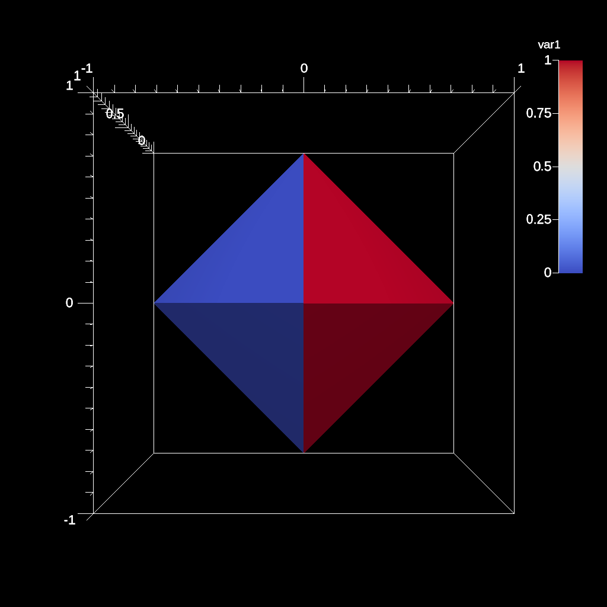
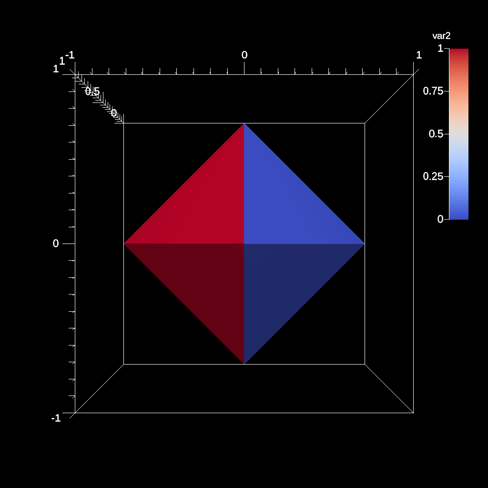
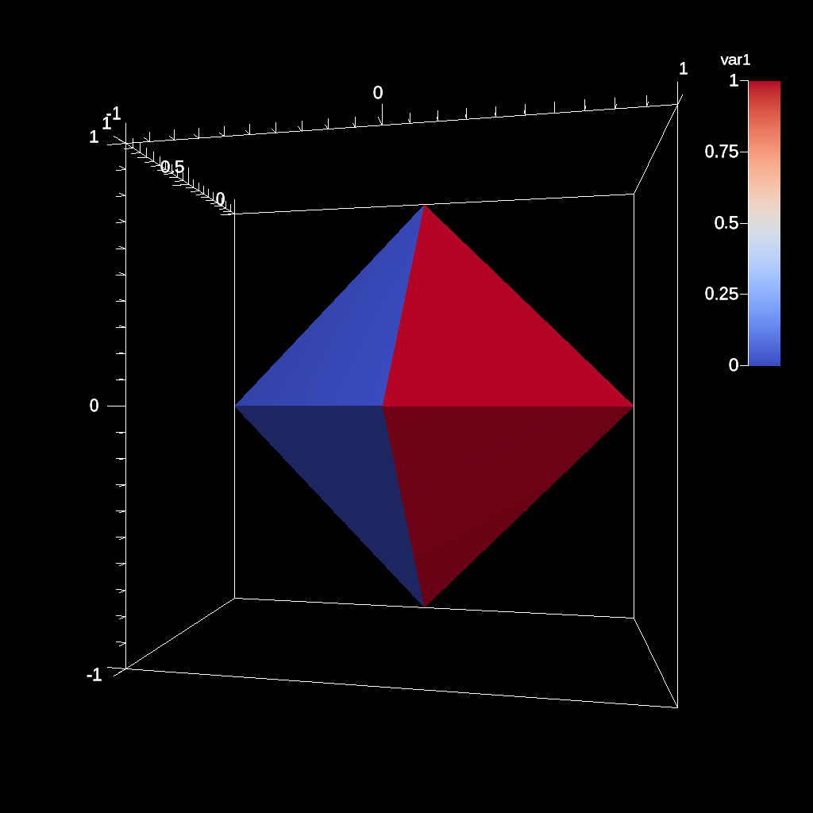
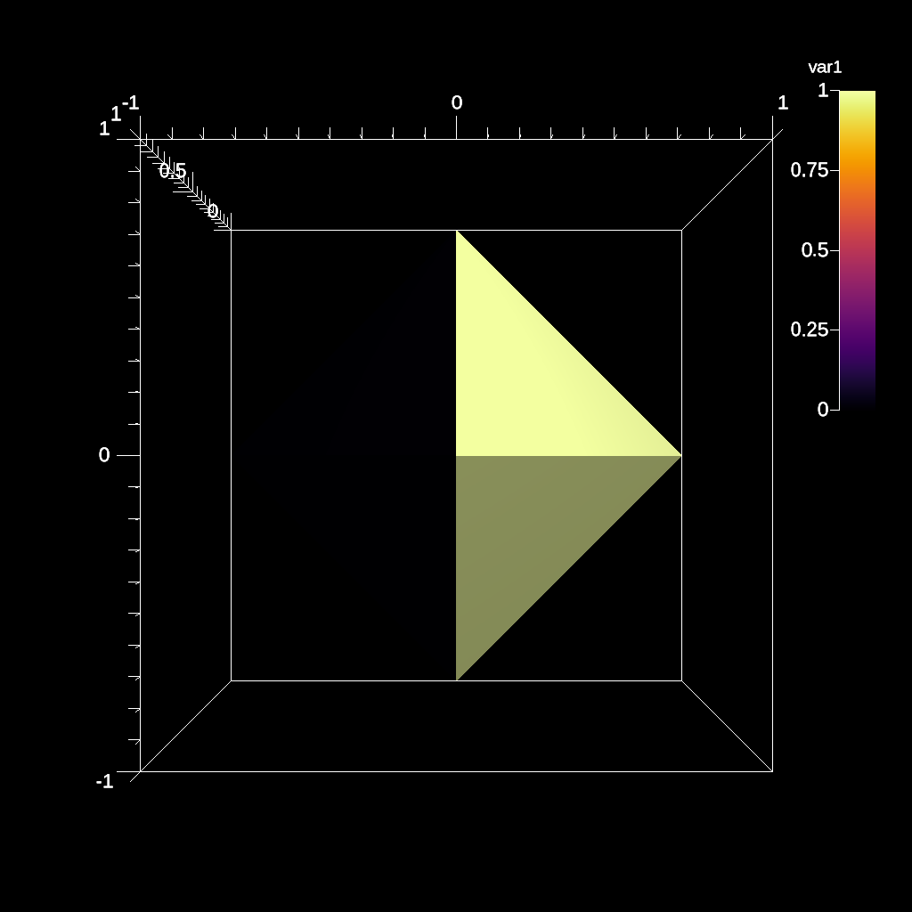

.. ############################################################################
.. # Copyright (c) 2015-2019, Lawrence Livermore National Security, LLC.
.. #
.. # Produced at the Lawrence Livermore National Laboratory
.. #
.. # LLNL-CODE-716457
.. #
.. # All rights reserved.
.. #
.. # This file is part of Ascent.
.. #
.. # For details, see: http://ascent.readthedocs.io/.
.. #
.. # Please also read ascent/LICENSE
.. #
.. # Redistribution and use in source and binary forms, with or without
.. # modification, are permitted provided that the following conditions are met:
.. #
.. # * Redistributions of source code must retain the above copyright notice,
.. #   this list of conditions and the disclaimer below.
.. #
.. # * Redistributions in binary form must reproduce the above copyright notice,
.. #   this list of conditions and the disclaimer (as noted below) in the
.. #   documentation and/or other materials provided with the distribution.
.. #
.. # * Neither the name of the LLNS/LLNL nor the names of its contributors may
.. #   be used to endorse or promote products derived from this software without
.. #   specific prior written permission.
.. #
.. # THIS SOFTWARE IS PROVIDED BY THE COPYRIGHT HOLDERS AND CONTRIBUTORS "AS IS"
.. # AND ANY EXPRESS OR IMPLIED WARRANTIES, INCLUDING, BUT NOT LIMITED TO, THE
.. # IMPLIED WARRANTIES OF MERCHANTABILITY AND FITNESS FOR A PARTICULAR PURPOSE
.. # ARE DISCLAIMED. IN NO EVENT SHALL LAWRENCE LIVERMORE NATIONAL SECURITY,
.. # LLC, THE U.S. DEPARTMENT OF ENERGY OR CONTRIBUTORS BE LIABLE FOR ANY
.. # DIRECT, INDIRECT, INCIDENTAL, SPECIAL, EXEMPLARY, OR CONSEQUENTIAL
.. # DAMAGES  (INCLUDING, BUT NOT LIMITED TO, PROCUREMENT OF SUBSTITUTE GOODS
.. # OR SERVICES; LOSS OF USE, DATA, OR PROFITS; OR BUSINESS INTERRUPTION)
.. # HOWEVER CAUSED AND ON ANY THEORY OF LIABILITY, WHETHER IN CONTRACT,
.. # STRICT LIABILITY, OR TORT (INCLUDING NEGLIGENCE OR OTHERWISE) ARISING
.. # IN ANY WAY OUT OF THE USE OF THIS SOFTWARE, EVEN IF ADVISED OF THE
.. # POSSIBILITY OF SUCH DAMAGE.
.. #
.. ############################################################################

.. _tutorial_scenes:

Rendering images with Scenes
-------------------------------

Scenes are the construct used to render pictures of meshes in Ascent. A scene description encapsulates all the information required to generate one or more images. Scenes can render mesh data published to Ascent or the result of an Ascent Pipeline.  This section of the tutorial provides a few simple examples demonstrating how to describe and render scenes. See :ref:`scenes` docs for deeper details on Scenes.

Using multiple scenes to render different variables 
~~~~~~~~~~~~~~~~~~~~~~~~~~~~~~~~~~~~~~~~~~~~~~~~~~~~

:download:`C++ <../../../src/examples/tutorial/ascent_intro/cpp/ascent_scene_example1.cpp>`

.. literalinclude:: ../../../src/examples/tutorial/ascent_intro/cpp/ascent_scene_example1.cpp
   :language: cpp
   :lines: 50-

:download:`Python <../../../src/examples/tutorial/ascent_intro/python/ascent_scene_example1.py>`

.. literalinclude:: ../../../src/examples/tutorial/ascent_intro/python/ascent_scene_example1.py
   :language: python
   :lines: 45-

    Render of tets var1 field

    Render of tets var2 field

Rendering multiple plots to a single image
~~~~~~~~~~~~~~~~~~~~~~~~~~~~~~~~~~~~~~~~~~~~

:download:`C++ <../../../src/examples/tutorial/ascent_intro/cpp/ascent_scene_example2.cpp>`

.. literalinclude:: ../../../src/examples/tutorial/ascent_intro/cpp/ascent_scene_example2.cpp
   :language: cpp
   :lines: 50-

:download:`Python <../../../src/examples/tutorial/ascent_intro/python/ascent_scene_example2.py>`

.. literalinclude:: ../../../src/examples/tutorial/ascent_intro/python/ascent_scene_example2.py
   :language: python
   :lines: 45-
   

    Render of two plots to a single image

Adjusting camera parameters
~~~~~~~~~~~~~~~~~~~~~~~~~~~~

Related docs: :ref:`scenes_renders`

:download:`C++ <../../../src/examples/tutorial/ascent_intro/cpp/ascent_scene_example3.cpp>`

.. literalinclude:: ../../../src/examples/tutorial/ascent_intro/cpp/ascent_scene_example3.cpp
   :language: cpp
   :lines: 50-

:download:`Python <../../../src/examples/tutorial/ascent_intro/python/ascent_scene_example3.py>`

.. literalinclude:: ../../../src/examples/tutorial/ascent_intro/python/ascent_scene_example3.py
   :language: python
   :lines: 45-

    Render with an azimuth change

    Render with a zoom

Changing the color tables
~~~~~~~~~~~~~~~~~~~~~~~~~~

Related docs: :ref:`scenes_color_tables`

:download:`C++ <../../../src/examples/tutorial/ascent_intro/cpp/ascent_scene_example4.cpp>`

.. literalinclude:: ../../../src/examples/tutorial/ascent_intro/cpp/ascent_scene_example4.cpp
   :language: cpp
   :lines: 50-

:download:`Python <../../../src/examples/tutorial/ascent_intro/python/ascent_scene_example4.py>`

.. literalinclude:: ../../../src/examples/tutorial/ascent_intro/python/ascent_scene_example4.py
   :language: python
   :lines: 45-

..  figure:: Tutorial_Output/out_scene_ex4_render_viridis.png
    :scale: 50 %
    :align: center

    Render with Viridis Color table

    Render with Inferno Color table