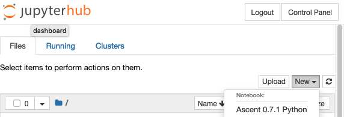
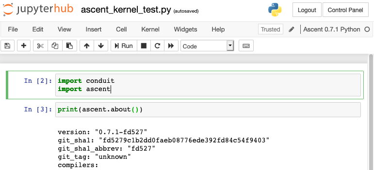

.. ############################################################################
.. # Copyright (c) 2015-2017, Lawrence Livermore National Security, LLC.
.. #
.. # Produced at the Lawrence Livermore National Laboratory
.. #
.. # LLNL-CODE-716457
.. #
.. # All rights reserved.
.. #
.. # This file is part of Ascent.
.. #
.. # For details, see: http://ascent.readthedocs.io/.
.. #
.. # Please also read ascent/LICENSE
.. #
.. # Redistribution and use in source and binary forms, with or without
.. # modification, are permitted provided that the following conditions are met:
.. #
.. # * Redistributions of source code must retain the above copyright notice,
.. #   this list of conditions and the disclaimer below.
.. #
.. # * Redistributions in binary form must reproduce the above copyright notice,
.. #   this list of conditions and the disclaimer (as noted below) in the
.. #   documentation and/or other materials provided with the distribution.
.. #
.. # * Neither the name of the LLNS/LLNL nor the names of its contributors may
.. #   be used to endorse or promote products derived from this software without
.. #   specific prior written permission.
.. #
.. # THIS SOFTWARE IS PROVIDED BY THE COPYRIGHT HOLDERS AND CONTRIBUTORS "AS IS"
.. # AND ANY EXPRESS OR IMPLIED WARRANTIES, INCLUDING, BUT NOT LIMITED TO, THE
.. # IMPLIED WARRANTIES OF MERCHANTABILITY AND FITNESS FOR A PARTICULAR PURPOSE
.. # ARE DISCLAIMED. IN NO EVENT SHALL LAWRENCE LIVERMORE NATIONAL SECURITY,
.. # LLC, THE U.S. DEPARTMENT OF ENERGY OR CONTRIBUTORS BE LIABLE FOR ANY
.. # DIRECT, INDIRECT, INCIDENTAL, SPECIAL, EXEMPLARY, OR CONSEQUENTIAL
.. # DAMAGES  (INCLUDING, BUT NOT LIMITED TO, PROCUREMENT OF SUBSTITUTE GOODS
.. # OR SERVICES; LOSS OF USE, DATA, OR PROFITS; OR BUSINESS INTERRUPTION)
.. # HOWEVER CAUSED AND ON ANY THEORY OF LIABILITY, WHETHER IN CONTRACT,
.. # STRICT LIABILITY, OR TORT (INCLUDING NEGLIGENCE OR OTHERWISE) ARISING
.. # IN ANY WAY OUT OF THE USE OF THIS SOFTWARE, EVEN IF ADVISED OF THE
.. # POSSIBILITY OF SUCH DAMAGE.
.. #
.. ############################################################################

.. _tutorial_setup:

Tutorial Setup
=================

The tutorial examples are installed with Ascent to the subdirectory ``examples/ascent/tutorial/``.  Below are several options for using pre-built Ascent installs and links to info about building Ascent. If you have access to Docker, the easiest way to test the waters is via the ``alpinedav/ascent`` Docker image.

Tutorial Cloud Option
~~~~~~~~~~~~~~~~~~~~~~~~~~~~~~~~

For in person tutorials (at Supercomputing, the ECP Annual Meeting, etc), we provide HTTP access to several instances of our Ascent Docker image running the jupyter notebook server.
We hand out IP addresses and login info to attendees during these events.

Using Docker
~~~~~~~~~~~~~~~~~~~~~~~~~~~~~~~~~~~~~~~~

If you have Docker installed you can obtain a Docker image with a ready-to-use ascent install from `Docker Hub <https://hub.docker.com/r/alpinedav/ascent/>`_. This image also includes a Jupyter install to support running Ascent's tutorial notebooks.

To directly start the Jupyter Notebook server and run the tutorial notebooks, run:

.. code::

    docker run -p 8000:8000 -p 8888:8888 -p 10000:10000 -t -i alpinedav/ascent-jupyter

(The ``-p`` is used to forward ports between the container and your host machine, we use these ports to allow web servers on the container to serve data to the host.)

This image automatically launches a Jupyter Notebook server on port 8888. Assuming you forwarded port 8888 from the Docker container to your host machine, you should be able to connect to the notebook server using http://localhost:8888. The current password for the notebook server is: ``learn``

To start the base image and explore the install and tutorial examples with bash, run:

.. code::

    docker run -p 8000:8000 -p 8888:8888 -p 10000:10000 -t -i alpinedav/ascent

You will now be at a bash prompt in you container.

To add the proper paths to Python and MPI to your environment, run:

.. code::

    source ascent_docker_setup_env.sh

The ascent source code is at ``/home/user/ascent/src/``, and the install is at ``/home/user/ascent/install-debug/``.
The tutorial examples are at ``/home/user/ascent/install-debug/examples/ascent/tutorial/`` and the tutorial notebooks are at ``/home/user/ascent/install-debug/examples/ascent/tutorial/ascent_intro/notebooks/``.

You can also launch the a Jupyter Notebook server from this image using the following:

.. code::

    ./ascent_docker_run_jupyter.sh

The url (http://localhost:8888) and password (``learn``) are the same as above.

.. _tutorial_setup_public_installs:

Using Public Installs of Ascent
~~~~~~~~~~~~~~~~~~~~~~~~~~~~~~~~~~~~~~~~

NERSC Cori Install
+++++++++++++++++++++++

We have a public ascent install for use on NERSC's Cori System. This install was built using the default
gnu compiler (8.2.0) with OpenMP and MPI support. You need to use ``module load gcc`` to build and run the installed examples.

The install is located at ``/project/projectdirs/alpine/software/ascent/current/cori/gnu/ascent-install``.
You can copy the tutorial examples from this install and use them as follows:

.. literalinclude:: tutorial_setup_nersc_cori_test.sh
   :language: bash

OLCF Summit Install
+++++++++++++++++++++++

We have two public ascents install for use on OLCF's Summit System. One install was built using the default
gnu compiler (6.4.0) with OpenMP and MPI support. You need to use `module load gcc` to build and run the installed examples.

.. warning::
    This install exists on a file system that is occasionally purged. We are looking for a better place to put our world accessable installs.

This install is located at ``/gpfs/alpine/world-shared/csc340/software/ascent/current/summit/openmp/gnu/ascent-install/``.
You can copy the tutorial examples from this install and use them as follows:

.. literalinclude:: tutorial_setup_olcf_summit_openmp_test.sh
   :language: bash

The second was built using the default
gnu compiler (6.4.0) with CUDA and MPI support. You need to use ``module load gcc`` and ``module load cuda`` to build and run the installed examples.

This install is located at ``/gpfs/alpine/world-shared/csc340/software/ascent/current/summit/cuda/gnu/ascent-install/``.
You can copy the tutorial examples from this install and use them as follows:

.. literalinclude:: tutorial_setup_olcf_summit_cuda_test.sh
   :language: bash

LLNL CZ TOSS 3 Install
+++++++++++++++++++++++

We have a public ascent install on LLNL CZ TOSS 3 Systems. This install includes OpenMP and MPI support.

The install is located at ``/usr/gapps/conduit/software/ascent/current/toss_3_x86_64_ib/openmp/gnu/ascent-install/``.
You can copy the tutorial examples from this install and use them as follows:

.. literalinclude:: tutorial_setup_llnl_pascal_openmp_test.sh
   :language: bash

Register Ascent's Python as a Jupyter Kernel
+++++++++++++++++++++++++++++++++++++++++++++

.. warning::
    This works the LLNL LC TOSS3 CZ OpenMP install, we are working on recipes for other HPC centers.

You can register Ascent's Python as a custom Jupyter kernel with Jupyter Hub.

LLNL CZ TOSS 3 Jupyter Kernel Register Example:

.. literalinclude:: tutorial_setup_llnl_pascal_openmp_jhub.sh
   :language: bash

After you register you will see an option to launch an Ascent kernel in Jupyter Hub:

With this kernel you can access Ascent's Python modules or run the tutorial notebooks:

If you want to remove the registered kernel, you can use:

.. code::
  
  # show list of registered kernels
  jupyter kernelspec list
  # remove our Ascent custom kernel
  jupyter kernelspec uninstall ascent_0.7.1 

..
.. SC19 Tutorial VM Option
.. ~~~~~~~~~~~~~~~~~~~~~~~~~~~~
..
.. Ascent is also installed on the SC19 SENSEI + Ascent Example VM Image. The install is located at ``/home/in-situ-user/ascent/current``. You can use the tutorial examples as follows:
..
.. .. code::
..
..     #
..     # source helper script with Ascent paths
..     #
..     source /home/in-situ-user/ascent/current/setup_ascent_env.sh
..
..     #
..     # build cpp examples and run the first one
..     #
..     cd /home/in-situ-user/ascent/current/ascent-install/examples/ascent/tutorial/ascent_intro/cpp
..     make
..     ./ascent_first_light_example
..
..     #
..     # run a python example
..     #
..     cd ..
..     cd python
..     python ascent_first_light_example.py
..
..
.. This install also includes jupyter, you can launch the notebook server with:
..
.. .. code::
..
..    jupyter notebook
..
..
.. The jupyter examples are at:
..
.. `/home/in-situ-user/ascent/current/ascent-install/examples/ascent/tutorial/ascent_intro/`

Build and Install
~~~~~~~~~~~~~~~~~~~~~~~~~~~~~~~~

To build and install Ascent yourself see :doc:`QuickStart`.

