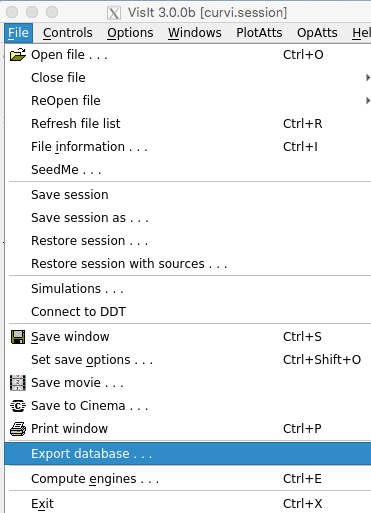
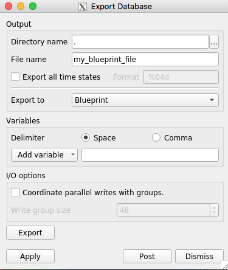

.. ############################################################################
.. # Copyright (c) 2015-2019, Lawrence Livermore National Security, LLC.
.. #
.. # Produced at the Lawrence Livermore National Laboratory
.. #
.. # LLNL-CODE-716457
.. #
.. # All rights reserved.
.. #
.. # This file is part of Ascent.
.. #
.. # For details, see: http://ascent.readthedocs.io/.
.. #
.. # Please also read ascent/LICENSE
.. #
.. # Redistribution and use in source and binary forms, with or without
.. # modification, are permitted provided that the following conditions are met:
.. #
.. # * Redistributions of source code must retain the above copyright notice,
.. #   this list of conditions and the disclaimer below.
.. #
.. # * Redistributions in binary form must reproduce the above copyright notice,
.. #   this list of conditions and the disclaimer (as noted below) in the
.. #   documentation and/or other materials provided with the distribution.
.. #
.. # * Neither the name of the LLNS/LLNL nor the names of its contributors may
.. #   be used to endorse or promote products derived from this software without
.. #   specific prior written permission.
.. #
.. # THIS SOFTWARE IS PROVIDED BY THE COPYRIGHT HOLDERS AND CONTRIBUTORS "AS IS"
.. # AND ANY EXPRESS OR IMPLIED WARRANTIES, INCLUDING, BUT NOT LIMITED TO, THE
.. # IMPLIED WARRANTIES OF MERCHANTABILITY AND FITNESS FOR A PARTICULAR PURPOSE
.. # ARE DISCLAIMED. IN NO EVENT SHALL LAWRENCE LIVERMORE NATIONAL SECURITY,
.. # LLC, THE U.S. DEPARTMENT OF ENERGY OR CONTRIBUTORS BE LIABLE FOR ANY
.. # DIRECT, INDIRECT, INCIDENTAL, SPECIAL, EXEMPLARY, OR CONSEQUENTIAL
.. # DAMAGES  (INCLUDING, BUT NOT LIMITED TO, PROCUREMENT OF SUBSTITUTE GOODS
.. # OR SERVICES; LOSS OF USE, DATA, OR PROFITS; OR BUSINESS INTERRUPTION)
.. # HOWEVER CAUSED AND ON ANY THEORY OF LIABILITY, WHETHER IN CONTRACT,
.. # STRICT LIABILITY, OR TORT (INCLUDING NEGLIGENCE OR OTHERWISE) ARISING
.. # IN ANY WAY OUT OF THE USE OF THIS SOFTWARE, EVEN IF ADVISED OF THE
.. # POSSIBILITY OF SUCH DAMAGE.
.. #
.. ############################################################################

Ascent Utilities
================
Ascent provides a some utilities to assist users and developers.
Currently, Ascent provides two main utilities:

* ``gen_spack_env_script.py`` : a python program to create a shell script that
  load libraries built by uberenv (i.e., spack) into the user environment.
* ``replay`` : a set of programs that replays simulation data saved by Ascent
  or exported by VisIt to Ascent.

Generate Spack Eviromnent Script
--------------------------------
The uberenv spack-based build installs libraries into 
difficult to locate paths. The ``gen_spack_env_script.py`` is a utility program that
searches the uberenv build for user specified dependencies and creates shell script that
loads these locations into your path.

Why Do I Need This?
"""""""""""""""""""
Even with a shared library build where dependent library locations are found automatically,
some dependencies such as MPI and Python need to be loaded into the user environment for
Ascent to execute successfully.

For example if the uberenv built MPI and the user machine
also contains an installation of MPI, executing a command such as ``mpirun -np 4 cloverleaf_par``
will most definitely invoke the system MPI and not the MPI that Ascent was built with.
Mixing MPI versions or implementation will almost never result in successful execution and
should be avoided at all costs.

How Do I Use It?
""""""""""""""""
From the top level Ascent directory (i.e., the root of the repository)

.. code:: bash

   python scripts/gen_spack_env_script.py mpi conduit python

Simply invoke the script with python followed by a list of packages. In the above example,
we are asking program to generate a shell script called ``s_env.sh`` to load the paths of ``mpi``, ``conduit``,
and ``python`` into our environment. Once this command executes, source the shell script to
your path:

.. code:: bash

   source s_env.sh

To verify success, you can echo your path and the paths of the libraries should appear at the
front of the path.

Replay
------
Replay is a utility that allows the user to 'replay' Conduit Blueprint HDF5
files saved by Ascent or exported by VisIt (starting in version 3.0 beta) back into
Ascent. Simulations often take a significant amount of time to develop into a meaningful
or interesting state. Replay enables the user or developer to cherry-pick specific time steps
and load them into Ascent.

Why Do I Need This?
"""""""""""""""""""
There are several use cases for using replay:

* Creating actions files
* Ascent development
* Algorithm development

When creating in situ actions, a common strategy for scripting actions a priori is to
get a smaller representation of the simulation data a user expects to see in situ and
create visualization actions that can then be applied to the full data set in situ.
Replay enables the user to load data into Ascent without using a fully integrated
simulation workflow.

Additionally, replay can be used for Ascent and algorithm development. Replay
can load specific data sets or time steps into Ascent. With replay, loading various test cases
and iterating over development cycles is straight forward.

How Do I Get Blueprint Files?
"""""""""""""""""""""""""""""
To use replay, you first need compatible data and there are two methods to obtaining it.

Using Ascent
^^^^^^^^^^^^
The ``relay`` extract saves out Conduit Blueprint HDF5 files that replay consumes.
Simply add the extract to the actions in the code or actions file. The ``relay`` extract can
also sub-select the fields that are saved to reduce the total data set size. For more information see
the :ref:`relay` section.

.. code-block:: c++

    conduit::Node extracts;
    extracts["e1/type"]  = "relay";
    extracts["e1/params/path"] = "my_output_file_name";
    extracts["e1/params/protocol"] = "blueprint/mesh/hdf5";

Using VisIt
^^^^^^^^^^^
Starting with 3.0 beta, VisIt supports exporting databases to the Conduit Blueprint HDF5 format.
With this support, VisIt can serve as file format converter from any of the many supported
database reader formats to the format that replay can consume.

To export in Blueprint format, select export from VisIt's File Menu:

Then from the **Export to** drop-down, select Blueprint:

How Do I Use It?
""""""""""""""""
Replay executables are created in the ``utilities/replay`` directory of the installation or build.
There are two versions of replay:

* ``replay_ser``: a serial (non-MPI) version
* ``replay_mpi``: an MPI version

The options for replay are:

* ``--root``: specifies Blueprint root file to load
* ``--cycles``: specifies a text file containing a list of Blueprint root files to load
* ``--actions``: specifies the name of the actions file to use (default: ``ascent_actions.json``)

Example launches:

.. code:: bash

   ./replay_ser --root=clover.cycle_000060.root --actions=my_actions.json
   srun -n 8 ./replay_mpi --root=clover.cycle_000060.root --actions=my_actions.json
   srun -n 8 ./replay_mpi --cycles=cycles_list.txt --actions=my_actions.json

The cycles files list is a text file containing one root file per line:

.. code:: bash

    cat cycles_list.txt
    clover.cycle_000060.root
    clover.cycle_000080.root
    clover.cycle_000100.root
    clover.cycle_000120.root

Replay will loop over these files in the order in which they appear in the file.

Domain Overloading
^^^^^^^^^^^^^^^^^^
Each root file can point to any number of domains. When launching ``replay_mpi``,
you can specify any number of ranks less than or equal to the number of domains.
Replay will automatically domain overload. For example if there were 100 domains and
replay is launched with 50 ranks, then each rank will load 2 domains.
