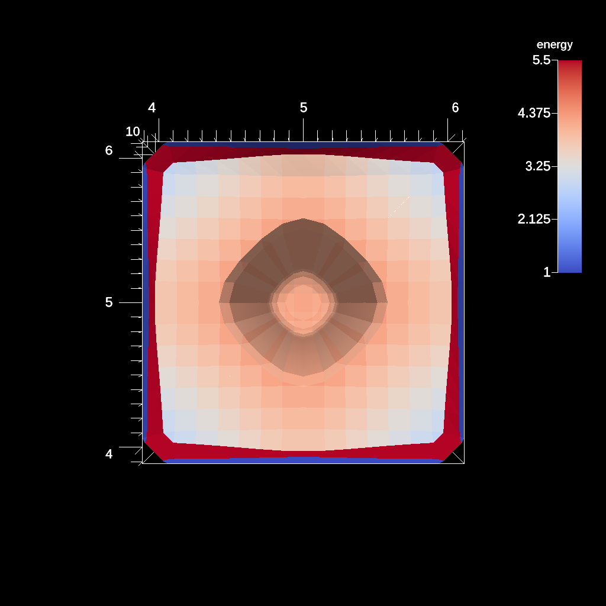
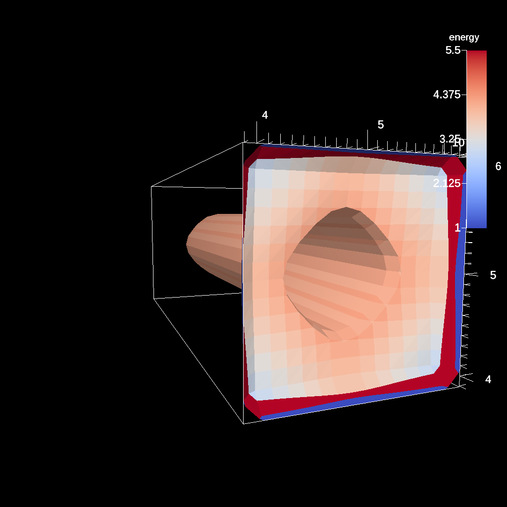

.. ############################################################################
.. # Copyright (c) Lawrence Livermore National Security, LLC and other Ascent
.. # Project developers. See top-level LICENSE AND COPYRIGHT files for dates and
.. # other details. No copyright assignment is required to contribute to Ascent.
.. ############################################################################

Ascent Utilities
================
Ascent provides a some utilities to assist users and developers.
Currently, Ascent provides two main utilities:

* ``gen_spack_env_script.py`` : a python program to create a shell script that
  load libraries built by uberenv (i.e., spack) into the user environment.
* ``replay`` : a set of programs that replays simulation data saved by Ascent
  or exported by VisIt to Ascent.

Generate Spack Environment Script
-----------------------------------
The uberenv spack-based build installs libraries into
difficult to locate paths. The ``gen_spack_env_script.py`` is a utility program that
searches the uberenv build for user specified dependencies and creates shell script that
loads these locations into your path.

Why Do I Need This?
"""""""""""""""""""
Even with a shared library build where dependent library locations are found automatically,
some dependencies such as MPI and Python need to be loaded into the user environment for
Ascent to execute successfully.

For example if the uberenv built MPI and the user machine
also contains an installation of MPI, executing a command such as ``mpirun -np 4 cloverleaf_par``
will most definitely invoke the system MPI and not the MPI that Ascent was built with.
Mixing MPI versions or implementation will almost never result in successful execution and
should be avoided at all costs.

How Do I Use It?
""""""""""""""""
From the top level Ascent directory (i.e., the root of the repository)

.. code:: bash

   python scripts/gen_spack_env_script.py mpi conduit python

Simply invoke the script with python followed by a list of packages. In the above example,
we are asking program to generate a shell script called ``s_env.sh`` to load the paths of ``mpi``, ``conduit``,
and ``python`` into our environment. Once this command executes, source the shell script to
your path:

.. code:: bash

   source s_env.sh

To verify success, you can echo your path and the paths of the libraries should appear at the
front of the path.

.. _utils_replay:

Replay
------
Replay is a utility that allows the user to 'replay' Conduit Blueprint HDF5
files saved by Ascent or exported by VisIt (starting in version 3.0 beta) back into
Ascent. Simulations often take a significant amount of time to develop into a meaningful
or interesting state. Replay enables the user or developer to cherry-pick specific time steps
and load them into Ascent.

Why Do I Need This?
"""""""""""""""""""
There are several use cases for using replay:

* Creating actions files
* Ascent development
* Algorithm development

When creating in situ actions, a common strategy for scripting actions a priori is to
get a smaller representation of the simulation data a user expects to see in situ and
create visualization actions that can then be applied to the full data set in situ.
Replay enables the user to load data into Ascent without using a fully integrated
simulation workflow.

Additionally, replay can be used for Ascent and algorithm development. Replay
can load specific data sets or time steps into Ascent. With replay, loading various test cases
and iterating over development cycles is straight forward.

How Do I Get Blueprint Files?
"""""""""""""""""""""""""""""
To use replay, you first need compatible data and there are two methods to obtaining it.

Using Ascent
^^^^^^^^^^^^
The ``relay`` extract saves out Conduit Blueprint HDF5 files that replay consumes.
Simply add the extract to the actions in the code or actions file. The ``relay`` extract can
also sub-select the fields that are saved to reduce the total data set size. For more information see
the :ref:`extracts_relay` section.

.. code-block:: c++

    conduit::Node extracts;
    extracts["e1/type"]  = "relay";
    extracts["e1/params/path"] = "my_output_file_name";
    extracts["e1/params/protocol"] = "blueprint/mesh/hdf5";

To do the same in an ascent actions file:

.. code-block:: yaml

    -
      action: "add_extracts"
      extracts:
        e1:
          type: "relay"
          params:
            path: "my_output_file_name"
            protocol: "blueprint/mesh/hdf5"

Using VisIt
^^^^^^^^^^^
Starting with 3.0 beta, VisIt supports exporting databases to the Conduit Blueprint HDF5 format.
With this support, VisIt can serve as file format converter from any of the many supported
database reader formats to the format that replay can consume.

To export in Blueprint format, select export from VisIt's File Menu:

..  image:: images/export_menu.png
    :width: 50%
    :align: center

Then from the **Export to** drop-down, select Blueprint:

..  image:: images/blueprint_export.png
    :width: 50%
    :align: center

How Do I Use It?
""""""""""""""""
Replay executables are created in the ``utilities/replay`` directory of the installation or build.
There are two versions of replay:

* ``replay_ser``: a serial (non-MPI) version
* ``replay_mpi``: an MPI version

The options for replay are:

* ``--root``: specifies Blueprint root file to load
* ``--cycles``: specifies a text file containing a list of Blueprint root files to load
* ``--actions``: specifies the name of the actions file to use (default: ``ascent_actions.json``)

Example launches:

.. code:: bash

   ./replay_ser --root=clover.cycle_000060.root --actions=my_actions.json
   srun -n 8 ./replay_mpi --root=clover.cycle_000060.root --actions=my_actions.json
   srun -n 8 ./replay_mpi --cycles=cycles_list.txt --actions=my_actions.json

The cycles files list is a text file containing one root file per line:

.. code:: bash

    cat cycles_list.txt
    clover.cycle_000060.root
    clover.cycle_000080.root
    clover.cycle_000100.root
    clover.cycle_000120.root

Replay will loop over these files in the order in which they appear in the file.

Domain Overloading
^^^^^^^^^^^^^^^^^^
Each root file can point to any number of domains. When launching ``replay_mpi``,
you can specify any number of ranks less than or equal to the number of domains.
Replay will automatically domain overload. For example if there were 100 domains and
replay is launched with 50 ranks, then each rank will load 2 domains.

Example Actions Development Workflow
""""""""""""""""""""""""""""""""""""
In this example, we will walk through the how to use replay to create a non-trivial
actions file. This can be error prone, since the actions files are just a text file
and errors won't be reported until runtime. We will use the cloverleaf 3D proxy
application as a data source.

Getting Data For Replay
^^^^^^^^^^^^^^^^^^^^^^^
We are only interested in getting a representative data set that we can
iterate over quickly. Ideally, this data will have all the same fields and
topologies as the full sized simulation, but with a much smaller mesh
resolution.

For an Ascent install, Cloverleaf3d is located in ``examples/ascent/proxies/cloverleaf3d``
and for an build, it's located in ``examples/proxies/cloverleaf3d``.
The input deck is ``clover.in``, and if you going to run Cloverleaf from another directory,
copy that file into the current working directory. By default, the data size is 64x64x64 and
the simulation will run for ``200`` cycles. Cloverleaf will call ascent every ``10`` cycles.

In the current directory create an ``ascent_actions.yaml`` file with the following
contents:

.. code-block:: yaml

    -
      action: "add_extracts"
      extracts:
        e1:
          type: "relay"
          params:
            path: "clover_data"
            protocol: "blueprint/mesh/hdf5"

To run clover: ``srun -n 1 path_to_clover/cloverleaf3d_par``. Your MPI may be different, so
you may need to lauch the MPI task with ``mpiexec`` or ``mpirun``. After this runs,
there will be ``20`` files in the form ``clover_data.cycle_000010.root`` in the current
directory. Each root file points to subdirectories with HDF5 files that contain
the mesh data for each cycle.

Before the next step, we will create a file that contains information about all the root files.
``ls full_path_to_the_cwd/*.root > clover_cycles`` will create a text file with all the root files.
While we can use replay on an individual root file, we will uses all time steps to see the results of
actions over multiple time steps. **Note**: its important to include the full path when creating
this file. This allows you to use the ``clover_cycles`` file anywhere on the file system.

Actions Templates
^^^^^^^^^^^^^^^^^
Now that we have data, we can begin to develop an actions file.
It's generally a good idea to use the our example actions :ref:`yaml-examples`
as templates for your own actions. These templates are auto-generated from
our test suite, so they should contain most capabilities.

Example Actions
^^^^^^^^^^^^^^^
We will will create an isosurface and plot it by using an example
actions as a base for our new actions and adapt it for Cloverleaf.

From the example of using creating a single contour:

.. code-block:: yaml

  -
    action: "add_pipelines"
    pipelines:
      pl1:
        f1:
          type: "contour"
          params:
            field: "braid"
            iso_values: 0.0
  -
    action: "add_scenes"
    scenes:
      s1:
        plots:
          p1:
            type: "pseudocolor"
            field: "radial"
            pipeline: "pl1"
        image_prefix: "tout_single_contour_3d"

The main things we have to change are the parameters of the contour filter and
the iso value. For example, Cloverleaf does not have the fields ``braid`` or ``radial``
, so we have to enter valid fields. Ascent will tell you if a field does not
exist, and Ascent will present you with a set of known fields as alternatives.
In this case, Cloverleaf has fields like ``density`` and ``energy``. Lets change
the field for the contour filter to ``density`` change the iso value to something
non-zero.

Changing these values we and the name of the resulting image, we end up with:

.. code-block:: yaml

  -
    action: "add_pipelines"
    pipelines:
      pl1:
        f1:
          type: "contour"
          params:
            field: "density"
            iso_values: 2.0
  -
    action: "add_scenes"
    scenes:
      s1:
        plots:
          p1:
            type: "pseudocolor"
            field: "energy"
            pipeline: "pl1"
        image_prefix: "my_image"

Writing Valid Yaml
^^^^^^^^^^^^^^^^^^
The yaml format is human readable, but it can still be easy to make mistakes.
Ascent will tell you about yaml parsing errors, but using external validation tools
like `<http://www.yamllint.com//>`_ helps filter out simple mistakes. You can simply
paste your yaml into the site and validate if the syntax is correct.

Running Replay
^^^^^^^^^^^^^^
We have created an actions file and now we want to run it.
We have two choices: use the mpi version ``replay_mpi`` or the serial
version ``replay_ser``. What you use depends on the data set, but since our
sample data size is small, the serial version will work just fine.

Our goal here is to test the actions we created above and validate that
they work as expected. Here we assume that the ``clover_cycles`` file and the
yaml actions file is called ``ascent_actions.yaml``.

.. code:: bash

   ./replay_ser --cycles=clover_cycles --actions=ascent_actions.yaml

The result produces 20 images, but Ascent emits warnings:

.. code:: bash

  s1/p1 pseudocolor plot yielded no data, i.e., no cells remain

This means that an iso value didn't produce any contours. There are three things we
can do to fix this.

* Use the `levels` option in the contour filter to automatically pick isovalues
* Use our knowledge of the simulation input to choose a better value.
* Open the data in VisIt and choose a better iso value.

In this case, we can look at the input deck (``clover.in``) and see that
the max value of density is ``2.0``. We can then alter the actions to choose
a isovalue of ``1.0`` and try again.

This time Ascent does not complain, and gives us non-blank images. Here is one:

We can still do better. Ascent creates a default camera, and we can use basic camera
controls to get a better image. ``azimuth`` (move around the equator)
and ``elevation`` (move towards the polls) allow us to move the camera
around the default position.

.. code-block:: yaml

  -
    action: "add_pipelines"
    pipelines:
      pl1:
        f1:
          type: "contour"
          params:
            field: "density"
            iso_values: 2.0
  -
    action: "add_scenes"
    scenes:
      s1:
        plots:
          p1:
            type: "pseudocolor"
            field: "energy"
            pipeline: "pl1"
        renders:
          my_image_1:
            camera:
              azimuth: -20
              elevation: 5
            image_prefix: "my_cooler_image"

