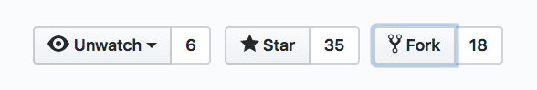
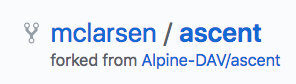
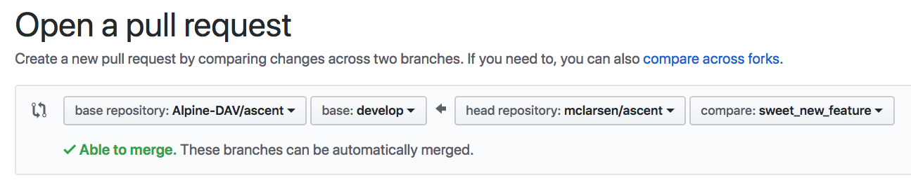
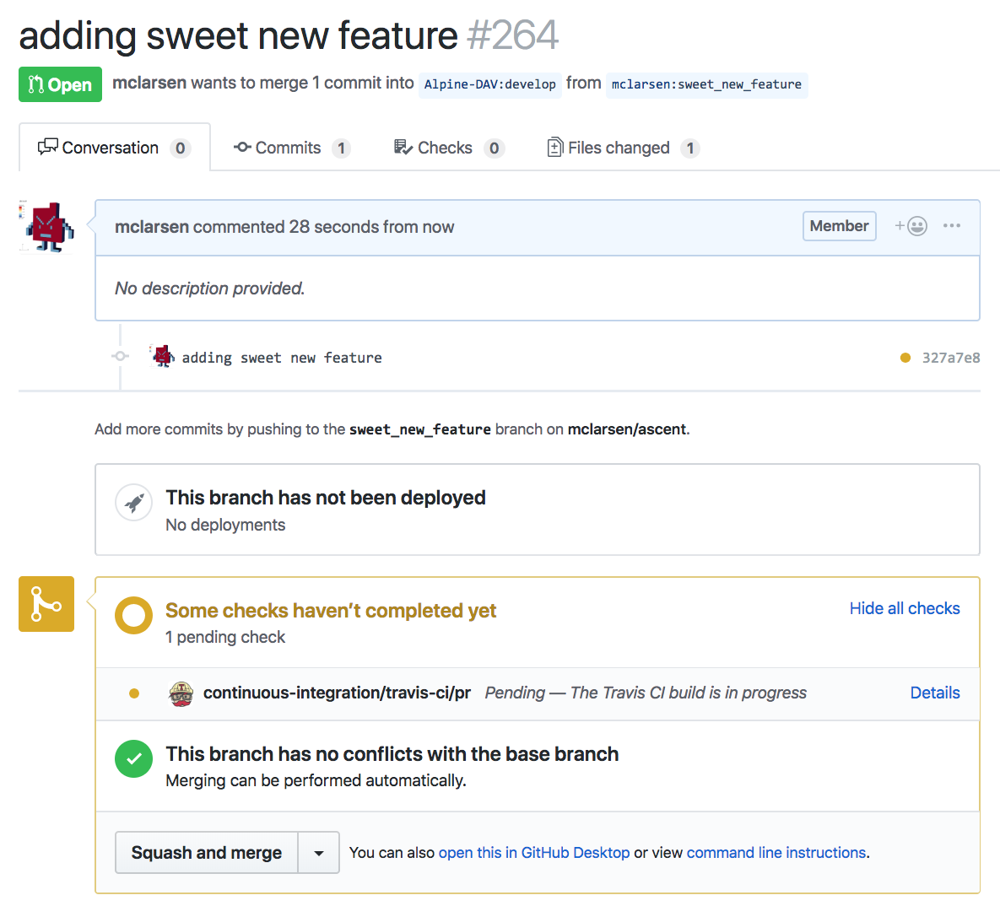

.. ############################################################################
.. # Copyright (c) Lawrence Livermore National Security, LLC and other Ascent
.. # Project developers. See top-level LICENSE AND COPYRIGHT files for dates and
.. # other details. No copyright assignment is required to contribute to Ascent.
.. ############################################################################

Ascent Contribution Guide
=========================
The Ascent contribution process is managed through the github repository, and
there are several ways to contribute to the project:

* Issue tracker: questions, issues, and feature requests can be made through the
  project github `issue tracker <https://github.com/Alpine-DAV/ascent/issues>`_
* Email help: help@ascent-dav.org
* Submitting a pull request

Github Code Contributions
-------------------------
The best way to contribute code to improve Ascent is through forking the main repository.
At the top right corner of the Ascent repository is the fork button:

After forking, you will have a forked copy of the Ascent repository under your
github account:

With a copy of the Ascent repository in hand, you are free to clone your fork
to a local machine and begin development.

What Branch Should I Use?
"""""""""""""""""""""""""
All work on Ascent is done through the ``develop`` branch, which is the default.

What Do I Need To Know About Ascent?
""""""""""""""""""""""""""""""""""""
There are several developer documents that provide a developer guide to add capabilities
to Ascent.

* :ref:`dev_overview`: a developers view of the Ascent
* :ref:`build_env`: how to setup a development environment
* :ref:`vtkh_filter`: developing VTK-m and VTK-h capabilities
* :ref:`flow_filter`: developing flow filters in Ascent

Submitting Pull Requests
""""""""""""""""""""""""
After developing new capability from your forked repository, you can create a pull
request to the main Ascent repository from the forked repo.

When submitting the pull request, make sure the pull request is targeting the develop branch.
This should be the default if you created you feature branch from ``develop``.

After submitting the pull request, you can view the pull request from the
main Ascent repository. Additionally, submitting a pull request triggers
Ascent's continuous integration test (CI).

If all CI tests pass, the pull request can be reviewed by the Ascent project
members. Only project members can perform the actual merge.

