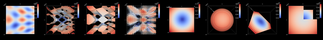

.. ###############################################################################
.. # Copyright (c) Lawrence Livermore National Security, LLC and other Ascent
.. # Project developers. See top-level LICENSE AND COPYRIGHT files for dates and
.. # other details. No copyright assignment is required to contribute to Ascent.
.. ###############################################################################

========
Ascent
========

`Ascent <http://github.com/alpine-dav/ascent>`_ is a many-core capable flyweight in situ visualization and analysis infrastructure for multi-physics HPC simulations.

Learn how to use Ascent with Docker + Jupyter
==============================================

If you have Docker, an easy way to learn about Ascent is to run our prebuilt Docker container:

.. code::

    docker run -p 8888:8888 -t -i alpinedav/ascent-jupyter

Then open http://localhost:8888 in your browser to connect to the Jupyter Server in the container.
The password for the Jupyter server is: ``learn``.  From here, you can run Ascent's Python Tutorial Notebook examples. For more details see our :doc:`Ascent Tutorial <Tutorial>`.

Introduction
============

.. Ascent is a system designed to meet the in-situ visualization and analysis needs of simulation code teams running multi-physics calculations on many-core HPC architectures. It provides rendering runtimes that can leverage many-core CPUs and GPUs to render images of simulation meshes.

Ascent is an easy-to-use flyweight in situ visualization and analysis library for HPC simulations:

- Supports: Making Pictures, Transforming Data, and Capturing Data for use outside of Ascent
- Young effort, yet already includes most common visualization operations
- Provides a simple infrastructure to integrate custom analysis
- Provides C++, C, Python, and Fortran APIs

Ascent's flyweight design targets next-generation HPC platforms:

- Provides efficient distributed-memory (MPI) and many-core (CUDA or OpenMP) execution 
- Demonstrated scaling:  In situ filtering and ray tracing across 16,384 GPUs on LLNL's Sierra Cluster
- Has lower memory requirements than current tools
- Requires less dependencies than current tools (ex: no OpenGL)

Ascent focuses on ease of use and reducing integration burden for simulation code teams:

- Actions are passed to Ascent via YAML files
- Replay capability helps prototype and test actions
- It does not require GUI or system-graphics libraries
- It includes integration examples that demonstrate how to use Ascent inside existing HPC-simulation proxy applications

Getting Started
----------------

To get started building and using Ascent, see the :doc:`Quick Start Guide <QuickStart>`  and the :doc:`Ascent Tutorial <Tutorial>`. For more details about building Ascent see the :doc:`Building documentation <BuildingAscent>`.

Ascent Project Resources
==========================

**Website and Online Documentation**

http://www.ascent-dav.org

**Github Source Repo**

http://github.com/alpine-dav/ascent

**Issue Tracker**

http://github.com/llnl/ascent/issues

**Help Email**

help@ascent-dav.org

**Contributors**

https://github.com/Alpine-DAV/ascent/graphs/contributors

Ascent Documentation
======================

.. toctree::
   :maxdepth: 1
   :hidden:

   QuickStart

.. toctree::
   :caption: Tutorial
   :maxdepth: 1
   :hidden:

   Tutorial
   Tutorial_Setup
   Tutorial_Intro
   Tutorial_CloverLeaf_Demos

.. toctree::
   :caption: User Documentation
   :maxdepth: 1
   :hidden:

   Overview
   ExampleIntegrations
   BuildingAscent
   AscentAPI
   Actions/index
   FeatureMap
   Utilities
   GPU_notes

.. toctree::
   :caption: Developer Documentation
   :maxdepth: 1
   :hidden:

   developer_docs/Contributing
   developer_docs/Overview
   developer_docs/BuildEnvironment
   developer_docs/VTKh_Filter
   developer_docs/Flow_Filter
   developer_docs/CI

.. toctree::
   :caption: Resources
   :maxdepth: 1
   :hidden:

   Releases
   Citing
   Publications
   Licenses

Indices and tables
==================

* :ref:`genindex`
* :ref:`modindex`
* :ref:`search`

